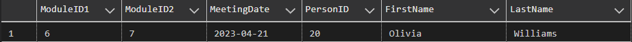
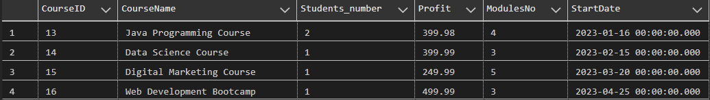
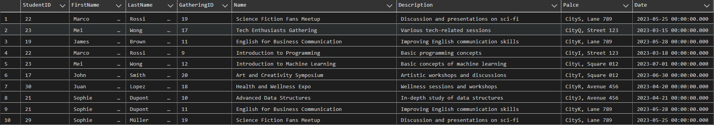
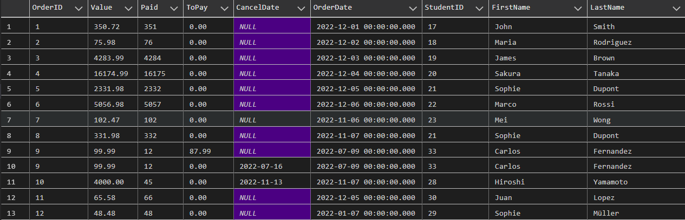
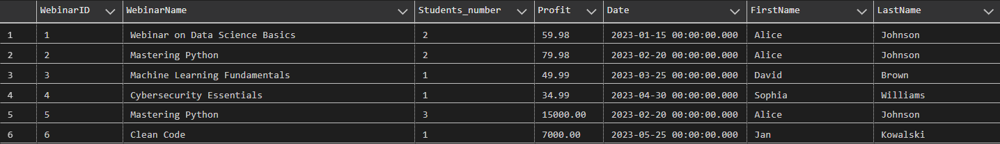

**<p align="center">Bazy Danych: Projekt</p>**

**<p align="center">Raport</p>**

**<p align="center">Zespół 5: Furgała Tomasz, Łukasz Kluza, Mateusz Sacha</p>**

1. Administrator

- Usuwanie webinaru, administrator może usunąć dostępne nagranie webinaru gdy uzna to za stosowne.
- Zarządzanie użytkownikami, administrator ma możliwość edycji kont innych użytkowników.
- Generowanie raportów, administrator generuję raporty zawierająca aktualne statystki.

2. Gość

- Założenie konta, użytkownik może założyć konto, które umożliwia mu korzystanie z systemu
- Przeglądanie kursów, użytkownik ma możliwość zapoznania się z aktualną ofertą kursów i szkoleń.

3. Zalogowany użytkownik

- Zapis na webinar, kurs lub studia, użytkownik może zapisać się na wybraną przez siebie usługę.
- Płatność za usługi, dokonuje opłaty by móc wziąć udział w webinarze, kursie lub studiach oraz wykupuje późniejszy dostęp do materiałów.
- Przeglądanie listy, możliwość przeglądania listy usług, na które dany użytkownik jest zapisany.
- Odbiera dyplom, użytkownik może odebrać dyplom, gdy zostanie on wystawiony przez administratora.

4. Koordynator

- Odraczanie płatności, dyrektor szkoły ma możliwość odroczenia płatności na określony czas.
- Wgląd do kursów oraz webinarów, dyrektor ma możliwość wglądu do danych o kursach i webinarach prowadzonych przez jego pracowników
- Zatwierdzanie programu studiów, dyrektor ma dostęp do ułożonych przez pracowników sylabusów przed opublikowaniem ich oraz możliwość zatwierdzania i wprowadzania poprawek do nich
- Zatwierdzanie nowych kursów i webinarów, dyrektor zatwierdza bądź odrzuca każdy nowy kurs, webinar, stworzony przez jego pracowników

5. Menadżer

- Zarządzaniem limitem miejsc, menadżer ustala maksymalną liczbę osób która może uczestniczyć w danym webinarze, szkoleniu
- Wystawianie dyplomów, menadżer wystawia dyplom użytkownikowi, który spełnił wszystkie regulaminowe przesłanki co to do tego.
- Zarządzanie ofertą, menadżer ma możliwość edycji obecnej oferty jak i możliwość dodawania nowych kursów, szkoleń.

6. Prowadzący/Wykładowca

- Dostęp do swoich webinarów, każdy prowadzący ma nielimitowany czasowo dostęp do nagrań wszystkich swoich webinarów
- Możliwość edycji modułów kursu, prowadzący mają możliwość wprowadzania poprawek oraz modyfikacji materiałów znajdujących się na prowadzonych przez siebie kursach
- Dostęp do systemu ocen i obecności, prowadzący ma dostęp do systemu, w którym może swobodnie zapisywać oraz zmieniać oceny i obecności uczestników jego kursów
- Ułożenie sylabusu, prowadzący musi ułożyć sylabus do każdego z prowadzonych przez siebie przedmiotów w określonym terminie przed rozpoczęciem studiów

7. System

- Generowanie linków do płatności, system sam, automatycznie generuje link do płatności, gdy użytkownik chce opłacić zamówienie.
- Wysyłanie powiadomień, uczestnik spotkania dostaje powiadomienia, gdy rozpoczyna się spotkanie, w którym ma uczestniczyć.
- Powiadomienie o zapłacie, użytkownik do dostaje przypomnienie o konieczności zapłaty tydzień przed ostatecznym terminem dokonania płatności, dotyczy to także zaliczek.

**Diagram bazy danych:**
<p align="center">
  
</p>


**Tabele:**

1. Offers:

Tabela zawiera informacje o wszystkich wydarzeniach jakie są oferowane. Zawiera idetyfikator wydarzenia (OfferID), nazwe, opis oraz typ (Name, Description, Type), typ określa czy jest to webinar, kurs, studia czy pojedyńcza lekcja. Dodatkowo miejsce wydarzenia oraz jego całkowity koszt (Place, Price).

<br>

```sql
CREATE TABLE [dbo].[Offers](
	[OfferID] [int] NOT NULL,
	[Name] [nchar](50) NOT NULL,
	[Type] [nchar](15) NOT NULL,
	[Description] [nchar](50) NULL,
	[Place] [nchar](20) NOT NULL,
	[Price] [money] NOT NULL,
 CONSTRAINT [PK_Offers] PRIMARY KEY CLUSTERED 
(
	[OfferID] ASC
)WITH (PAD_INDEX = OFF, STATISTICS_NORECOMPUTE = OFF, IGNORE_DUP_KEY = OFF, ALLOW_ROW_LOCKS = ON, ALLOW_PAGE_LOCKS = ON, OPTIMIZE_FOR_SEQUENTIAL_KEY = OFF) ON [PRIMARY]
) ON [PRIMARY]

ALTER TABLE [dbo].[Offers]  WITH CHECK ADD  CONSTRAINT [CHK_Name_Length] CHECK  ((len([Name])>=(5)))

ALTER TABLE [dbo].[Offers] CHECK CONSTRAINT [CHK_Name_Length]

ALTER TABLE [dbo].[Offers]  WITH CHECK ADD  CONSTRAINT [CHK_Price_NonNegative] CHECK  (([Price]>=(0)))

ALTER TABLE [dbo].[Offers] CHECK CONSTRAINT [CHK_Price_NonNegative]

ALTER TABLE [dbo].[Offers]  WITH CHECK ADD  CONSTRAINT [CHK_Type_Values] CHECK  (([Type]='Gathering' OR [Type]='Lesson' OR [Type]='Studies' OR [Type]='Courses' OR [Type]='Webinar'))

ALTER TABLE [dbo].[Offers] CHECK CONSTRAINT [CHK_Type_Values]
```


2. Webinar:

Tabela zawiera informacje o webianrach, zawiera klucz główny (WebinarID), nazwę oraz datę rozpoczęcia (WebinarName, Date), inforamcje o osbie, która to prowadzi (TeacherID) i link do webinaru (MeetingLink).

```sql
CREATE TABLE [dbo].[Webinar](
	[WebinarID] [int] NOT NULL,
	[WebinarName] [nchar](50) NOT NULL,
	[Date] [datetime] NOT NULL,
	[TeacherID] [int] NOT NULL,
	[MeetingLink] [nchar](30) NULL,
 CONSTRAINT [PK_Webinar] PRIMARY KEY CLUSTERED 
(
	[WebinarID] ASC
)WITH (PAD_INDEX = OFF, STATISTICS_NORECOMPUTE = OFF, IGNORE_DUP_KEY = OFF, ALLOW_ROW_LOCKS = ON, ALLOW_PAGE_LOCKS = ON, OPTIMIZE_FOR_SEQUENTIAL_KEY = OFF) ON [PRIMARY]
) ON [PRIMARY]

ALTER TABLE [dbo].[Webinar]  WITH CHECK ADD  CONSTRAINT [FK_Webinar_Offers] FOREIGN KEY([WebinarID])
REFERENCES [dbo].[Offers] ([OfferID])

ALTER TABLE [dbo].[Webinar] CHECK CONSTRAINT [FK_Webinar_Offers]

ALTER TABLE [dbo].[Webinar]  WITH CHECK ADD  CONSTRAINT [FK_Webinar_TeachingStaff] FOREIGN KEY([TeacherID])
REFERENCES [dbo].[TeachingStaff] ([TeacherID])

ALTER TABLE [dbo].[Webinar] CHECK CONSTRAINT [FK_Webinar_TeachingStaff]

ALTER TABLE [dbo].[Webinar]  WITH CHECK ADD  CONSTRAINT [CHK_Webinar_WebinarName_Length] CHECK  ((len([WebinarName])>(5)))

ALTER TABLE [dbo].[Webinar] CHECK CONSTRAINT [CHK_Webinar_WebinarName_Length]
```

3. Studies:

Tabela zawiera informacje o studiach, zawiera klucz główny (StudiesID), kierunku studiów oraz opłacie za nie (Name, Fee), koorynatorze, maksymalnej ilości studentów na danym studium (MEnagerID, StudentCapacity).

```sql
CREATE TABLE [dbo].[Studies](
	[StudiesID] [int] NOT NULL,
	[Name] [nchar](50) NOT NULL,
	[Fee] [money] NOT NULL,
	[MenagerID] [int] NOT NULL,
	[StudentCapacity] [int] NOT NULL,
 CONSTRAINT [PK_Studies_1] PRIMARY KEY CLUSTERED 
(
	[StudiesID] ASC
)WITH (PAD_INDEX = OFF, STATISTICS_NORECOMPUTE = OFF, IGNORE_DUP_KEY = OFF, ALLOW_ROW_LOCKS = ON, ALLOW_PAGE_LOCKS = ON, OPTIMIZE_FOR_SEQUENTIAL_KEY = OFF) ON [PRIMARY]
) ON [PRIMARY]S

ALTER TABLE [dbo].[Studies]  WITH CHECK ADD  CONSTRAINT [FK_Studies_Employees] FOREIGN KEY([MenagerID])
REFERENCES [dbo].[Employees] ([EmployeeID])

ALTER TABLE [dbo].[Studies] CHECK CONSTRAINT [FK_Studies_Employees]

ALTER TABLE [dbo].[Studies]  WITH CHECK ADD  CONSTRAINT [FK_Studies_Offers] FOREIGN KEY([StudiesID])
REFERENCES [dbo].[Offers] ([OfferID])

ALTER TABLE [dbo].[Studies] CHECK CONSTRAINT [FK_Studies_Offers]

ALTER TABLE [dbo].[Studies]  WITH CHECK ADD  CONSTRAINT [CHK_Fee_NonNegative] CHECK  (([Fee]>=(0)))

ALTER TABLE [dbo].[Studies] CHECK CONSTRAINT [CHK_Fee_NonNegative]

ALTER TABLE [dbo].[Studies]  WITH CHECK ADD  CONSTRAINT [CHK_StudentCapacity_Minimum] CHECK  (([StudentCapacity]>=(10)))

ALTER TABLE [dbo].[Studies] CHECK CONSTRAINT [CHK_StudentCapacity_Minimum]

ALTER TABLE [dbo].[Studies]  WITH CHECK ADD  CONSTRAINT [CHK_Studies_Name_Length] CHECK  ((len([Name])>(5)))

ALTER TABLE [dbo].[Studies] CHECK CONSTRAINT [CHK_Studies_Name_Length]

```

4. Courses:

Tabela zawiera spis wszystkich kursów z kluczem głównym (CourseID), posiada informację o temacie kursu oraz jego nazwie (TopicID, CourseName), a także dacie rozpoczęcia, ilości modułów z których kurs się składa i dacie zapłaty (StartDate, ModulesNo, PaymentDay), całkowitej kwocie jaką należy za kurs zapłacić, kwocie zaliczki oraz zniżce (FullPrice, Deposit, Discount).

```sql
CREATE TABLE [dbo].[Courses](
	[CourseID] [int] NOT NULL,
	[TopicID] [int] NOT NULL,
	[CourseName] [nchar](30) NOT NULL,
	[StartDate] [datetime] NOT NULL,
	[ModulesNo] [int] NOT NULL,
	[PaymentDay] [datetime] NOT NULL,
	[FullPrice] [money] NOT NULL,
	[Deposit] [money] NOT NULL,
	[Discount] [float] NOT NULL,
 CONSTRAINT [PK_Courses] PRIMARY KEY CLUSTERED 
(
	[CourseID] ASC
)WITH (PAD_INDEX = OFF, STATISTICS_NORECOMPUTE = OFF, IGNORE_DUP_KEY = OFF, ALLOW_ROW_LOCKS = ON, ALLOW_PAGE_LOCKS = ON, OPTIMIZE_FOR_SEQUENTIAL_KEY = OFF) ON [PRIMARY]
) ON [PRIMARY]

ALTER TABLE [dbo].[Courses]  WITH CHECK ADD  CONSTRAINT [FK_Courses_Offers] FOREIGN KEY([CourseID])
REFERENCES [dbo].[Offers] ([OfferID])

ALTER TABLE [dbo].[Courses] CHECK CONSTRAINT [FK_Courses_Offers]

ALTER TABLE [dbo].[Courses]  WITH CHECK ADD  CONSTRAINT [FK_Courses_Topics] FOREIGN KEY([TopicID])
REFERENCES [dbo].[Topics] ([TopicID])

ALTER TABLE [dbo].[Courses] CHECK CONSTRAINT [FK_Courses_Topics]

ALTER TABLE [dbo].[Courses]  WITH CHECK ADD  CONSTRAINT [CHK_Courses_CourseName_Length] CHECK  ((len([CourseName])>(5)))

ALTER TABLE [dbo].[Courses] CHECK CONSTRAINT [CHK_Courses_CourseName_Length]

ALTER TABLE [dbo].[Courses]  WITH CHECK ADD  CONSTRAINT [CHK_Deposit_Range] CHECK  (([Deposit]>=(0) AND [Deposit]<=[FullPrice]))

ALTER TABLE [dbo].[Courses] CHECK CONSTRAINT [CHK_Deposit_Range]

ALTER TABLE [dbo].[Courses]  WITH CHECK ADD  CONSTRAINT [CHK_Discount_Range] CHECK  (([Discount]>=(0) AND [Discount]<=(1)))

ALTER TABLE [dbo].[Courses] CHECK CONSTRAINT [CHK_Discount_Range]

ALTER TABLE [dbo].[Courses]  WITH CHECK ADD  CONSTRAINT [CHK_FullPrice_NonNegative] CHECK  (([FullPrice]>=(0)))

ALTER TABLE [dbo].[Courses] CHECK CONSTRAINT [CHK_FullPrice_NonNegative]

ALTER TABLE [dbo].[Courses]  WITH CHECK ADD  CONSTRAINT [CHK_ModulesNo_Positive] CHECK  (([ModulesNo]>(0)))

ALTER TABLE [dbo].[Courses] CHECK CONSTRAINT [CHK_ModulesNo_Positive]

ALTER TABLE [dbo].[Courses]  WITH CHECK ADD  CONSTRAINT [CHK_PaymentDay_BeforeStart] CHECK  (([PaymentDay]<=dateadd(day,(-3),[StartDate])))

ALTER TABLE [dbo].[Courses] CHECK CONSTRAINT [CHK_PaymentDay_BeforeStart]
```

5. Gatherings:

Tabela zawiera informacje o zjazdach, posaida klucz główny (GatheringID) i semestr, w ramach którego odbywa się dany zjazd oraz datę w której zjazd się odbywa (SemestrID, Date).

```sql
CREATE TABLE [dbo].[Gatherings](
	[GatheringID] [int] NOT NULL,
	[Semester] [int] NOT NULL,
	[Date] [datetime] NOT NULL,
 CONSTRAINT [PK_Gatherings] PRIMARY KEY CLUSTERED 
(
	[GatheringID] ASC
)WITH (PAD_INDEX = OFF, STATISTICS_NORECOMPUTE = OFF, IGNORE_DUP_KEY = OFF, ALLOW_ROW_LOCKS = ON, ALLOW_PAGE_LOCKS = ON, OPTIMIZE_FOR_SEQUENTIAL_KEY = OFF) ON [PRIMARY]
) ON [PRIMARY]

ALTER TABLE [dbo].[Gatherings]  WITH CHECK ADD  CONSTRAINT [FK_Gatherings_Offers] FOREIGN KEY([GatheringID])
REFERENCES [dbo].[Offers] ([OfferID])

ALTER TABLE [dbo].[Gatherings] CHECK CONSTRAINT [FK_Gatherings_Offers]

ALTER TABLE [dbo].[Gatherings]  WITH CHECK ADD  CONSTRAINT [FK_Gatherings_Semesters] FOREIGN KEY([Semester])
REFERENCES [dbo].[Semesters] ([SemesterID])

ALTER TABLE [dbo].[Gatherings] CHECK CONSTRAINT [FK_Gatherings_Semesters]
```

6. Semesters:

W tabeli znajdują się informacje o wszystkich semestrach na wszystkich kierunkach studiów, klucz główny to (SemesterID), zawiera też informacje o kierunku studiów na którym semestr się znajduje, numerze semestru(StudiesID, Semester_no).

```sql
CREATE TABLE [dbo].[Semesters](
	[SemesterID] [int] NOT NULL,
	[StudiesID] [int] NOT NULL,
	[Semester_no] [int] NOT NULL,
 CONSTRAINT [PK_Semesters] PRIMARY KEY CLUSTERED 
(
	[SemesterID] ASC
)WITH (PAD_INDEX = OFF, STATISTICS_NORECOMPUTE = OFF, IGNORE_DUP_KEY = OFF, ALLOW_ROW_LOCKS = ON, ALLOW_PAGE_LOCKS = ON, OPTIMIZE_FOR_SEQUENTIAL_KEY = OFF) ON [PRIMARY]
) ON [PRIMARY]

ALTER TABLE [dbo].[Semesters]  WITH CHECK ADD  CONSTRAINT [FK_Semesters_Studies] FOREIGN KEY([StudiesID])
REFERENCES [dbo].[Studies] ([StudiesID])

ALTER TABLE [dbo].[Semesters] CHECK CONSTRAINT [FK_Semesters_Studies]

ALTER TABLE [dbo].[Semesters]  WITH CHECK ADD  CONSTRAINT [CHK_Semester_no_Positive] CHECK  (([Semester_no]>(0)))

ALTER TABLE [dbo].[Semesters] CHECK CONSTRAINT [CHK_Semester_no_Positive]
```

7. Practices:

Tabela zawiera dane o praktykach, posiada klucz główny (PractiseID), semestrze na którym się odbywają i pracowniku, który je prowadzi (SemesterID, EmployeeID), posiada informacje o miejscu, w kótrym praktyki się odbywają, dacie rozpoczęcia, ilości spotkań oraz potrzebnym wyposażeniu (Address, StartDate, MeetingsCount, RequiredEquipment).

```sql
CREATE TABLE [dbo].[Practices](
	[PractiseID] [int] NOT NULL,
	[SemesterID] [int] NOT NULL,
	[EmployeeID] [int] NOT NULL,
	[Address] [nchar](40) NOT NULL,
	[StartDate] [datetime] NOT NULL,
	[MeetingsCount] [int] NOT NULL,
	[RequiredEquipment] [nchar](20) NULL,
 CONSTRAINT [PK_Practices] PRIMARY KEY CLUSTERED 
(
	[PractiseID] ASC
)WITH (PAD_INDEX = OFF, STATISTICS_NORECOMPUTE = OFF, IGNORE_DUP_KEY = OFF, ALLOW_ROW_LOCKS = ON, ALLOW_PAGE_LOCKS = ON, OPTIMIZE_FOR_SEQUENTIAL_KEY = OFF) ON [PRIMARY]
) ON [PRIMARY]

ALTER TABLE [dbo].[Practices]  WITH CHECK ADD  CONSTRAINT [FK_Practices_Semesters] FOREIGN KEY([SemesterID])
REFERENCES [dbo].[Semesters] ([SemesterID])

ALTER TABLE [dbo].[Practices] CHECK CONSTRAINT [FK_Practices_Semesters]

ALTER TABLE [dbo].[Practices]  WITH CHECK ADD  CONSTRAINT [FK_Practices_TeachingStaff] FOREIGN KEY([EmployeeID])
REFERENCES [dbo].[TeachingStaff] ([TeacherID])

ALTER TABLE [dbo].[Practices] CHECK CONSTRAINT [FK_Practices_TeachingStaff]

ALTER TABLE [dbo].[Practices]  WITH CHECK ADD  CONSTRAINT [CHK_MeetingsCount_Positive] CHECK  (([MeetingsCount]>(0)))

ALTER TABLE [dbo].[Practices] CHECK CONSTRAINT [CHK_MeetingsCount_Positive]
```

8. PractiseAttendance:

Tabela posiada informacje o obecności studentów na praktykach, posiada klucz główny (PractiseAttendanceID), dla każdego studenta przypisuje czy był obecny na danych praktykach, na które jest zapisany (PractiseID, StudentID, Attendance).

```sql
CREATE TABLE [dbo].[PractiseAttendance](
	[PractiseAttendanceID] [int] NOT NULL,
	[PractiseID] [int] NOT NULL,
	[StudentID] [int] NOT NULL,
	[Attendance] [bit] NOT NULL,
 CONSTRAINT [PK_PractiseAttendance] PRIMARY KEY CLUSTERED 
(
	[PractiseAttendanceID] ASC
)WITH (PAD_INDEX = OFF, STATISTICS_NORECOMPUTE = OFF, IGNORE_DUP_KEY = OFF, ALLOW_ROW_LOCKS = ON, ALLOW_PAGE_LOCKS = ON, OPTIMIZE_FOR_SEQUENTIAL_KEY = OFF) ON [PRIMARY]
) ON [PRIMARY]

ALTER TABLE [dbo].[PractiseAttendance]  WITH CHECK ADD  CONSTRAINT [FK_PractiseAttendance_Lessons] FOREIGN KEY([StudentID])
REFERENCES [dbo].[Lessons] ([LessonID])

ALTER TABLE [dbo].[PractiseAttendance] CHECK CONSTRAINT [FK_PractiseAttendance_Lessons]

ALTER TABLE [dbo].[PractiseAttendance]  WITH CHECK ADD  CONSTRAINT [FK_PractiseAttendance_Practices] FOREIGN KEY([PractiseID])
REFERENCES [dbo].[Practices] ([PractiseID])

ALTER TABLE [dbo].[PractiseAttendance] CHECK CONSTRAINT [FK_PractiseAttendance_Practices]

ALTER TABLE [dbo].[PractiseAttendance]  WITH CHECK ADD  CONSTRAINT [FK_PractiseAttendance_Students] FOREIGN KEY([StudentID])
REFERENCES [dbo].[Students] ([StudentID])

ALTER TABLE [dbo].[PractiseAttendance] CHECK CONSTRAINT [FK_PractiseAttendance_Students]
```

9. Subjects:

Tabela zawiera informacje o przedmiotach występujących w semestrach z kluczem głównym (SubjectID), przypisuje przemiot do określonego semestru, posiada nazwę przedmiotu oraz jego opis (SemesterID, SubjectName, Description).

```sql
CREATE TABLE [dbo].[Subjects](
	[SubjectID] [int] NOT NULL,
	[SemesterID] [int] NOT NULL,
	[SubjectName] [nchar](50) NOT NULL,
	[Description] [nchar](70) NULL,
 CONSTRAINT [PK_Subjects] PRIMARY KEY CLUSTERED 
(
	[SubjectID] ASC
)WITH (PAD_INDEX = OFF, STATISTICS_NORECOMPUTE = OFF, IGNORE_DUP_KEY = OFF, ALLOW_ROW_LOCKS = ON, ALLOW_PAGE_LOCKS = ON, OPTIMIZE_FOR_SEQUENTIAL_KEY = OFF) ON [PRIMARY]
) ON [PRIMARY]

ALTER TABLE [dbo].[Subjects]  WITH CHECK ADD  CONSTRAINT [FK_Subjects_Semesters] FOREIGN KEY([SemesterID])
REFERENCES [dbo].[Semesters] ([SemesterID])

ALTER TABLE [dbo].[Subjects] CHECK CONSTRAINT [FK_Subjects_Semesters]

ALTER TABLE [dbo].[Subjects]  WITH CHECK ADD  CONSTRAINT [CHK_Subjects_SubjectName_Length] CHECK  ((len([SubjectName])>(5)))

ALTER TABLE [dbo].[Subjects] CHECK CONSTRAINT [CHK_Subjects_SubjectName_Length]
```

10. Lessons:

Tabela zawiera informacje o lekcjach zarówno tych na studiach, oraz tych możliwych do kupienia pojedynczo, posida klucz główny (LessonID), przedmiot i zjazd do którego jest przypisana dana lekcja, oraz nauczyciela który ją prowadzi (SubjectID, GatheringID, TeacherID) zawiera temat, datę, typ, język prowadzenia, cenę i czas trwania (TopicID, Date, Type, Language, Price, Duration).

```sql
CREATE TABLE [dbo].[Lessons](
	[LessonID] [int] NOT NULL,
	[SubjectID] [int] NOT NULL,
	[GatheringID] [int] NOT NULL,
	[TeacherID] [int] NOT NULL,
	[TopicID] [int] NOT NULL,
	[Date] [datetime] NOT NULL,
	[Type] [nchar](10) NOT NULL,
	[Language] [nchar](10) NOT NULL,
	[Price] [int] NOT NULL,
	[Duration] [time](7) NULL,
 CONSTRAINT [PK_Lessons] PRIMARY KEY CLUSTERED 
(
	[LessonID] ASC
)WITH (PAD_INDEX = OFF, STATISTICS_NORECOMPUTE = OFF, IGNORE_DUP_KEY = OFF, ALLOW_ROW_LOCKS = ON, ALLOW_PAGE_LOCKS = ON, OPTIMIZE_FOR_SEQUENTIAL_KEY = OFF) ON [PRIMARY]
) ON [PRIMARY]

ALTER TABLE [dbo].[Lessons]  WITH CHECK ADD  CONSTRAINT [FK_Lessons_Gatherings] FOREIGN KEY([GatheringID])
REFERENCES [dbo].[Gatherings] ([GatheringID])

ALTER TABLE [dbo].[Lessons] CHECK CONSTRAINT [FK_Lessons_Gatherings]

ALTER TABLE [dbo].[Lessons]  WITH CHECK ADD  CONSTRAINT [FK_Lessons_Subjects] FOREIGN KEY([SubjectID])
REFERENCES [dbo].[Subjects] ([SubjectID])

ALTER TABLE [dbo].[Lessons] CHECK CONSTRAINT [FK_Lessons_Subjects]

ALTER TABLE [dbo].[Lessons]  WITH CHECK ADD  CONSTRAINT [FK_Lessons_TeachingStaff] FOREIGN KEY([TeacherID])
REFERENCES [dbo].[TeachingStaff] ([TeacherID])

ALTER TABLE [dbo].[Lessons] CHECK CONSTRAINT [FK_Lessons_TeachingStaff]

ALTER TABLE [dbo].[Lessons]  WITH CHECK ADD  CONSTRAINT [FK_Lessons_Topics] FOREIGN KEY([TopicID])
REFERENCES [dbo].[Topics] ([TopicID])

ALTER TABLE [dbo].[Lessons] CHECK CONSTRAINT [FK_Lessons_Topics]

ALTER TABLE [dbo].[Lessons]  WITH CHECK ADD  CONSTRAINT [CHK_Lessons_Type] CHECK  (([Type]='online' OR [Type]='hybrid' OR [Type]='stationary'))

ALTER TABLE [dbo].[Lessons] CHECK CONSTRAINT [CHK_Lessons_Type]
```

11. LessonsAttendance:

Tabela posiada informacje o obecności studentów na lekcjach, posiada klucz główny (LessonsAttendenseID), dla każdego studenta przypisuje czy był obecny na danej lekcji, na którą jest zapisany (LessonID, StudentID, Attendance).

```sql
CREATE TABLE [dbo].[LessonsAttendance](
	[LessonsAttendenseID] [int] NOT NULL,
	[LessonID] [int] NOT NULL,
	[StudentID] [int] NOT NULL,
	[Attendance] [bit] NOT NULL,
 CONSTRAINT [PK_LessonsAttendance] PRIMARY KEY CLUSTERED 
(
	[LessonsAttendenseID] ASC
)WITH (PAD_INDEX = OFF, STATISTICS_NORECOMPUTE = OFF, IGNORE_DUP_KEY = OFF, ALLOW_ROW_LOCKS = ON, ALLOW_PAGE_LOCKS = ON, OPTIMIZE_FOR_SEQUENTIAL_KEY = OFF) ON [PRIMARY]
) ON [PRIMARY]

ALTER TABLE [dbo].[LessonsAttendance]  WITH CHECK ADD  CONSTRAINT [FK_LessonsAttendance_Lessons] FOREIGN KEY([LessonID])
REFERENCES [dbo].[Lessons] ([LessonID])

ALTER TABLE [dbo].[LessonsAttendance] CHECK CONSTRAINT [FK_LessonsAttendance_Lessons]

ALTER TABLE [dbo].[LessonsAttendance]  WITH CHECK ADD  CONSTRAINT [FK_LessonsAttendance_Students] FOREIGN KEY([StudentID])
REFERENCES [dbo].[Students] ([StudentID])

ALTER TABLE [dbo].[LessonsAttendance] CHECK CONSTRAINT [FK_LessonsAttendance_Students]

ALTER TABLE [dbo].[LessonsAttendance]  WITH CHECK ADD  CONSTRAINT [FK_LessonsAttendance_Students1] FOREIGN KEY([StudentID])
REFERENCES [dbo].[Students] ([StudentID])

ALTER TABLE [dbo].[LessonsAttendance] CHECK CONSTRAINT [FK_LessonsAttendance_Students1]
```

12. Topics:

Tabela posiada dane o tematach kursów, bądź lekcji, posiada klucz główny (TopicID) oraz nazwę tematu i jego opis (TopicName, Description).

```sql
CREATE TABLE [dbo].[Topics](
	[TopicID] [int] NOT NULL,
	[TopicName] [nchar](50) NOT NULL,
	[Description] [nchar](70) NULL,
 CONSTRAINT [PK_Topics] PRIMARY KEY CLUSTERED 
(
	[TopicID] ASC
)WITH (PAD_INDEX = OFF, STATISTICS_NORECOMPUTE = OFF, IGNORE_DUP_KEY = OFF, ALLOW_ROW_LOCKS = ON, ALLOW_PAGE_LOCKS = ON, OPTIMIZE_FOR_SEQUENTIAL_KEY = OFF) ON [PRIMARY]
) ON [PRIMARY]

ALTER TABLE [dbo].[Topics]  WITH CHECK ADD  CONSTRAINT [CHK_Topics_TopicName_Length] CHECK  ((len([TopicName])>(5)))

ALTER TABLE [dbo].[Topics] CHECK CONSTRAINT [CHK_Topics_TopicName_Length]
```

13. Modules:

Tabela zawiera wszystkie moduły, znajdujące się kursach, posiada klucz główny (ModuleID), informacje o kursie, do którego moduł należy oraz jego tytule i typie (CourseID, Title, Type), a także dacie zakończenia i rozpoczęcia oraz klasie, w której się odbywa (EndDate, StartDate, Classroom).

```sql
CREATE TABLE [dbo].[Modules](
	[ModuleID] [int] NOT NULL,
	[CourseID] [int] NOT NULL,
	[Title] [nchar](50) NOT NULL,
	[Type] [nchar](10) NOT NULL,
	[EndDate] [datetime] NULL,
	[StartDate] [datetime] NULL,
	[Classroom] [nchar](10) NULL,
 CONSTRAINT [PK_Modules] PRIMARY KEY CLUSTERED 
(
	[ModuleID] ASC
)WITH (PAD_INDEX = OFF, STATISTICS_NORECOMPUTE = OFF, IGNORE_DUP_KEY = OFF, ALLOW_ROW_LOCKS = ON, ALLOW_PAGE_LOCKS = ON, OPTIMIZE_FOR_SEQUENTIAL_KEY = OFF) ON [PRIMARY]
) ON [PRIMARY]

ALTER TABLE [dbo].[Modules]  WITH CHECK ADD  CONSTRAINT [FK_Modules_Courses] FOREIGN KEY([CourseID])
REFERENCES [dbo].[Courses] ([CourseID])

ALTER TABLE [dbo].[Modules] CHECK CONSTRAINT [FK_Modules_Courses]

ALTER TABLE [dbo].[Modules]  WITH CHECK ADD  CONSTRAINT [CHK_Modules_Date_Order] CHECK  (([EndDate]>[StartDate]))

ALTER TABLE [dbo].[Modules] CHECK CONSTRAINT [CHK_Modules_Date_Order]

ALTER TABLE [dbo].[Modules]  WITH CHECK ADD  CONSTRAINT [CHK_Modules_Title_Length] CHECK  ((len([Title])>(5)))

ALTER TABLE [dbo].[Modules] CHECK CONSTRAINT [CHK_Modules_Title_Length]

ALTER TABLE [dbo].[Modules]  WITH CHECK ADD  CONSTRAINT [CHK_Modules_Type_Values] CHECK  (([Type]='online' OR [Type]='hybrid' OR [Type]='stationary'))

ALTER TABLE [dbo].[Modules] CHECK CONSTRAINT [CHK_Modules_Type_Values]
```

14. Meetings:

Tabela zawiera dane o spotkaniach odbywających się w ramach konkretnego modułu, posiada klucz główny (MeetingID), przypisuje spotkanie do modułu, zawiera datę odbycia się i język prowadzenia oraz typ (ModuleID, Date, LanguageID, Type), miejsce odbywania się modułu, link do ewentualnego spotlania online, nauczyciela prowadzącego i tłumacza (Place, Link, TeacherID, TranslatorID).

```sql
CREATE TABLE [dbo].[Meetings](
	[MeetingID] [int] NOT NULL,
	[ModuleID] [int] NOT NULL,
	[LanguageID] [int] NOT NULL,
	[Date] [date] NOT NULL,
	[Type] [nchar](10) NOT NULL,
	[Place] [nchar](10) NULL,
	[Link] [nchar](30) NULL,
	[TeacherID] [int] NOT NULL,
	[TranslatorID] [int] NULL,
 CONSTRAINT [PK_Meetings] PRIMARY KEY CLUSTERED 
(
	[MeetingID] ASC
)WITH (PAD_INDEX = OFF, STATISTICS_NORECOMPUTE = OFF, IGNORE_DUP_KEY = OFF, ALLOW_ROW_LOCKS = ON, ALLOW_PAGE_LOCKS = ON, OPTIMIZE_FOR_SEQUENTIAL_KEY = OFF) ON [PRIMARY]
) ON [PRIMARY]

ALTER TABLE [dbo].[Meetings]  WITH CHECK ADD  CONSTRAINT [FK_Meetings_Modules] FOREIGN KEY([ModuleID])
REFERENCES [dbo].[Modules] ([ModuleID])

ALTER TABLE [dbo].[Meetings] CHECK CONSTRAINT [FK_Meetings_Modules]

ALTER TABLE [dbo].[Meetings]  WITH CHECK ADD  CONSTRAINT [FK_Meetings_TeachingStaff] FOREIGN KEY([TeacherID])
REFERENCES [dbo].[TeachingStaff] ([TeacherID])

ALTER TABLE [dbo].[Meetings] CHECK CONSTRAINT [FK_Meetings_TeachingStaff]

ALTER TABLE [dbo].[Meetings]  WITH CHECK ADD  CONSTRAINT [FK_Meetings_Translators] FOREIGN KEY([TranslatorID])
REFERENCES [dbo].[Translators] ([TranslatorID])

ALTER TABLE [dbo].[Meetings] CHECK CONSTRAINT [FK_Meetings_Translators]

ALTER TABLE [dbo].[Meetings]  WITH CHECK ADD  CONSTRAINT [CHK_Meetings_Type_Values] CHECK  (([Type]='online' OR [Type]='hybrid' OR [Type]='stationary'))

ALTER TABLE [dbo].[Meetings] CHECK CONSTRAINT [CHK_Meetings_Type_Values]
```

15. CourseAttendace:

Tabela posiada informacje o obecności studentów na spotkaniach w donym module kursu, posiada klucz główny (AttendanceID), dla każdego studenta przypisuje czy był obecny na danym spotkaniu, na które jest zapisany (MeetingID, StudentID, Attendance).

```sql
CREATE TABLE [dbo].[CourseAttendance](
	[AttendanceID] [int] NOT NULL,
	[MeetingID] [int] NOT NULL,
	[StudentID] [int] NOT NULL,
	[Attendance] [bit] NOT NULL,
 CONSTRAINT [PK_Attendance] PRIMARY KEY CLUSTERED 
(
	[AttendanceID] ASC
)WITH (PAD_INDEX = OFF, STATISTICS_NORECOMPUTE = OFF, IGNORE_DUP_KEY = OFF, ALLOW_ROW_LOCKS = ON, ALLOW_PAGE_LOCKS = ON, OPTIMIZE_FOR_SEQUENTIAL_KEY = OFF) ON [PRIMARY]
) ON [PRIMARY]

ALTER TABLE [dbo].[CourseAttendance]  WITH CHECK ADD  CONSTRAINT [FK_Attendance_Meetings] FOREIGN KEY([MeetingID])
REFERENCES [dbo].[Meetings] ([MeetingID])

ALTER TABLE [dbo].[CourseAttendance] CHECK CONSTRAINT [FK_Attendance_Meetings]

ALTER TABLE [dbo].[CourseAttendance]  WITH CHECK ADD  CONSTRAINT [FK_Attendance_Students] FOREIGN KEY([StudentID])
REFERENCES [dbo].[Students] ([StudentID])

ALTER TABLE [dbo].[CourseAttendance] CHECK CONSTRAINT [FK_Attendance_Students]
```

16. Orders:

Tabela przypisuje zamówienie do określonego studenta, posiada klucz główny (OrderID), studenta, do którego należy zamówienie, datę jego złożenia (StudentID, OrderDate). 
```sql
CREATE TABLE [dbo].[Orders](
	[OrderID] [int] NOT NULL,
	[StudentID] [int] NOT NULL,
	[OrderDate] [datetime] NOT NULL,
 CONSTRAINT [PK_Cart] PRIMARY KEY CLUSTERED 
(
	[OrderID] ASC
)WITH (PAD_INDEX = OFF, STATISTICS_NORECOMPUTE = OFF, IGNORE_DUP_KEY = OFF, ALLOW_ROW_LOCKS = ON, ALLOW_PAGE_LOCKS = ON, OPTIMIZE_FOR_SEQUENTIAL_KEY = OFF) ON [PRIMARY]
) ON [PRIMARY]

ALTER TABLE [dbo].[Orders]  WITH CHECK ADD  CONSTRAINT [FK_Orders_Students] FOREIGN KEY([StudentID])
REFERENCES [dbo].[Students] ([StudentID])

ALTER TABLE [dbo].[Orders] CHECK CONSTRAINT [FK_Orders_Students]
```

17. Order_Details:

Tabela zawiera szczegółowe informacje o konkretnym zamówieniu, posiada klucz główny (OrderDetailsID), przypisuje zamówienie do złożonego zamówienia, który się w nim znajdu (OrderID, EnrollmentID), wartość produktu i zniżke(Value, Discount), zniażka jest wartoscia typu float z zakresu od 0 do 1. 

```sql
CREATE TABLE [dbo].[Order_details](
	[OrderDetailsID] [int] NOT NULL,
	[OrderID] [int] NOT NULL,
	[OfferID] [int] NOT NULL,
	[Value] [money] NOT NULL,
	[Discount] [float] NOT NULL,
 CONSTRAINT [PK_Cart_details] PRIMARY KEY CLUSTERED 
(
	[OrderDetailsID] ASC
)WITH (PAD_INDEX = OFF, STATISTICS_NORECOMPUTE = OFF, IGNORE_DUP_KEY = OFF, ALLOW_ROW_LOCKS = ON, ALLOW_PAGE_LOCKS = ON, OPTIMIZE_FOR_SEQUENTIAL_KEY = OFF) ON [PRIMARY]
) ON [PRIMARY]

ALTER TABLE [dbo].[Order_details]  WITH CHECK ADD  CONSTRAINT [FK_Cart_details_Cart] FOREIGN KEY([OrderID])
REFERENCES [dbo].[Orders] ([OrderID])

ALTER TABLE [dbo].[Order_details] CHECK CONSTRAINT [FK_Cart_details_Cart]

ALTER TABLE [dbo].[Order_details]  WITH CHECK ADD  CONSTRAINT [FK_Order_details_Offers] FOREIGN KEY([OfferID])
REFERENCES [dbo].[Offers] ([OfferID])

ALTER TABLE [dbo].[Order_details] CHECK CONSTRAINT [FK_Order_details_Offers]

ALTER TABLE [dbo].[Order_details]  WITH CHECK ADD  CONSTRAINT [CHK_OrderDetails_Discount_Range] CHECK  (([Discount]>=(0) AND [Discount]<=(1)))

ALTER TABLE [dbo].[Order_details] CHECK CONSTRAINT [CHK_OrderDetails_Discount_Range]

ALTER TABLE [dbo].[Order_details]  WITH CHECK ADD  CONSTRAINT [CHK_OrderDetails_Value_NonNegative] CHECK  (([Value]>=(0)))

ALTER TABLE [dbo].[Order_details] CHECK CONSTRAINT [CHK_OrderDetails_Value_NonNegative]
```

18. Payments:

Tabela zawiera dane o płatnościach, posiada klucz główny (PaymentID), łączy płatność z określonym zamówieniem(OrderID), zawiera datę, wartość oraz status płatności (Date, Value, IsCancelled), status jest typu bit.

```sql
CREATE TABLE [dbo].[Payments](
	[PaymentID] [int] NOT NULL,
	[OrderID] [int] NOT NULL,
	[Date] [datetime] NOT NULL,
	[Value] [money] NOT NULL,
	[IsCancelled] [bit] NOT NULL,
 CONSTRAINT [PK_Payments] PRIMARY KEY CLUSTERED 
(
	[PaymentID] ASC
)WITH (PAD_INDEX = OFF, STATISTICS_NORECOMPUTE = OFF, IGNORE_DUP_KEY = OFF, ALLOW_ROW_LOCKS = ON, ALLOW_PAGE_LOCKS = ON, OPTIMIZE_FOR_SEQUENTIAL_KEY = OFF) ON [PRIMARY]
) ON [PRIMARY]

ALTER TABLE [dbo].[Payments]  WITH CHECK ADD  CONSTRAINT [FK_Payments_Cart] FOREIGN KEY([OrderID])
REFERENCES [dbo].[Orders] ([OrderID])

ALTER TABLE [dbo].[Payments] CHECK CONSTRAINT [FK_Payments_Cart]

ALTER TABLE [dbo].[Payments]  WITH CHECK ADD  CONSTRAINT [CHK_Payments_Value_Positive] CHECK  (([Value]>(0)))

ALTER TABLE [dbo].[Payments] CHECK CONSTRAINT [CHK_Payments_Value_Positive]
```

19. Users:

Tabela zawiera wszystkich użytkowników z całej bazy danych, posiada klucz główny (UserID), do tego dla każdego użytkownika przypisuje login i hasło (Login, Password).

```sql
CREATE TABLE [dbo].[Users](
	[UserID] [int] NOT NULL,
	[Login] [nchar](20) NOT NULL,
	[Password] [nchar](20) NOT NULL,
 CONSTRAINT [PK_Users] PRIMARY KEY CLUSTERED 
(
	[UserID] ASC
)WITH (PAD_INDEX = OFF, STATISTICS_NORECOMPUTE = OFF, IGNORE_DUP_KEY = OFF, ALLOW_ROW_LOCKS = ON, ALLOW_PAGE_LOCKS = ON, OPTIMIZE_FOR_SEQUENTIAL_KEY = OFF) ON [PRIMARY],
 CONSTRAINT [UQ_Users_Login] UNIQUE NONCLUSTERED 
(
	[Login] ASC
)WITH (PAD_INDEX = OFF, STATISTICS_NORECOMPUTE = OFF, IGNORE_DUP_KEY = OFF, ALLOW_ROW_LOCKS = ON, ALLOW_PAGE_LOCKS = ON, OPTIMIZE_FOR_SEQUENTIAL_KEY = OFF) ON [PRIMARY]
) ON [PRIMARY]

ALTER TABLE [dbo].[Users]  WITH CHECK ADD  CONSTRAINT [CHK_Users_Login_Length] CHECK  ((len([Login])>=(5)))

ALTER TABLE [dbo].[Users] CHECK CONSTRAINT [CHK_Users_Login_Length]

ALTER TABLE [dbo].[Users]  WITH CHECK ADD  CONSTRAINT [CHK_Users_Password_Digit] CHECK  ((patindex('%[0-9]%',[Password])>(0)))

ALTER TABLE [dbo].[Users] CHECK CONSTRAINT [CHK_Users_Password_Digit]

ALTER TABLE [dbo].[Users]  WITH CHECK ADD  CONSTRAINT [CHK_Users_Password_Length] CHECK  ((len([Password])>=(8)))

ALTER TABLE [dbo].[Users] CHECK CONSTRAINT [CHK_Users_Password_Length]
```


20. Students:

Tabela posiada wszystkch zarejestrowanych studentów, zawiera klucz główny (StudentID). Przechowuje informacje o studentach takie jak: imię, nazwisko, datę urodzenia (FirstName, LastName, BirthDate), z jakiego kraju pochodzi i dane adresowe (CountryID, Country, Region, City, ZipCode, Street), numer prywatnego i domowego telefonu (Phone, HomeNumber).

```sql
CREATE TABLE [dbo].[Students](
	[StudentID] [int] NOT NULL,
	[FirstName] [nchar](20) NOT NULL,
	[LastName] [nchar](20) NOT NULL,
	[BirthDate] [date] NOT NULL,
	[CountryID] [int] NOT NULL,
	[Region] [nchar](20) NOT NULL,
	[City] [nchar](20) NOT NULL,
	[ZipCode] [nchar](10) NOT NULL,
	[Street] [nchar](20) NOT NULL,
	[Phone] [nchar](20) NOT NULL,
	[HomeNumber] [nchar](15) NULL,
 CONSTRAINT [PK_Students] PRIMARY KEY CLUSTERED 
(
	[StudentID] ASC
)WITH (PAD_INDEX = OFF, STATISTICS_NORECOMPUTE = OFF, IGNORE_DUP_KEY = OFF, ALLOW_ROW_LOCKS = ON, ALLOW_PAGE_LOCKS = ON, OPTIMIZE_FOR_SEQUENTIAL_KEY = OFF) ON [PRIMARY]
) ON [PRIMARY]

ALTER TABLE [dbo].[Students]  WITH CHECK ADD  CONSTRAINT [FK_Students_Countries] FOREIGN KEY([CountryID])
REFERENCES [dbo].[Countries] ([CountryID])

ALTER TABLE [dbo].[Students] CHECK CONSTRAINT [FK_Students_Countries]

ALTER TABLE [dbo].[Students]  WITH CHECK ADD  CONSTRAINT [FK_Students_Users] FOREIGN KEY([StudentID])
REFERENCES [dbo].[Users] ([UserID])

ALTER TABLE [dbo].[Students] CHECK CONSTRAINT [FK_Students_Users]

ALTER TABLE [dbo].[Students]  WITH CHECK ADD  CONSTRAINT [CHK_Students_BirthDate] CHECK  (([BirthDate]<=getdate()))

ALTER TABLE [dbo].[Students] CHECK CONSTRAINT [CHK_Students_BirthDate]
```

21. Employees:

Tabela zawiera o wszystkich pracownikach, posiada klucz główny (EmployeeID) oraz inforamcaje o pracowniku takie jak: pozycję, imię, nazwisko (PositionID, FirstName, LastName), datę zatrudnienia, pensje, email, numer telefonu oraz miasto (HireDate, Salary, Email, Phone, City), dodatkowo informację czy dany pracownik wciąż dla nas pracuje(IsActive).

```sql
CREATE TABLE [dbo].[Employees](
	[EmployeeID] [int] NOT NULL,
	[PositionID] [int] NOT NULL,
	[FirstName] [nchar](20) NOT NULL,
	[LastName] [nchar](20) NOT NULL,
	[HireDate] [date] NOT NULL,
	[Salary] [money] NOT NULL,
	[Email] [nchar](30) NOT NULL,
	[Phone] [nchar](15) NOT NULL,
	[City] [nchar](20) NOT NULL,
	[IsActive] [bit] NOT NULL,
 CONSTRAINT [PK_Employees] PRIMARY KEY CLUSTERED 
(
	[EmployeeID] ASC
)WITH (PAD_INDEX = OFF, STATISTICS_NORECOMPUTE = OFF, IGNORE_DUP_KEY = OFF, ALLOW_ROW_LOCKS = ON, ALLOW_PAGE_LOCKS = ON, OPTIMIZE_FOR_SEQUENTIAL_KEY = OFF) ON [PRIMARY],
 CONSTRAINT [UQ_Employees_Email] UNIQUE NONCLUSTERED 
(
	[Email] ASC
)WITH (PAD_INDEX = OFF, STATISTICS_NORECOMPUTE = OFF, IGNORE_DUP_KEY = OFF, ALLOW_ROW_LOCKS = ON, ALLOW_PAGE_LOCKS = ON, OPTIMIZE_FOR_SEQUENTIAL_KEY = OFF) ON [PRIMARY]
) ON [PRIMARY]

ALTER TABLE [dbo].[Employees]  WITH CHECK ADD  CONSTRAINT [FK_Employees_Position] FOREIGN KEY([PositionID])
REFERENCES [dbo].[Positions] ([PositionID])

ALTER TABLE [dbo].[Employees] CHECK CONSTRAINT [FK_Employees_Position]

ALTER TABLE [dbo].[Employees]  WITH CHECK ADD  CONSTRAINT [FK_Employees_Users] FOREIGN KEY([EmployeeID])
REFERENCES [dbo].[Users] ([UserID])

ALTER TABLE [dbo].[Employees] CHECK CONSTRAINT [FK_Employees_Users]

ALTER TABLE [dbo].[Employees]  WITH CHECK ADD  CONSTRAINT [CHK_Employees_Email_Format] CHECK  ((charindex('@',[Email])>(0)))

ALTER TABLE [dbo].[Employees] CHECK CONSTRAINT [CHK_Employees_Email_Format]

ALTER TABLE [dbo].[Employees]  WITH CHECK ADD  CONSTRAINT [CHK_Employees_Salary] CHECK  (([Salary]>(0)))

ALTER TABLE [dbo].[Employees] CHECK CONSTRAINT [CHK_Employees_Salary]

```

22. TeachingStaff:

Tabela zawiera inforamacje o kadrze nauczycielskiej, posiada klucz główny (TeacherID) oraz informajce o tym w jakim języku prowadzi zajęcia i jego stopień naukowy (LanguageID, Degree).

```sql
CREATE TABLE [dbo].[TeachingStaff](
	[TeacherID] [int] NOT NULL,
	[LanguageID] [int] NOT NULL,
	[Degree] [nchar](30) NOT NULL,
 CONSTRAINT [PK_TeachingStaff] PRIMARY KEY CLUSTERED 
(
	[TeacherID] ASC
)WITH (PAD_INDEX = OFF, STATISTICS_NORECOMPUTE = OFF, IGNORE_DUP_KEY = OFF, ALLOW_ROW_LOCKS = ON, ALLOW_PAGE_LOCKS = ON, OPTIMIZE_FOR_SEQUENTIAL_KEY = OFF) ON [PRIMARY]
) ON [PRIMARY]

ALTER TABLE [dbo].[TeachingStaff]  WITH CHECK ADD  CONSTRAINT [FK_TeachingStaff_Employees] FOREIGN KEY([TeacherID])
REFERENCES [dbo].[Employees] ([EmployeeID])

ALTER TABLE [dbo].[TeachingStaff] CHECK CONSTRAINT [FK_TeachingStaff_Employees]

ALTER TABLE [dbo].[TeachingStaff]  WITH CHECK ADD  CONSTRAINT [CK_TeachingStaff_Degree] CHECK  (([Degree]='professor' OR [Degree]='doctor' OR [Degree]='master' OR [Degree]='bachelor' OR [Degree]='none'))

ALTER TABLE [dbo].[TeachingStaff] CHECK CONSTRAINT [CK_TeachingStaff_Degree]
```


23. Translators:

Tabela zawiera inforamacje o tłumaczach, posiada klucz główny (TranslatorID) oraz informacje o języku z którego tłumaczy (LanguageID).

```sql
CREATE TABLE [dbo].[Translators](
	[TranslatorID] [int] NOT NULL,
	[LanguageID] [int] NOT NULL,
 CONSTRAINT [PK_Translators] PRIMARY KEY CLUSTERED 
(
	[TranslatorID] ASC
)WITH (PAD_INDEX = OFF, STATISTICS_NORECOMPUTE = OFF, IGNORE_DUP_KEY = OFF, ALLOW_ROW_LOCKS = ON, ALLOW_PAGE_LOCKS = ON, OPTIMIZE_FOR_SEQUENTIAL_KEY = OFF) ON [PRIMARY]
) ON [PRIMARY]

ALTER TABLE [dbo].[Translators]  WITH CHECK ADD  CONSTRAINT [FK_Translators_Employees] FOREIGN KEY([TranslatorID])
REFERENCES [dbo].[Employees] ([EmployeeID])

ALTER TABLE [dbo].[Translators] CHECK CONSTRAINT [FK_Translators_Employees]

ALTER TABLE [dbo].[Translators]  WITH CHECK ADD  CONSTRAINT [FK_Translators_Languages] FOREIGN KEY([LanguageID])
REFERENCES [dbo].[Languages] ([LanguageID])

ALTER TABLE [dbo].[Translators] CHECK CONSTRAINT [FK_Translators_Languages]
```


24. Administrators:

Tabela zawiera inforamacja o admnistarotach zawiera klucz głowny (AdminID) oraz data otrzymania uprawnień (Add_date).

```sql
CREATE TABLE [dbo].[Administrators](
	[AdminID] [int] NOT NULL,
	[Add_date] [datetime] NOT NULL,
 CONSTRAINT [PK_Administrators_1] PRIMARY KEY CLUSTERED 
(
	[AdminID] ASC
)WITH (PAD_INDEX = OFF, STATISTICS_NORECOMPUTE = OFF, IGNORE_DUP_KEY = OFF, ALLOW_ROW_LOCKS = ON, ALLOW_PAGE_LOCKS = ON, OPTIMIZE_FOR_SEQUENTIAL_KEY = OFF) ON [PRIMARY]
) ON [PRIMARY]

ALTER TABLE [dbo].[Administrators]  WITH CHECK ADD  CONSTRAINT [FK_Administrators_Employees] FOREIGN KEY([AdminID])
REFERENCES [dbo].[Employees] ([EmployeeID])

ALTER TABLE [dbo].[Administrators] CHECK CONSTRAINT [FK_Administrators_Employees]
```


25. Countries:

Tabela zawiera informacje o krajach, posiada klucz główny (CountryID), nazwę kraju i język (CountryName, LanguageID).

```sql
CREATE TABLE [dbo].[Countries](
	[CountryID] [int] NOT NULL,
	[CountryName] [nchar](20) NOT NULL,
	[LanguageID] [int] NOT NULL,
 CONSTRAINT [PK_Countries2] PRIMARY KEY CLUSTERED 
(
	[CountryID] ASC
)WITH (PAD_INDEX = OFF, STATISTICS_NORECOMPUTE = OFF, IGNORE_DUP_KEY = OFF, ALLOW_ROW_LOCKS = ON, ALLOW_PAGE_LOCKS = ON, OPTIMIZE_FOR_SEQUENTIAL_KEY = OFF) ON [PRIMARY]
) ON [PRIMARY]

ALTER TABLE [dbo].[Countries]  WITH CHECK ADD  CONSTRAINT [FK_Countries_Languages] FOREIGN KEY([LanguageID])
REFERENCES [dbo].[Languages] ([LanguageID])

ALTER TABLE [dbo].[Countries] CHECK CONSTRAINT [FK_Countries_Languages]

ALTER TABLE [dbo].[Countries]  WITH CHECK ADD  CONSTRAINT [CHK_Countries_CountryName_Length] CHECK  ((len([CountryName])>=(3)))

ALTER TABLE [dbo].[Countries] CHECK CONSTRAINT [CHK_Countries_CountryName_Length]
```

26. Languages:

Tabela zawiera informacje o językach, posiada klucz główny (LanguageID) oraz nazwę języka (LanguageName).

```sql
CREATE TABLE [dbo].[Languages](
	[LanguageID] [int] NOT NULL,
	[LanguageName] [nchar](20) NOT NULL,
 CONSTRAINT [PK_Languages] PRIMARY KEY CLUSTERED 
(
	[LanguageID] ASC
)WITH (PAD_INDEX = OFF, STATISTICS_NORECOMPUTE = OFF, IGNORE_DUP_KEY = OFF, ALLOW_ROW_LOCKS = ON, ALLOW_PAGE_LOCKS = ON, OPTIMIZE_FOR_SEQUENTIAL_KEY = OFF) ON [PRIMARY]
) ON [PRIMARY]

ALTER TABLE [dbo].[Languages]  WITH CHECK ADD  CONSTRAINT [CHK_Languages_LanguageName_Length] CHECK  ((len([LanguageName])>=(3)))

ALTER TABLE [dbo].[Languages] CHECK CONSTRAINT [CHK_Languages_LanguageName_Length]
```

27. Position

Tabela zawiera informacje o stanowiskach, posiada klucz główny (PositionID) oraz nazwę stanowski w postaci znakowej (PositionName).

```sql
CREATE TABLE [dbo].[Positions](
	[PositionID] [int] NOT NULL,
	[PositionName] [nchar](15) NOT NULL,
 CONSTRAINT [PK_Position] PRIMARY KEY CLUSTERED 
(
	[PositionID] ASC
)WITH (PAD_INDEX = OFF, STATISTICS_NORECOMPUTE = OFF, IGNORE_DUP_KEY = OFF, ALLOW_ROW_LOCKS = ON, ALLOW_PAGE_LOCKS = ON, OPTIMIZE_FOR_SEQUENTIAL_KEY = OFF) ON [PRIMARY]
) ON [PRIMARY]

ALTER TABLE [dbo].[Positions]  WITH CHECK ADD  CONSTRAINT [CHK_Positions_PositionName] CHECK  (([PositionName]='director' OR [PositionName]='administrator' OR [PositionName]='educator' OR [PositionName]='menager'))

ALTER TABLE [dbo].[Positions] CHECK CONSTRAINT [CHK_Positions_PositionName]
```
**Widoki:**

1. AttendanceMeetingView

Widok przedstawiający obecność studentów na spotkaniach. Dla każdego kursu podaje sumę obecności, łączną liczbę spotkań oraz procentową obecność. Umożliwia analizę uczestnictwa studentów w ramach konkretnych kursów i modułów.

```sql
CREATE VIEW [dbo].[AttendanceMeetingView] AS
SELECT 
    c.CourseID, 
    c.CourseName, 
    a.StudentID, 
    s.FirstName, 
    s.LastName,
    m.ModuleID, 
    m.Title, 
    SUM(CAST(a.Attendance AS INT)) AS Attendance, 
    COUNT(CAST(a.Attendance AS INT) * 100) AS AllMeeting, 
    AVG(CAST(a.Attendance AS INT) * 100) AS AttendancePercentage
FROM dbo.Courses AS c 
    INNER JOIN dbo.Modules AS m ON m.CourseID = c.CourseID 
    INNER JOIN dbo.Meetings AS me ON me.ModuleID = m.ModuleID 
    INNER JOIN dbo.CourseAttendance AS a ON a.MeetingID = me.MeetingID INNER JOIN dbo.Students AS s ON a.StudentID = s.StudentID
GROUP BY c.CourseID, c.CourseName, a.StudentID, s.FirstName, s.LastName, m.ModuleID, m.Title
```

<!-- TRZEBA ZDJĘCIE ZMIENIĆ!!! -->
<p align="center">
  
</p>


2. CoursesPass

Widok ten identyfikuje, czy studenci zaliczyli kurs na podstawie procentowej obecności w poszczególnych modułach. Dla każdego kursu podaje procentową obecność, łączną liczbę modułów oraz status "Pass" lub "Fail" w zależności od spełnienia warunku procentowej obecności (80% lub więcej). Umożliwia monitorowanie postępów studentów i ocenę ich osiągnięć w kontekście kursów.

```sql
CREATE VIEW [dbo].[CoursesPass] As
SELECT 
    amv.CourseID, 
    amv.CourseName, 
    amv.StudentID, 
    s.FirstName, 
    s.LastName, 
    COUNT(amv.ModuleID) * 100 / c.ModulesNo AS AttendancePercentage, 
    c.ModulesNo, 
    CASE WHEN ((COUNT(amv.ModuleID) * 100) / c.odulesNo) >= 80 THEN 'Pass' ELSE 'Fail' END AS Result
FROM dbo.AttendanceMeetingView AS amv 
    INNER JOIN dbo.Courses AS c ON amv.CourseID = c.CourseID 
    INNER JOIN dbo.Students AS s ON amv.StudentID = s.StudentID
WHERE amv.AttendancePercentage = 100
GROUP BY amv.CourseID, amv.CourseName, amv.StudentID, s.FirstName, s.LastName, c.ModulesNo
```
<!-- TRZEBA ZDJĘCIE ZMIENIĆ!!! -->
<p align="center">
  
</p>


3. ConflictingTranslatorMeetings

Widok przedstawia tłumaczy, którzy przypisani są do różnych meetingów odbywających sie w tym samym czasie.

```sql
CREATE VIEW [dbo].[ConflictingTranslatorMeetings] AS
SELECT M1.ModuleID AS ModuleID1, 
       M2.ModuleID AS ModuleID2, 
       M1.Date AS MeetingDate, 
       M1.TranslatorID AS PersonID, 
       T.FirstName, 
       T.LastName
FROM Meetings M1
JOIN Meetings M2 ON M1.TranslatorID = M2.TranslatorID
JOIN Employees T ON M1.TranslatorID = T.EmployeeID
WHERE M1.MeetingID <> M2.MeetingID 
    AND M1.Date = M2.Date  
    AND M1.MeetingID < M2.MeetingID 
```
<p align="center">
  
</p>

4. CourseProfitView

Widok przedstawia dochód z poszczególnych kursów.

```sql
CREATE VIEW [dbo].[CourseProfitView] AS
SELECT
    c.CourseName,
    ISNULL((
        SELECT SUM(od.Value)
        FROM Order_details od
        WHERE od.OrderID IN (SELECT p.OrderID FROM Payments p)
        AND od.OfferID = c.CourseID
    ), 0) AS Profit
FROM
    Courses c;
```

<p align="center">
  
</p>

5. EnrolledStudentsToCourses

Widok przedstawia informacje dotyczące studentów zapisanych na kursy.

```sql
CREATE VIEW [dbo].[EnrolledStudentsToCourses] AS
SELECT 
    S.StudentID, 
    S.FirstName, 
    S.LastName, 
    O.OfferID AS CourseID, 
    O.Name AS CourseName, 
    O.Description AS CourseDescription, 
    O.Place AS CoursePlace,
    C.StartDate
FROM dbo.Students AS S 
    INNER JOIN dbo.Orders AS Ord ON S.StudentID = Ord.StudentID 
    INNER JOIN dbo.Order_details AS Od ON Ord.OrderID = Od.OrderID 
    INNER JOIN dbo.Offers AS O ON Od.OfferID = O.OfferID 
    INNER JOIN dbo.Courses AS C ON O.OfferID = C.CourseID
WHERE  (O.Type = 'Courses')
```
<!-- TRZEBA ZDJĘCIE ZMIENIĆ!!! -->
<p align="center">
  
</p>

6. EnrolledStudentsToGatherings

Widok przedstawia informacje dotyczące studentów zapisanych na zjazdy.

```sql
CREATE VIEW [dbo].[EnrolledStudentsToGatherings] AS
SELECT
    S.StudentID,
    S.FirstName,
    S.LastName,
    O.OfferID AS GatheringID,
    O.Name AS GatheringName,
    O.Description AS GatheringDescription,
    O.Place AS GatheringPlace,
    G.[Date]
FROM
    dbo.Students S
    INNER JOIN dbo.Orders Ord ON S.StudentID = Ord.StudentID
    INNER JOIN dbo.Order_details Od ON Ord.OrderID = Od.OrderID
    INNER JOIN dbo.Offers O ON Od.OfferID = O.OfferID
    INNER JOIN dbo.Gatherings G ON O.OfferID = G.GatheringID
WHERE
    O.Type = 'Gathering';
```
<!-- TRZEBA ZDJĘCIE ZMIENIĆ!!! -->
<p align="center">
  
</p>

7. EnrolledStudentsToStudies

Widok przedstawia informacje dotyczące studentów zapisanych na studia.

```sql
CREATE VIEW [dbo].[EnrolledStudentsToStudies] AS
SELECT
    S.StudentID,
    S.FirstName,
    S.LastName,
    St.StudiesID,
	O.Name AS OfferName, 
	O.Description AS OfferDescription, 
	O.Place AS OfferPlace,
    MIN(G.[Date]) AS StartDate
FROM
    dbo.Students S
    LEFT JOIN dbo.Orders Ord ON S.StudentID = Ord.StudentID
    LEFT JOIN dbo.Order_details Od ON Ord.OrderID = Od.OrderID
    LEFT JOIN dbo.Offers O ON Od.OfferID = O.OfferID
    LEFT JOIN dbo.Studies St ON O.OfferID = St.StudiesID
    LEFT JOIN dbo.Semesters Sem ON St.StudiesID = Sem.StudiesID
    LEFT JOIN dbo.Gatherings G ON Sem.SemesterID = G.SemesterID
WHERE
    O.Type = 'Studies'
GROUP BY S.StudentID, S.FirstName, S.LastName, St.StudiesID, O.OfferID, O.Name, O.Description, O.Place;
```
<!-- TRZEBA ZDJĘCIE ZMIENIĆ!!! -->
<p align="center">
  
</p>

8. EnrolledStudentsToWebinars

Widok przedstawia informacje dotyczące studentów zapisanych na webinary.

```sql
CREATE VIEW [dbo].[EnrolledStudentsToWebinars] AS
SELECT
    S.StudentID,
    S.FirstName,
    S.LastName,
    O.OfferID AS WebinarID,
    O.Name AS GatheringName,
    O.Description AS GatheringDescription,
    O.Place AS GatheringPlace,
    W.[Date]
FROM
    dbo.Students S
    INNER JOIN dbo.Orders Ord ON S.StudentID = Ord.StudentID
    INNER JOIN dbo.Order_details Od ON Ord.OrderID = Od.OrderID
    INNER JOIN dbo.Offers O ON Od.OfferID = O.OfferID
    INNER JOIN dbo.Webinar W ON O.OfferID = W.WebinarID
WHERE
    O.Type = 'Webinar';
```
<!-- TRZEBA ZDJĘCIE ZMIENIĆ!!! -->
<p align="center">
  
</p


9. ListOfDebtors

Widok przedstawia listę dłużników, czyli osób, które wzięły udział w wydarzeniu, za które jeszcze nie zapłaciły, dzięki temu wiadomo którym użytkownikom należy wysyłać maile z przypomnieniem o nieopłaconym zamówieniu. 

```sql
CREATE VIEW [dbo].[ListOfDebtors] AS
WITH t AS (
    SELECT 
        o.OrderID,
        CASE 
            WHEN EXISTS (SELECT 1 FROM Payments as p WHERE o.OrderID = p.OrderID AND p.CancelDate IS NULL) THEN 1
            ELSE 0
        END AS OrderStatus
    FROM 
        Orders as o
)

SELECT s.StudentID,s.FirstName,s.LastName 
FROM Gatherings as g
INNER JOIN Offers as o ON g.GatheringID = o.OfferID
INNER JOIN Order_details as d ON d.OfferID = o.OfferID
INNER JOIN t ON t.OrderID = d.OrderID
INNER JOIN Orders as r ON r.OrderID = d.OrderID
INNER JOIN Students as s ON s.StudentID = r.StudentID
WHERE t.OrderStatus = 0 AND g.Date < GETDATE()

UNION

SELECT s.StudentID,s.FirstName,s.LastName 
FROM Courses as c
INNER JOIN Offers as o ON c.CourseID = o.OfferID
INNER JOIN Order_details as d ON d.OfferID = o.OfferID
INNER JOIN t ON t.OrderID = d.OrderID
INNER JOIN Orders as r ON r.OrderID = d.OrderID
INNER JOIN Students as s ON s.StudentID = r.StudentID
WHERE t.OrderStatus = 0 AND c.StartDate < GETDATE()

UNION

SELECT s.StudentID,s.FirstName,s.LastName 
FROM Webinar as w
INNER JOIN Offers as o ON w.WebinarID = o.OfferID
INNER JOIN Order_details as d ON d.OfferID = o.OfferID
INNER JOIN t ON t.OrderID = d.OrderID
INNER JOIN Orders as r ON r.OrderID = d.OrderID
INNER JOIN Students as s ON s.StudentID = r.StudentID
WHERE t.OrderStatus = 0 AND w.Date < GETDATE()

UNION

SELECT s.StudentID,s.FirstName,s.LastName
FROM Studies as sd
INNER JOIN Offers as o ON sd.StudiesID = o.OfferID
INNER JOIN Semesters as se ON se.StudiesID=sd.StudiesID
INNER JOIN Gatherings as g ON g.SemesterID = se.SemesterID
INNER JOIN Order_details as d ON d.OfferID = o.OfferID
INNER JOIN t ON t.OrderID = d.OrderID
INNER JOIN Orders as r ON r.OrderID = d.OrderID
INNER JOIN Students as s ON s.StudentID = r.StudentID
GROUP BY s.StudentID,s.FirstName,s.LastName, t.OrderStatus
HAVING min(g.Date) < GETDATE() AND t.OrderStatus = 0;
```

<p align="center">
  
</p


10. OrdersPaymentsView

Widok przedstawia inforamacje dotyczące płatności dla każdego zamówienia.

```sql
CREATE VIEW [dbo].[OrdersPaymentsView]
AS
SELECT 
    Ord.OrderID, 
    SUM(ROUND(OD.Value*(1-OD.Discount),2)) AS Value, 
    P.Value AS Paid, 
    ROUND(SUM(ROUND(ROUND(OD.Value*(1-OD.Discount),2),2))-P.Value,2) AS ToPay, 
    P.CancelDate 
FROM 
    Orders AS Ord
INNER JOIN 
    Order_details AS OD ON Ord.OrderID = OD.OrderID
INNER JOIN 
    Payments AS P ON Ord.OrderID = P.OrderID
GROUP BY 
    Ord.OrderID, P.CancelDate, P.Value;
```
<p align="center">
  
</p

11. ProfitInfo

Widok przedstawia liczbę wydarzń na jakie dokonano zapisu w zamówieniu oraz łączny dochód dla każdego z zamówień.

```sql
CREATE VIEW [dbo].[OrdersPaymentsView]
AS
SELECT 
    Ord.OrderID, 
    SUM(ROUND(OD.Value*(1-OD.Discount),2)) AS Value, 
    P.Value AS Paid, 
    ROUND(SUM(ROUND(ROUND(OD.Value*(1-OD.Discount),2),2))-P.Value,2) AS ToPay, 
    P.CancelDate 
FROM 
    Orders AS Ord
INNER JOIN 
    Order_details AS OD ON Ord.OrderID = OD.OrderID
INNER JOIN 
    Payments AS P ON Ord.OrderID = P.OrderID
GROUP BY 
    Ord.OrderID, P.CancelDate, P.Value;
```

<p align="center">
  
</p

12. StudentPracticesCompletionStatus

Widok przedstawia status inforamacje dotyczące ukończenia praktyk.

```sql
CREATE VIEW [dbo].[StudentPracticesCompletionStatus] AS
SELECT 
    out_t.StudentID, 
    out_t.FirstName, 
    out_t.LastName, 
    COUNT(out_t.PractiseID) AS CompletedPracticesCount,
    (SELECT COUNT(in_t.PractiseID) 
     FROM StudentPracticesSummaryByPractiseID as in_t 
     WHERE in_t.StudentID = out_t.StudentID 
     GROUP BY StudentID) AS TotalPracticesCount,
    CASE 
        WHEN COUNT(out_t.PractiseID) = (SELECT COUNT(in_t.PractiseID) 
			FROM StudentPracticesSummaryByPractiseID as in_t 
			WHERE in_t.StudentID = out_t.StudentID 
			GROUP BY StudentID) THEN 'Pass'
        ELSE 'Fail'
    END AS Result
FROM 
    StudentPracticesSummaryByPractiseID as out_t
WHERE 
    CompletedAllPractices = 'True'
GROUP BY 
    out_t.StudentID, out_t.FirstName, out_t.LastName;
```
<p align="center">
  
</p

13. StudentPracticesSummaryByPractiseID

Widok przedstawia całą listę obecności na praktykch dla wszystkich studentów.

```sql
CREATE VIEW [dbo].[StudentPracticesSummaryByPractiseID] AS
SELECT 
    PA.StudentID,
    S.FirstName,
    S.LastName,
	PA.PractiseID,
    CASE WHEN SUM(CAST(PA.Attendance AS INT)) = COUNT(PA.Attendance)
         THEN 'True'
         ELSE 'False'
    END AS CompletedAllPractices
FROM 
    PractiseAttendance PA
JOIN 
    Students S ON PA.StudentID = S.StudentID
GROUP BY 
    PA.StudentID, PA.PractiseID, S.FirstName, S.LastName;
```

<p align="center">
  
</p

14. StudentsEnrolmentInfo 

Widok przedstawia inforamacje dotyczące wszystkich studentów oraz liczbę wydarzeń na jaką jest zapisany.

```sql
CREATE VIEW [dbo].[StudentsEnrolmentInfo] AS
SELECT        
	dbo.Students.StudentID, 
	dbo.Students.FirstName, 
	dbo.Students.LastName, 
	COUNT(DISTINCT dbo.Order_details.OfferID) AS Num_of_events, 
	dbo.Students.Phone
FROM            
	dbo.Users 
INNER JOIN
	dbo.Students ON dbo.Users.UserID = dbo.Students.StudentID 
INNER JOIN
	dbo.Orders ON dbo.Orders.StudentID = dbo.Students.StudentID 
INNER JOIN
	dbo.Order_details ON dbo.Order_details.OrderID = dbo.Orders.OrderID
GROUP BY 
	dbo.Students.StudentID, 
	dbo.Students.FirstName, 
	dbo.Students.LastName, 
	dbo.Students.Phone
```
<p align="center">
  
</p

15. StudiesProfitView

Widok przedstawia dochód z poszczególnych studiów.

```sql
CREATE VIEW [dbo].[StudiesProfitView] AS
SELECT
    s.Name,
    ISNULL((
        SELECT SUM(od.Value)
        FROM Order_details od
        WHERE od.OrderID IN (SELECT p.OrderID FROM Payments p)
        AND od.OfferID = s.StudiesID
    ), 0) AS Profit
FROM
    Studies s;
```

<p align="center">
  
</p

16. WebinarProfitView

Widok przedstawia dochód z poszczególnych webinarów.

```sql
CREATE VIEW [dbo].[WebinarProfitView] AS
SELECT
    w.WebinarName,
    ISNULL((
        SELECT SUM(od.Value)
        FROM Order_details od
        WHERE od.OrderID IN (SELECT p.OrderID FROM Payments p)
        AND od.OfferID = w.WebinarID
    ), 0) AS Profit
FROM
    Webinar w;
```

<p align="center">
  
</p

**Procedury:**

1. AddLessonAttendance

Procedura ta pozwala na dodanie konkretnemu użytkownikowi obecności na danej lekcji, przed wykonaniem polecenia dodawania sprawdza także czy lekcja o podanym ID istnieje oraz czy uczeń o podanym ID istnieje.

```sql
CREATE PROCEDURE [dbo].[AddLessonAttendance]
    @LessonID INT,
    @StudentID INT,
    @IsPresent BIT
AS
BEGIN
    IF EXISTS (SELECT 1 FROM Lessons WHERE LessonID = @LessonID) AND EXISTS (SELECT 1 FROM Students WHERE StudentID = @StudentID)
    BEGIN
        INSERT INTO LessonsAttendance(LessonID, StudentID, Attendance)
        VALUES (@LessonID, @StudentID, @IsPresent);
    END
END;
```

2. AddMeetingAttendance

Procedura ta pozwala na dodanie konkretnemu użytkownikowi obecności na danym spotkaniu, przed wykonaniem polecenia dodawania sprawdza także czy spotkanie o podanym ID istnieje oraz czy uczeń o podanym ID istnieje.

```sql
CREATE PROCEDURE [dbo].[AddMeetingAttendance]
    @MeetingID INT,
    @StudentID INT,
    @IsPresent BIT
AS
BEGIN
    IF EXISTS (SELECT 1 FROM Meetings WHERE MeetingID = @MeetingID) AND EXISTS (SELECT 1 FROM Students WHERE StudentID = @StudentID)
    BEGIN
        INSERT INTO CourseAttendance (MeetingID, StudentID, Attendance)
        VALUES (@MeetingID, @StudentID, @IsPresent);
    END
END;
```

3. AddPractiseAttendance

Procedura ta pozwala na dodanie konkretnemu użytkownikowi obecności na danych praktykach, przed wykonaniem polecenia dodawania sprawdza także czy praktyki o podanym ID istnieją oraz czy uczeń o podanym ID istnieje.

```sql
CREATE PROCEDURE [dbo].[AddPractiseAttendance]
    @PractiseID INT,
    @StudentID INT,
    @IsPresent BIT
AS
BEGIN
    IF EXISTS (SELECT 1 FROM Practices WHERE PractiseID = @PractiseID) AND EXISTS (SELECT 1 FROM Students WHERE StudentID = @StudentID)
    BEGIN
        INSERT INTO PractiseAttendance(PractiseID, StudentID, Attendance)
        VALUES (@PractiseID, @StudentID, @IsPresent);
    END
END;
```

4. AddNewOrder

Procedura ta umożliwa dodatnie do tabeli Orders nowego zamówienia dla studenta o podanym ID, jako datę zamówienia wstawia aktualną datę.

```sql
CREATE PROCEDURE [dbo].[AddNewOrder]
    @StudentID INT
AS
BEGIN
    INSERT INTO Orders (StudentID, OrderDate)
    VALUES (@StudentID, GETDATE());

END;
```

5. AddOrderDetails

Procedura ta pozwala na dodanie szczegółów do konkretnego zamówienia, przyjmuje argumenty takie jak: numer zamówienia, nummer oferty zamówionego produktu, koszt tego produktu i ewentualną zniżkę, przed dodaniem do tabeli upewnia się czy suma wartości pozostałych kupionych produktów oraz tego wstawianego nie przekracza przypadkiem kwoty która została zapłacona za zamówienia.

```sql
CREATE PROCEDURE [dbo].[AddOrderDetails]
    @OrderID INT,
    @OfferID INT,
    @Value MONEY,
    @Discount FLOAT
AS
BEGIN
    DECLARE @OrderTotalMoney MONEY;
    DECLARE @PaymentTotalMoney MONEY;

    IF EXISTS (SELECT 1 FROM Orders WHERE OrderID = @OrderID)
    BEGIN
        
        SELECT @OrderTotalMoney = SUM(Value * (1 - Discount)) 
        FROM Order_details 
        WHERE OrderID = @OrderID;

        SET @OrderTotalMoney = @OrderTotalMoney + (@Value * (1 - @Discount));

        SELECT @PaymentTotalMoney = Value 
        FROM Payments 
        WHERE OrderID = @OrderID;

        IF @OrderTotalMoney <= @PaymentTotalMoney
        BEGIN
            INSERT INTO Order_details (OrderID, OfferID, Value, Discount)
            VALUES (@OrderID, @OfferID, @Value, @Discount);
        END
    END
END;
```

6. AddPayment

Procedura ta pozwala na dodanie nowego rekordu w tabeli Payments, dla konkretnego zamówieniam daty oraz kwoty oraz dla ewentualnej daty odroczenia płatności. Procedura sprawdza także czy podane ID zamówienia istnieje w tabeli z zamówieniami.

```sql
CREATE PROCEDURE [dbo].[AddPayment]
    @OrderID INT,
    @Date DATETIME,
    @Value MONEY,
    @CancelDate DATETIME
AS
BEGIN
    
    IF EXISTS (SELECT 1 FROM Orders WHERE OrderID = @OrderID)
    BEGIN
   
        INSERT INTO Payments (OrderID, Date, Value, CancelDate)
        VALUES (@OrderID, @Date, @Value, @CancelDate);

    END
END;
```

7. GetOrdersPaymentsByStudentID

```sql
CREATE PROCEDURE [dbo].[GetOrdersPaymentsByStudentID]
    @StudentID INT
AS
BEGIN
    SELECT 
        Ord.OrderID, 
        SUM(ROUND(OD.Value*(1-OD.Discount),2)) AS Value, 
        P.Value AS Paid, 
        ROUND(SUM(ROUND(ROUND(OD.Value*(1-OD.Discount),2),2))-P.Value,2) AS ToPay, 
        P.CancelDate 
    FROM 
        Orders AS Ord
    INNER JOIN 
        Order_details AS OD ON Ord.OrderID = OD.OrderID
    INNER JOIN 
        Payments AS P ON Ord.OrderID = P.OrderID
    WHERE 
        Ord.StudentID = @StudentID
    GROUP BY 
        Ord.OrderID, P.CancelDate, P.Value;
END;
```

8. GetStudentPracticeCompletionStatus

```sql
CREATE PROCEDURE [dbo].[GetStudentPracticeCompletionStatus]
    @StudentID INT
AS
BEGIN
    SELECT *
    FROM StudentPracticesCompletionStatus
    WHERE StudentID = @StudentID;
END;
```

9. GetStudentPracticeSummary

```sql
CREATE PROCEDURE [dbo].[GetStudentPracticeSummary]
    @StudentID INT
AS
BEGIN
    SELECT 
        PA.StudentID,
        S.FirstName,
        S.LastName,
        PA.PractiseID,
        CASE WHEN SUM(CAST(PA.Attendance AS INT)) = COUNT(PA.Attendance)
             THEN 'True'
             ELSE 'False'
        END AS CompletedAllPractices
    FROM 
        PractiseAttendance PA
    JOIN 
        Students S ON PA.StudentID = S.StudentID
    WHERE
        PA.StudentID = @StudentID
    GROUP BY 
        PA.StudentID, PA.PractiseID, S.FirstName, S.LastName;
END;
```

10. MeetingsByTeacher

```sql
CREATE Procedure [dbo].[MeetingsByTeacher]
	@TeacherID INT
AS 
Begin
select * from Meetings as m
where m.TeacherID=@TeacherID
End
```

11. OrdersByStudentID

```sql
CREATE PROCEDURE [dbo].[OrdersByStudentID]
    @StudentID int
AS
BEGIN
    SELECT O.OfferID, O.Name, O.Type, O.Place, OD.Value*(1-OD.Discount) AS Value, P.Value AS Paid, OD.Value-P.Value AS ToPay, P.CancelDate FROM Orders AS Ord
	INNER JOIN Order_details AS OD ON Ord.OrderID = OD.OrderID
	INNER JOIN Offers AS O on O.OfferID = OD.OfferID
	INNER JOIN Payments AS P on Ord.OrderID =P.PaymentID
	WHERE Ord.StudentID = @StudentID
END;
```

12. UpdateLessonAttendance

Proceudra ta umożliwia zmianę statusu obecności danego ucznia na danej lekcji, przed wykonaniem polecenia sprawdza czy modyfikowany rekord obecności faktycznie istnieje.

```sql
CREATE PROCEDURE [dbo].[UpdateLessonAttendance]
    @LessonID INT,
    @StudentID INT,
    @NewAttendance BIT
AS
BEGIN
    IF EXISTS (SELECT 1 FROM LessonsAttendance WHERE LessonID = @LessonID AND StudentID = @StudentID)
    BEGIN
        UPDATE LessonsAttendance
        SET Attendance = @NewAttendance
        WHERE LessonID = @LessonID AND StudentID = @StudentID;
    END
END;
```

13. UpdateMeetingAttendance

Proceudra ta umożliwia zmianę statusu obecności danego ucznia na danym spotkaniu, przed wykonaniem polecenia sprawdza czy modyfikowany rekord obecności faktycznie istnieje.

```sql
CREATE PROCEDURE [dbo].[UpdateMeetingAttendance]
    @MeetingID INT,
    @StudentID INT,
    @NewAttendance BIT
AS
BEGIN
    IF EXISTS (SELECT 1 FROM CourseAttendance WHERE MeetingID = @MeetingID AND StudentID = @StudentID)
    BEGIN
        UPDATE CourseAttendance
        SET Attendance = @NewAttendance
        WHERE MeetingID = @MeetingID AND StudentID = @StudentID;
    END
END;
```

14. UpdatePractiseAttendance

Proceudra ta umożliwia zmianę statusu obecności danego ucznia na danych praktykach, przed wykonaniem polecenia sprawdza czy modyfikowany rekord obecności faktycznie istnieje.

```sql
CREATE PROCEDURE [dbo].[UpdatePractiseAttendance]
    @PractiseID INT,
    @StudentID INT,
    @NewAttendance BIT
AS
BEGIN
    IF EXISTS (SELECT 1 FROM PractiseAttendance WHERE PractiseID = @PractiseID AND StudentID = @StudentID)
    BEGIN
        UPDATE PractiseAttendance
        SET Attendance = @NewAttendance
        WHERE PractiseID = @PractiseID AND StudentID = @StudentID;
    END
END;
```

14. GetProfitInTimeRange

Proceudra przedstawia dochód z poszczególnych kursów w zadanym przedziale czasowym. 

```sql
CREATE PROCEDURE GetProfitInTimeRange
    @From DATE,
    @To DATE
AS
BEGIN
    SELECT
        c.CourseName,
        ISNULL((
            SELECT SUM(od.Value)
            FROM Order_details od
            INNER JOIN Payments p ON od.OrderID = p.OrderID
            WHERE od.OfferID = c.CourseID AND p.[Date] BETWEEN @From AND @To
        ), 0) AS Profit
    FROM Courses c; 
END;
```

15. EnrolledStudentsToCoursesInTimeRange

Proceudra przedstawia studentów zapisanych na poszczególne kursy w zadanym przedziale czasowym. 

```sql
CREATE PROCEDURE EnrolledStudentsToCoursesInTimeRange
    @From DATE,
    @To DATE
AS
BEGIN
    SELECT *
    FROM StudentCourseDetailsView
    WHERE StartDate BETWEEN @From AND @To;
END;
```
16.EnrolledStudentsToGatheringsInTimeRange

Proceudra przedstawia studentów zapisanych na poszczególne zjazdy w zadanym przedziale czasowym. 

```sql
CREATE PROCEDURE EnrolledStudentsToGatheringsInTimeRange
    @From DATE,
    @To DATE
AS
BEGIN
    SELECT *
    FROM EnrolledStudentsToGatherings
    WHERE [Date] BETWEEN @From AND @To;
END;

```

17.EnrolledStudentsToStudiesInDateRange

Proceudra przedstawia studentów zapisanych na poszczególne studia w zadanym przedziale czasowym. 

```sql
CREATE PROCEDURE EnrolledStudentsToStudiesInDateRange
    @From DATE,
    @To DATE
AS
BEGIN
    SELECT *
    FROM dbo.EnrolledStudentsToStudies
    WHERE StartDate BETWEEN @From AND @To;
END;
```

18.EnrolledStudentsToWebinarsInDateRange

Proceudra przedstawia studentów zapisanych na poszczególne webinary w zadanym przedziale czasowym. 

```sql
CREATE PROCEDURE EnrolledStudentsToWebinarsInDateRange
    @From DATE,
    @To DATE
AS
BEGIN
    SELECT *
    FROM dbo.EnrolledStudentsToWebinars
    WHERE [Date] BETWEEN @From AND @To;
END;

```

**Funkcje:**

1. CourseEnrolmentsNumber 

Funkcja ta podaje ilość zapisanych użytkowników na podany kurs.

```sql
Create FUNCTION [dbo].[CourseEnrolmentsNumber](@CourseID INT)
RETURNS INT
AS
BEGIN

    DECLARE @Enrolments INT;
    
	select @Enrolments = count(o.StudentID) from Orders as o
	inner join Payments as p on p.OrderID=o.OrderID
	inner join Order_details as d on d.OrderID=p.OrderID
	inner join Offers as f on f.OfferID=d.OfferID
	inner join Courses as c on c.CourseID=f.OfferID
	group by c.CourseID,p.CancelDate
	having p.CancelDate is Null and c.CourseID=@CourseID

    RETURN @Enrolments;
END;
```

2. IsStudyEnrollmentPossible

Funkcja ta przyjmuje jako argument ID oferty jakiegoś kierunku studiów a następnie zwraca wartość True/False w zależnosći czy na danym studium jest jeszcze miejsce do zapisania się.

```sql
CREATE FUNCTION [dbo].[IsStudyEnrollmentPossible] (@StudyID INT)
RETURNS BIT
AS
BEGIN
    DECLARE @Capacity INT;

    SELECT @Capacity = s.StudentCapacity 
    FROM Studies as s
    WHERE s.StudiesID = @StudyID;

    IF (dbo.StudyEnrollmentsNumber(@StudyID) < @Capacity) 
        RETURN 1; 
    RETURN 0;  
END;
```

3. StudyEnrollmentsNumber

Funkcja ta zwraca ilość użytkowników aktualnie zapisanych na podane studium.

```sql
CREATE FUNCTION [dbo].[StudyEnrollmentsNumber] (@StudyID INT)
RETURNS INT
AS
BEGIN
    DECLARE @Enrollments INT;

    select @Enrollments = count(o.StudentID) from Orders as o
	inner join Payments as p on p.OrderID=o.OrderID
	inner join Order_details as d on d.OrderID=p.OrderID
	inner join Offers as f on f.OfferID=d.OfferID
	inner join Studies as s on s.StudiesID=f.OfferID
	group by p.CancelDate, s.StudiesID
	having p.CancelDate is Null and s.StudiesID=@StudyID

    RETURN @Enrollments;
END;
```

4. WebinarEnrolmentsNumber

Funkcja ta zwraca ilość użytkowników aktualnie zapisanych na podany webinar.

```sql
CREATE FUNCTION [dbo].[WebinarEnrolmentsNumber](@WebinarID INT)
RETURNS INT
AS
BEGIN

    DECLARE @Enrolments INT;
    
	select @Enrolments = count(o.StudentID) from Orders as o
	inner join Payments as p on p.OrderID=o.OrderID
	inner join Order_details as d on d.OrderID=p.OrderID
	inner join Offers as f on f.OfferID=d.OfferID
	inner join Webinar as w on w.WebinarID=f.OfferID
	group by w.WebinarID,p.CancelDate
	having p.CancelDate is Null and w.WebinarID=@WebinarID

    RETURN @Enrolments;
END
```


**Triggery:**
1. CheckStudentCountOnStudies

Trigger sprawdza w momencie zapisu na wydarzenie czy wydarzenie osiągneło już limit studentów. Jeżeli nie ma już miejsc to anuluje próbę zapisu na to wydarzenie.

```sql
CREATE TRIGGER [dbo].[CheckStudentCountOnStudies]
ON [dbo].[Order_details]
AFTER INSERT, UPDATE
AS
BEGIN
    DECLARE @StudiesID INT,
            @NewStudentCount INT,
            @MaxStudentCapacity INT;

    SELECT @StudiesID = o.OfferID
    FROM inserted i
    INNER JOIN Offers o ON i.OfferID = o.OfferID;

    SELECT @NewStudentCount = COUNT(*)
    FROM Order_details od
    WHERE od.OfferID = @StudiesID;

    SELECT @MaxStudentCapacity = s.StudentCapacity
    FROM Studies s
    WHERE s.StudiesID = @StudiesID;

    IF (@NewStudentCount > @MaxStudentCapacity)
    BEGIN
        RAISERROR('Liczba studentów przekracza maksymalną pojemność studium!', 16, 1);
        ROLLBACK;
    END
END;
```