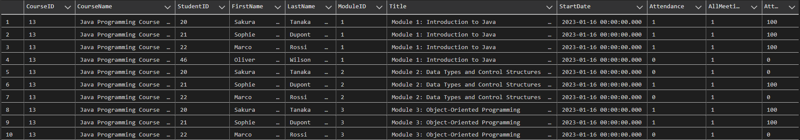
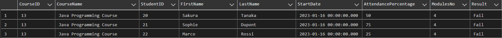
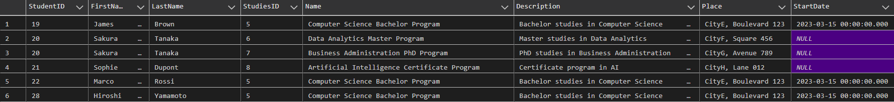
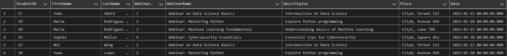
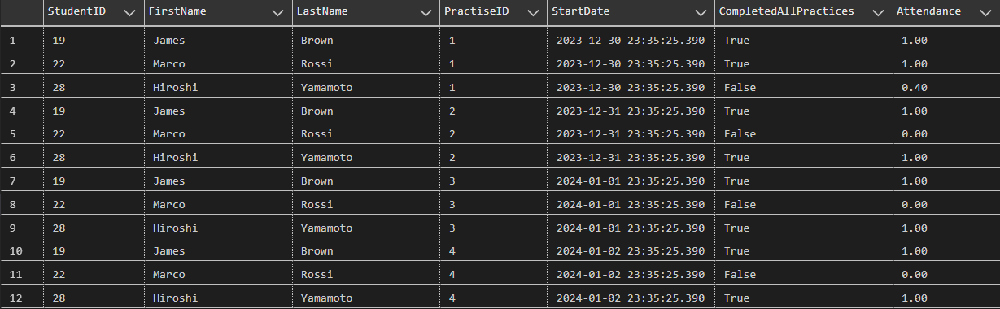
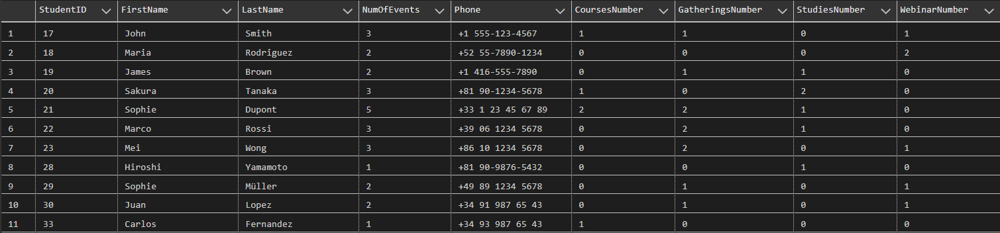
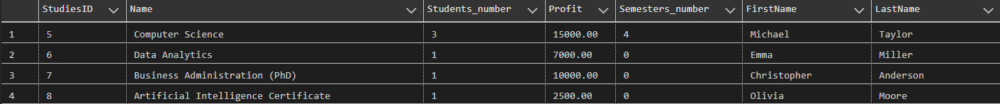

**<p align="center">Bazy Danych: Projekt</p>**

**<p align="center">Raport</p>**

**<p align="center">Zespół 5: Furgała Tomasz, Łukasz Kluza, Mateusz Sacha</p>**

1. Administrator

- Usuwanie webinaru, administrator może usunąć dostępne nagranie webinaru gdy uzna to za stosowne.
- Zarządzanie użytkownikami, administrator ma możliwość edycji kont innych użytkowników.
- Generowanie raportów, administrator generuję raporty zawierająca aktualne statystki.

2. Gość

- Założenie konta, użytkownik może założyć konto, które umożliwia mu korzystanie z systemu
- Przeglądanie kursów, użytkownik ma możliwość zapoznania się z aktualną ofertą kursów i szkoleń.

3. Zalogowany użytkownik

- Zapis na webinar, kurs lub studia, użytkownik może zapisać się na wybraną przez siebie usługę.
- Płatność za usługi, dokonuje opłaty by móc wziąć udział w webinarze, kursie lub studiach oraz wykupuje późniejszy dostęp do materiałów.
- Przeglądanie listy, możliwość przeglądania listy usług, na które dany użytkownik jest zapisany.
- Odbiera dyplom, użytkownik może odebrać dyplom, gdy zostanie on wystawiony przez administratora.

4. Koordynator

- Odraczanie płatności, dyrektor szkoły ma możliwość odroczenia płatności na określony czas.
- Wgląd do kursów oraz webinarów, dyrektor ma możliwość wglądu do danych o kursach i webinarach prowadzonych przez jego pracowników
- Zatwierdzanie programu studiów, dyrektor ma dostęp do ułożonych przez pracowników sylabusów przed opublikowaniem ich oraz możliwość zatwierdzania i wprowadzania poprawek do nich
- Zatwierdzanie nowych kursów i webinarów, dyrektor zatwierdza bądź odrzuca każdy nowy kurs, webinar, stworzony przez jego pracowników

5. Menadżer

- Zarządzaniem limitem miejsc, menadżer ustala maksymalną liczbę osób która może uczestniczyć w danym webinarze, szkoleniu
- Wystawianie dyplomów, menadżer wystawia dyplom użytkownikowi, który spełnił wszystkie regulaminowe przesłanki co to do tego.
- Zarządzanie ofertą, menadżer ma możliwość edycji obecnej oferty jak i możliwość dodawania nowych kursów, szkoleń.

6. Prowadzący/Wykładowca

- Dostęp do swoich webinarów, każdy prowadzący ma nielimitowany czasowo dostęp do nagrań wszystkich swoich webinarów
- Możliwość edycji modułów kursu, prowadzący mają możliwość wprowadzania poprawek oraz modyfikacji materiałów znajdujących się na prowadzonych przez siebie kursach
- Dostęp do systemu ocen i obecności, prowadzący ma dostęp do systemu, w którym może swobodnie zapisywać oraz zmieniać oceny i obecności uczestników jego kursów
- Ułożenie sylabusu, prowadzący musi ułożyć sylabus do każdego z prowadzonych przez siebie przedmiotów w określonym terminie przed rozpoczęciem studiów

7. System

- Generowanie linków do płatności, system sam, automatycznie generuje link do płatności, gdy użytkownik chce opłacić zamówienie.
- Wysyłanie powiadomień, uczestnik spotkania dostaje powiadomienia, gdy rozpoczyna się spotkanie, w którym ma uczestniczyć.
- Powiadomienie o zapłacie, użytkownik do dostaje przypomnienie o konieczności zapłaty tydzień przed ostatecznym terminem dokonania płatności, dotyczy to także zaliczek.

**Diagram bazy danych:**
<p align="center">
  
</p>

**Tabele:**

1. Offers:

Tabela zawiera informacje o wszystkich wydarzeniach jakie są oferowane. Zawiera idetyfikator wydarzenia (OfferID), nazwe, opis oraz typ (Name, Description, Type), typ określa czy jest to webinar, kurs, studia czy pojedyńcza lekcja. Dodatkowo miejsce wydarzenia oraz jego całkowity koszt (Place, Price).

<br>

```sql
CREATE TABLE [dbo].[Offers](
	[OfferID] [int] IDENTITY(1,1) NOT NULL,
	[Name] [nchar](50) NOT NULL,
	[Type] [nchar](15) NOT NULL,
	[Description] [nchar](50) NULL,
	[Place] [nchar](20) NOT NULL,
	[Price] [money] NOT NULL,
	[DiscountToStudents] [float] NULL,
 CONSTRAINT [PK_Offers] PRIMARY KEY CLUSTERED 
(
	[OfferID] ASC
)WITH (PAD_INDEX = OFF, STATISTICS_NORECOMPUTE = OFF, IGNORE_DUP_KEY = OFF, ALLOW_ROW_LOCKS = ON, ALLOW_PAGE_LOCKS = ON, OPTIMIZE_FOR_SEQUENTIAL_KEY = OFF) ON [PRIMARY]
) ON [PRIMARY]

ALTER TABLE [dbo].[Offers] ADD  CONSTRAINT [DF_DiscountToStudents]  DEFAULT ((0.10)) FOR [DiscountToStudents]

ALTER TABLE [dbo].[Offers]  WITH CHECK ADD  CONSTRAINT [CHK_DiscountToStudentsForGathering] CHECK  (([Type]<>'Gathering' OR [Type]='Gathering' AND ([DiscountToStudents] IS NULL OR [DiscountToStudents]>=(0) AND [DiscountToStudents]<=(1))))

ALTER TABLE [dbo].[Offers] CHECK CONSTRAINT [CHK_DiscountToStudentsForGathering]

ALTER TABLE [dbo].[Offers]  WITH CHECK ADD  CONSTRAINT [CHK_PricePrecision] CHECK  (([Price]>=(0) AND round([Price],(2))=[Price]))

ALTER TABLE [dbo].[Offers] CHECK CONSTRAINT [CHK_PricePrecision]

ALTER TABLE [dbo].[Offers]  WITH CHECK ADD  CONSTRAINT [CHK_Type_Values] CHECK  (([Type]='Gathering' OR [Type]='Studies' OR [Type]='Courses' OR [Type]='Webinar'))

ALTER TABLE [dbo].[Offers] CHECK CONSTRAINT [CHK_Type_Values]
```


2. Webinar:

Tabela zawiera informacje o webianrach, zawiera klucz główny (WebinarID), nazwę oraz datę rozpoczęcia (WebinarName, Date), inforamcje o osbie, która to prowadzi (TeacherID) i link do webinaru (MeetingLink).

```sql
CREATE TABLE [dbo].[Webinar](
	[WebinarID] [int] NOT NULL,
	[WebinarName] [nchar](50) NOT NULL,
	[Date] [datetime] NOT NULL,
	[TeacherID] [int] NOT NULL,
	[MeetingLink] [nchar](30) NULL,
 CONSTRAINT [PK_Webinar] PRIMARY KEY CLUSTERED 
(
	[WebinarID] ASC
)WITH (PAD_INDEX = OFF, STATISTICS_NORECOMPUTE = OFF, IGNORE_DUP_KEY = OFF, ALLOW_ROW_LOCKS = ON, ALLOW_PAGE_LOCKS = ON, OPTIMIZE_FOR_SEQUENTIAL_KEY = OFF) ON [PRIMARY]
) ON [PRIMARY]

ALTER TABLE [dbo].[Webinar]  WITH CHECK ADD  CONSTRAINT [FK_Webinar_Offers] FOREIGN KEY([WebinarID])
REFERENCES [dbo].[Offers] ([OfferID])

ALTER TABLE [dbo].[Webinar] CHECK CONSTRAINT [FK_Webinar_Offers]

ALTER TABLE [dbo].[Webinar]  WITH CHECK ADD  CONSTRAINT [FK_Webinar_TeachingStaff] FOREIGN KEY([TeacherID])
REFERENCES [dbo].[TeachingStaff] ([TeacherID])

ALTER TABLE [dbo].[Webinar] CHECK CONSTRAINT [FK_Webinar_TeachingStaff]
```

3. Studies:

Tabela zawiera informacje o studiach, zawiera klucz główny (StudiesID), kierunku studiów oraz opłacie za nie (Name, Fee), koorynatorze, maksymalnej ilości studentów na danym studium (MEnagerID, StudentCapacity).

```sql
CREATE TABLE [dbo].[Studies](
	[StudiesID] [int] NOT NULL,
	[Name] [nchar](50) NOT NULL,
	[Fee] [money] NOT NULL,
	[MenagerID] [int] NOT NULL,
	[StudentCapacity] [int] NOT NULL,
 CONSTRAINT [PK_Studies_1] PRIMARY KEY CLUSTERED 
(
	[StudiesID] ASC
)WITH (PAD_INDEX = OFF, STATISTICS_NORECOMPUTE = OFF, IGNORE_DUP_KEY = OFF, ALLOW_ROW_LOCKS = ON, ALLOW_PAGE_LOCKS = ON, OPTIMIZE_FOR_SEQUENTIAL_KEY = OFF) ON [PRIMARY]
) ON [PRIMARY]S

ALTER TABLE [dbo].[Studies]  WITH CHECK ADD  CONSTRAINT [FK_Studies_Employees] FOREIGN KEY([MenagerID])
REFERENCES [dbo].[Employees] ([EmployeeID])

ALTER TABLE [dbo].[Studies] CHECK CONSTRAINT [FK_Studies_Employees]

ALTER TABLE [dbo].[Studies]  WITH CHECK ADD  CONSTRAINT [FK_Studies_Offers] FOREIGN KEY([StudiesID])
REFERENCES [dbo].[Offers] ([OfferID])

ALTER TABLE [dbo].[Studies] CHECK CONSTRAINT [FK_Studies_Offers]

ALTER TABLE [dbo].[Studies]  WITH CHECK ADD  CONSTRAINT [CHK_Fee_NonNegative] CHECK  (([Fee]>=(0)))

ALTER TABLE [dbo].[Studies] CHECK CONSTRAINT [CHK_Fee_NonNegative]
```

4. Courses:

Tabela zawiera spis wszystkich kursów z kluczem głównym (CourseID), posiada informację o temacie kursu oraz jego nazwie (TopicID, CourseName), a także dacie rozpoczęcia, ilości modułów z których kurs się składa i dacie zapłaty (StartDate, ModulesNo, PaymentDay), całkowitej kwocie jaką należy za kurs zapłacić, kwocie zaliczki oraz zniżce (FullPrice, Deposit, Discount).

```sql
CREATE TABLE [dbo].[Courses](
	[CourseID] [int] IDENTITY(1,1) NOT NULL,
	[TopicID] [int] NOT NULL,
	[CourseName] [nchar](30) NOT NULL,
	[StartDate] [datetime] NOT NULL,
	[ModulesNo] [int] NOT NULL,
	[PaymentDay] [datetime] NOT NULL,
	[FullPrice] [money] NOT NULL,
	[Deposit] [money] NOT NULL,
	[Discount] [float] NOT NULL,
 CONSTRAINT [PK_Courses] PRIMARY KEY CLUSTERED 
(
	[CourseID] ASC
)WITH (PAD_INDEX = OFF, STATISTICS_NORECOMPUTE = OFF, IGNORE_DUP_KEY = OFF, ALLOW_ROW_LOCKS = ON, ALLOW_PAGE_LOCKS = ON, OPTIMIZE_FOR_SEQUENTIAL_KEY = OFF) ON [PRIMARY]
) ON [PRIMARY]

ALTER TABLE [dbo].[Courses]  WITH CHECK ADD  CONSTRAINT [FK_Courses_Offers] FOREIGN KEY([CourseID])
REFERENCES [dbo].[Offers] ([OfferID])

ALTER TABLE [dbo].[Courses] CHECK CONSTRAINT [FK_Courses_Offers]

ALTER TABLE [dbo].[Courses]  WITH CHECK ADD  CONSTRAINT [FK_Courses_Topics] FOREIGN KEY([TopicID])
REFERENCES [dbo].[Topics] ([TopicID])

ALTER TABLE [dbo].[Courses] CHECK CONSTRAINT [FK_Courses_Topics]

ALTER TABLE [dbo].[Courses]  WITH CHECK ADD  CONSTRAINT [CHK_Deposit_Range] CHECK  (([Deposit]>=(0) AND [Deposit]<=[FullPrice]))

ALTER TABLE [dbo].[Courses] CHECK CONSTRAINT [CHK_Deposit_Range]

ALTER TABLE [dbo].[Courses]  WITH CHECK ADD  CONSTRAINT [CHK_Discount_Range] CHECK  (([Discount]>=(0) AND [Discount]<=(1)))

ALTER TABLE [dbo].[Courses] CHECK CONSTRAINT [CHK_Discount_Range]

ALTER TABLE [dbo].[Courses]  WITH CHECK ADD  CONSTRAINT [CHK_FullPrice_NonNegative] CHECK  (([FullPrice]>=(0)))

ALTER TABLE [dbo].[Courses] CHECK CONSTRAINT [CHK_FullPrice_NonNegative]

ALTER TABLE [dbo].[Courses]  WITH CHECK ADD  CONSTRAINT [CHK_ModulesNo_Positive] CHECK  (([ModulesNo]>(0)))

ALTER TABLE [dbo].[Courses] CHECK CONSTRAINT [CHK_ModulesNo_Positive]

ALTER TABLE [dbo].[Courses]  WITH CHECK ADD  CONSTRAINT [CHK_PaymentDay_BeforeStart] CHECK  (([PaymentDay]<=dateadd(day,(-3),[StartDate])))

ALTER TABLE [dbo].[Courses] CHECK CONSTRAINT [CHK_PaymentDay_BeforeStart]
```

5. Gatherings:

Tabela zawiera informacje o zjazdach, posaida klucz główny (GatheringID) i semestr, w ramach którego odbywa się dany zjazd oraz datę w której zjazd się odbywa (SemestrID, Date).

```sql
CREATE TABLE [dbo].[Gatherings](
    [GatheringID] [int] IDENTITY(1,1) NOT NULL,
	[Semester] [int] NOT NULL,
	[Date] [datetime] NOT NULL,
 CONSTRAINT [PK_Gatherings] PRIMARY KEY CLUSTERED 
(
	[GatheringID] ASC
)WITH (PAD_INDEX = OFF, STATISTICS_NORECOMPUTE = OFF, IGNORE_DUP_KEY = OFF, ALLOW_ROW_LOCKS = ON, ALLOW_PAGE_LOCKS = ON, OPTIMIZE_FOR_SEQUENTIAL_KEY = OFF) ON [PRIMARY]
) ON [PRIMARY]

ALTER TABLE [dbo].[Gatherings]  WITH CHECK ADD  CONSTRAINT [FK_Gatherings_Offers] FOREIGN KEY([GatheringID])
REFERENCES [dbo].[Offers] ([OfferID])

ALTER TABLE [dbo].[Gatherings] CHECK CONSTRAINT [FK_Gatherings_Offers]

ALTER TABLE [dbo].[Gatherings]  WITH CHECK ADD  CONSTRAINT [FK_Gatherings_Semesters] FOREIGN KEY([Semester])
REFERENCES [dbo].[Semesters] ([SemesterID])

ALTER TABLE [dbo].[Gatherings] CHECK CONSTRAINT [FK_Gatherings_Semesters]
```

6. Semesters:

W tabeli znajdują się informacje o wszystkich semestrach na wszystkich kierunkach studiów, klucz główny to (SemesterID), zawiera też informacje o kierunku studiów na którym semestr się znajduje, numerze semestru(StudiesID, Semester_no).

```sql
CREATE TABLE [dbo].[Semesters](
	[SemesterID] [int] IDENTITY(1,1) NOT NULL,
	[StudiesID] [int] NOT NULL,
	[Semester_no] [int] NOT NULL,
 CONSTRAINT [PK_Semesters] PRIMARY KEY CLUSTERED 
(
	[SemesterID] ASC
)WITH (PAD_INDEX = OFF, STATISTICS_NORECOMPUTE = OFF, IGNORE_DUP_KEY = OFF, ALLOW_ROW_LOCKS = ON, ALLOW_PAGE_LOCKS = ON, OPTIMIZE_FOR_SEQUENTIAL_KEY = OFF) ON [PRIMARY]
) ON [PRIMARY]

ALTER TABLE [dbo].[Semesters]  WITH CHECK ADD  CONSTRAINT [FK_Semesters_Studies] FOREIGN KEY([StudiesID])
REFERENCES [dbo].[Studies] ([StudiesID])

ALTER TABLE [dbo].[Semesters] CHECK CONSTRAINT [FK_Semesters_Studies]

ALTER TABLE [dbo].[Semesters]  WITH CHECK ADD  CONSTRAINT [CHK_Semester_no_Positive] CHECK  (([Semester_no]>(0)))

ALTER TABLE [dbo].[Semesters] CHECK CONSTRAINT [CHK_Semester_no_Positive]
```

7. Practices:

Tabela zawiera dane o praktykach, posiada klucz główny (PractiseID), semestrze na którym się odbywają i pracowniku, który je prowadzi (SemesterID, EmployeeID), posiada informacje o miejscu, w kótrym praktyki się odbywają, dacie rozpoczęcia, ilości spotkań oraz potrzebnym wyposażeniu (Address, StartDate, MeetingsCount, RequiredEquipment).

```sql
CREATE TABLE [dbo].[Practices](
    [PractiseID] [int] IDENTITY(1,1) NOT NULL,
	[SemesterID] [int] NOT NULL,
	[EmployeeID] [int] NOT NULL,
	[Address] [nchar](40) NOT NULL,
	[StartDate] [datetime] NOT NULL,
	[MeetingsCount] [int] NOT NULL,
	[RequiredEquipment] [nchar](20) NULL,
 CONSTRAINT [PK_Practices] PRIMARY KEY CLUSTERED 
(
	[PractiseID] ASC
)WITH (PAD_INDEX = OFF, STATISTICS_NORECOMPUTE = OFF, IGNORE_DUP_KEY = OFF, ALLOW_ROW_LOCKS = ON, ALLOW_PAGE_LOCKS = ON, OPTIMIZE_FOR_SEQUENTIAL_KEY = OFF) ON [PRIMARY]
) ON [PRIMARY]

ALTER TABLE [dbo].[Practices]  WITH CHECK ADD  CONSTRAINT [FK_Practices_Semesters] FOREIGN KEY([SemesterID])
REFERENCES [dbo].[Semesters] ([SemesterID])

ALTER TABLE [dbo].[Practices] CHECK CONSTRAINT [FK_Practices_Semesters]

ALTER TABLE [dbo].[Practices]  WITH CHECK ADD  CONSTRAINT [FK_Practices_TeachingStaff] FOREIGN KEY([EmployeeID])
REFERENCES [dbo].[TeachingStaff] ([TeacherID])

ALTER TABLE [dbo].[Practices] CHECK CONSTRAINT [FK_Practices_TeachingStaff]

ALTER TABLE [dbo].[Practices]  WITH CHECK ADD  CONSTRAINT [CHK_MeetingsCount_Positive] CHECK  (([MeetingsCount]>(0)))

ALTER TABLE [dbo].[Practices] CHECK CONSTRAINT [CHK_MeetingsCount_Positive]
```

8. PractiseAttendance:

Tabela posiada informacje o obecności studentów na praktykach, posiada klucz główny (PractiseAttendanceID), dla każdego studenta przypisuje czy był obecny na danych praktykach, na które jest zapisany (PractiseID, StudentID, Attendance).

```sql
CREATE TABLE [dbo].[PractiseAttendance](
	[PractiseAttendanceID] [int] IDENTITY(1,1) NOT NULL,
	[PractiseID] [int] NOT NULL,
	[StudentID] [int] NOT NULL,
	[Attendance] [bit] NOT NULL,
 CONSTRAINT [PK_PractiseAttendance] PRIMARY KEY CLUSTERED 
(
	[PractiseAttendanceID] ASC
)WITH (PAD_INDEX = OFF, STATISTICS_NORECOMPUTE = OFF, IGNORE_DUP_KEY = OFF, ALLOW_ROW_LOCKS = ON, ALLOW_PAGE_LOCKS = ON, OPTIMIZE_FOR_SEQUENTIAL_KEY = OFF) ON [PRIMARY]
) ON [PRIMARY]

ALTER TABLE [dbo].[PractiseAttendance]  WITH CHECK ADD  CONSTRAINT [FK_PractiseAttendance_Lessons] FOREIGN KEY([StudentID])
REFERENCES [dbo].[Lessons] ([LessonID])

ALTER TABLE [dbo].[PractiseAttendance] CHECK CONSTRAINT [FK_PractiseAttendance_Lessons]

ALTER TABLE [dbo].[PractiseAttendance]  WITH CHECK ADD  CONSTRAINT [FK_PractiseAttendance_Practices] FOREIGN KEY([PractiseID])
REFERENCES [dbo].[Practices] ([PractiseID])

ALTER TABLE [dbo].[PractiseAttendance] CHECK CONSTRAINT [FK_PractiseAttendance_Practices]

ALTER TABLE [dbo].[PractiseAttendance]  WITH CHECK ADD  CONSTRAINT [FK_PractiseAttendance_Students] FOREIGN KEY([StudentID])
REFERENCES [dbo].[Students] ([StudentID])

ALTER TABLE [dbo].[PractiseAttendance] CHECK CONSTRAINT [FK_PractiseAttendance_Students]
```

9. Subjects:

Tabela zawiera informacje o przedmiotach występujących w semestrach z kluczem głównym (SubjectID), przypisuje przemiot do określonego semestru, posiada nazwę przedmiotu oraz jego opis (SemesterID, SubjectName, Description).

```sql
CREATE TABLE [dbo].[Subjects](
	[SubjectID] [int] IDENTITY(1,1) NOT NULL,
	[SemesterID] [int] NOT NULL,
	[SubjectName] [nchar](50) NOT NULL,
	[Description] [nchar](70) NULL,
 CONSTRAINT [PK_Subjects] PRIMARY KEY CLUSTERED 
(
	[SubjectID] ASC
)WITH (PAD_INDEX = OFF, STATISTICS_NORECOMPUTE = OFF, IGNORE_DUP_KEY = OFF, ALLOW_ROW_LOCKS = ON, ALLOW_PAGE_LOCKS = ON, OPTIMIZE_FOR_SEQUENTIAL_KEY = OFF) ON [PRIMARY]
) ON [PRIMARY]

ALTER TABLE [dbo].[Subjects]  WITH CHECK ADD  CONSTRAINT [FK_Subjects_Semesters] FOREIGN KEY([SemesterID])
REFERENCES [dbo].[Semesters] ([SemesterID])

ALTER TABLE [dbo].[Subjects] CHECK CONSTRAINT [FK_Subjects_Semesters]
```

10. Lessons:

Tabela zawiera informacje o lekcjach zarówno tych na studiach, oraz tych możliwych do kupienia pojedynczo, posida klucz główny (LessonID), przedmiot i zjazd do którego jest przypisana dana lekcja, oraz nauczyciela który ją prowadzi (SubjectID, GatheringID, TeacherID) zawiera temat, datę, typ, język prowadzenia, cenę i czas trwania (TopicID, Date, Type, Language, Price, Duration).

```sql
CREATE TABLE [dbo].[Lessons](
	[LessonID] [int] NOT NULL,
	[SubjectID] [int] NOT NULL,
	[GatheringID] [int] NOT NULL,
	[TeacherID] [int] NOT NULL,
	[TopicID] [int] NOT NULL,
	[Date] [datetime] NOT NULL,
	[Type] [nchar](10) NOT NULL,
	[Language] [nchar](10) NOT NULL,
	[Price] [int] NOT NULL,
	[Duration] [time](7) NULL,
 CONSTRAINT [PK_Lessons] PRIMARY KEY CLUSTERED 
(
	[LessonID] ASC
)WITH (PAD_INDEX = OFF, STATISTICS_NORECOMPUTE = OFF, IGNORE_DUP_KEY = OFF, ALLOW_ROW_LOCKS = ON, ALLOW_PAGE_LOCKS = ON, OPTIMIZE_FOR_SEQUENTIAL_KEY = OFF) ON [PRIMARY]
) ON [PRIMARY]

ALTER TABLE [dbo].[Lessons]  WITH CHECK ADD  CONSTRAINT [FK_Lessons_Gatherings] FOREIGN KEY([GatheringID])
REFERENCES [dbo].[Gatherings] ([GatheringID])

ALTER TABLE [dbo].[Lessons] CHECK CONSTRAINT [FK_Lessons_Gatherings]

ALTER TABLE [dbo].[Lessons]  WITH CHECK ADD  CONSTRAINT [FK_Lessons_Subjects] FOREIGN KEY([SubjectID])
REFERENCES [dbo].[Subjects] ([SubjectID])

ALTER TABLE [dbo].[Lessons] CHECK CONSTRAINT [FK_Lessons_Subjects]

ALTER TABLE [dbo].[Lessons]  WITH CHECK ADD  CONSTRAINT [FK_Lessons_TeachingStaff] FOREIGN KEY([TeacherID])
REFERENCES [dbo].[TeachingStaff] ([TeacherID])

ALTER TABLE [dbo].[Lessons] CHECK CONSTRAINT [FK_Lessons_TeachingStaff]

ALTER TABLE [dbo].[Lessons]  WITH CHECK ADD  CONSTRAINT [FK_Lessons_Topics] FOREIGN KEY([TopicID])
REFERENCES [dbo].[Topics] ([TopicID])

ALTER TABLE [dbo].[Lessons] CHECK CONSTRAINT [FK_Lessons_Topics]

ALTER TABLE [dbo].[Lessons]  WITH CHECK ADD  CONSTRAINT [CHK_Lessons_Type] CHECK  (([Type]='online' OR [Type]='hybrid' OR [Type]='stationary'))

ALTER TABLE [dbo].[Lessons] CHECK CONSTRAINT [CHK_Lessons_Type]
```

11. LessonsAttendance:

Tabela posiada informacje o obecności studentów na lekcjach, posiada klucz główny (LessonsAttendenseID), dla każdego studenta przypisuje czy był obecny na danej lekcji, na którą jest zapisany (LessonID, StudentID, Attendance).

```sql
CREATE TABLE [dbo].[LessonsAttendance](
	[LessonsAttendenseID] [int] IDENTITY(1,1) NOT NULL,
	[LessonID] [int] NOT NULL,
	[StudentID] [int] NOT NULL,
	[Attendance] [bit] NOT NULL,
 CONSTRAINT [PK_LessonsAttendance] PRIMARY KEY CLUSTERED 
(
	[LessonsAttendenseID] ASC
)WITH (PAD_INDEX = OFF, STATISTICS_NORECOMPUTE = OFF, IGNORE_DUP_KEY = OFF, ALLOW_ROW_LOCKS = ON, ALLOW_PAGE_LOCKS = ON, OPTIMIZE_FOR_SEQUENTIAL_KEY = OFF) ON [PRIMARY]
) ON [PRIMARY]

ALTER TABLE [dbo].[LessonsAttendance]  WITH CHECK ADD  CONSTRAINT [FK_LessonsAttendance_Lessons] FOREIGN KEY([LessonID])
REFERENCES [dbo].[Lessons] ([LessonID])

ALTER TABLE [dbo].[LessonsAttendance] CHECK CONSTRAINT [FK_LessonsAttendance_Lessons]

ALTER TABLE [dbo].[LessonsAttendance]  WITH CHECK ADD  CONSTRAINT [FK_LessonsAttendance_Students] FOREIGN KEY([StudentID])
REFERENCES [dbo].[Students] ([StudentID])

ALTER TABLE [dbo].[LessonsAttendance] CHECK CONSTRAINT [FK_LessonsAttendance_Students]

ALTER TABLE [dbo].[LessonsAttendance]  WITH CHECK ADD  CONSTRAINT [FK_LessonsAttendance_Students1] FOREIGN KEY([StudentID])
REFERENCES [dbo].[Students] ([StudentID])

ALTER TABLE [dbo].[LessonsAttendance] CHECK CONSTRAINT [FK_LessonsAttendance_Students1]
```

12. Topics:

Tabela posiada dane o tematach kursów, bądź lekcji, posiada klucz główny (TopicID) oraz nazwę tematu i jego opis (TopicName, Description).

```sql
CREATE TABLE [dbo].[Topics](
    [TopicID] [int] IDENTITY(1,1) NOT NULL,
	[TopicName] [nchar](50) NOT NULL,
	[Description] [nchar](70) NULL,
 CONSTRAINT [PK_Topics] PRIMARY KEY CLUSTERED 
(
	[TopicID] ASC
)WITH (PAD_INDEX = OFF, STATISTICS_NORECOMPUTE = OFF, IGNORE_DUP_KEY = OFF, ALLOW_ROW_LOCKS = ON, ALLOW_PAGE_LOCKS = ON, OPTIMIZE_FOR_SEQUENTIAL_KEY = OFF) ON [PRIMARY]
) ON [PRIMARY]
```

13. Modules:

Tabela zawiera wszystkie moduły, znajdujące się kursach, posiada klucz główny (ModuleID), informacje o kursie, do którego moduł należy oraz jego tytule i typie (CourseID, Title, Type), a także dacie zakończenia i rozpoczęcia oraz klasie, w której się odbywa (EndDate, StartDate, Classroom).

```sql
CREATE TABLE [dbo].[Modules](
	[ModuleID] [int] IDENTITY(1,1) NOT NULL,
	[CourseID] [int] NOT NULL,
	[Title] [nchar](50) NOT NULL,
	[Type] [nchar](10) NOT NULL,
	[EndDate] [datetime] NULL,
	[StartDate] [datetime] NULL,
	[Classroom] [nchar](10) NULL,
 CONSTRAINT [PK_Modules] PRIMARY KEY CLUSTERED 
(
	[ModuleID] ASC
)WITH (PAD_INDEX = OFF, STATISTICS_NORECOMPUTE = OFF, IGNORE_DUP_KEY = OFF, ALLOW_ROW_LOCKS = ON, ALLOW_PAGE_LOCKS = ON, OPTIMIZE_FOR_SEQUENTIAL_KEY = OFF) ON [PRIMARY]
) ON [PRIMARY]

ALTER TABLE [dbo].[Modules]  WITH CHECK ADD  CONSTRAINT [FK_Modules_Courses] FOREIGN KEY([CourseID])
REFERENCES [dbo].[Courses] ([CourseID])

ALTER TABLE [dbo].[Modules] CHECK CONSTRAINT [FK_Modules_Courses]

ALTER TABLE [dbo].[Modules]  WITH CHECK ADD  CONSTRAINT [CHK_Modules_Date_Order] CHECK  (([EndDate]>[StartDate]))

ALTER TABLE [dbo].[Modules] CHECK CONSTRAINT [CHK_Modules_Date_Order]

ALTER TABLE [dbo].[Modules]  WITH CHECK ADD  CONSTRAINT [CHK_Modules_Type_Values] CHECK  (([Type]='online' OR [Type]='hybrid' OR [Type]='stationary'))

ALTER TABLE [dbo].[Modules] CHECK CONSTRAINT [CHK_Modules_Type_Values]
```

14. Meetings:

Tabela zawiera dane o spotkaniach odbywających się w ramach konkretnego modułu, posiada klucz główny (MeetingID), przypisuje spotkanie do modułu, zawiera datę odbycia się i język prowadzenia oraz typ (ModuleID, Date, LanguageID, Type), miejsce odbywania się modułu, link do ewentualnego spotlania online, nauczyciela prowadzącego i tłumacza (Place, Link, TeacherID, TranslatorID).

```sql
CREATE TABLE [dbo].[Meetings](
	[MeetingID] [int] IDENTITY(1,1) NOT NULL,
	[ModuleID] [int] NOT NULL,
	[LanguageID] [int] NOT NULL,
	[Date] [date] NOT NULL,
	[Type] [nchar](10) NOT NULL,
	[Place] [nchar](10) NULL,
	[Link] [nchar](30) NULL,
	[TeacherID] [int] NOT NULL,
	[TranslatorID] [int] NULL,
 CONSTRAINT [PK_Meetings] PRIMARY KEY CLUSTERED 
(
	[MeetingID] ASC
)WITH (PAD_INDEX = OFF, STATISTICS_NORECOMPUTE = OFF, IGNORE_DUP_KEY = OFF, ALLOW_ROW_LOCKS = ON, ALLOW_PAGE_LOCKS = ON, OPTIMIZE_FOR_SEQUENTIAL_KEY = OFF) ON [PRIMARY]
) ON [PRIMARY]

ALTER TABLE [dbo].[Meetings]  WITH CHECK ADD  CONSTRAINT [FK_Meetings_Modules] FOREIGN KEY([ModuleID])
REFERENCES [dbo].[Modules] ([ModuleID])

ALTER TABLE [dbo].[Meetings] CHECK CONSTRAINT [FK_Meetings_Modules]

ALTER TABLE [dbo].[Meetings]  WITH CHECK ADD  CONSTRAINT [FK_Meetings_TeachingStaff] FOREIGN KEY([TeacherID])
REFERENCES [dbo].[TeachingStaff] ([TeacherID])

ALTER TABLE [dbo].[Meetings] CHECK CONSTRAINT [FK_Meetings_TeachingStaff]

ALTER TABLE [dbo].[Meetings]  WITH CHECK ADD  CONSTRAINT [FK_Meetings_Translators] FOREIGN KEY([TranslatorID])
REFERENCES [dbo].[Translators] ([TranslatorID])

ALTER TABLE [dbo].[Meetings] CHECK CONSTRAINT [FK_Meetings_Translators]

ALTER TABLE [dbo].[Meetings]  WITH CHECK ADD  CONSTRAINT [CHK_Meetings_Type_Values] CHECK  (([Type]='online' OR [Type]='hybrid' OR [Type]='stationary'))

ALTER TABLE [dbo].[Meetings] CHECK CONSTRAINT [CHK_Meetings_Type_Values]
```

15. CourseAttendace:

Tabela posiada informacje o obecności studentów na spotkaniach w donym module kursu, posiada klucz główny (AttendanceID), dla każdego studenta przypisuje czy był obecny na danym spotkaniu, na które jest zapisany (MeetingID, StudentID, Attendance).

```sql
CREATE TABLE [dbo].[CourseAttendance](
	[AttendanceID] [int] IDENTITY(1,1) NOT NULL,
	[MeetingID] [int] NOT NULL,
	[StudentID] [int] NOT NULL,
	[Attendance] [bit] NOT NULL,
 CONSTRAINT [PK_Attendance] PRIMARY KEY CLUSTERED 
(
	[AttendanceID] ASC
)WITH (PAD_INDEX = OFF, STATISTICS_NORECOMPUTE = OFF, IGNORE_DUP_KEY = OFF, ALLOW_ROW_LOCKS = ON, ALLOW_PAGE_LOCKS = ON, OPTIMIZE_FOR_SEQUENTIAL_KEY = OFF) ON [PRIMARY]
) ON [PRIMARY]

ALTER TABLE [dbo].[CourseAttendance]  WITH CHECK ADD  CONSTRAINT [FK_Attendance_Meetings] FOREIGN KEY([MeetingID])
REFERENCES [dbo].[Meetings] ([MeetingID])

ALTER TABLE [dbo].[CourseAttendance] CHECK CONSTRAINT [FK_Attendance_Meetings]

ALTER TABLE [dbo].[CourseAttendance]  WITH CHECK ADD  CONSTRAINT [FK_Attendance_Students] FOREIGN KEY([StudentID])
REFERENCES [dbo].[Students] ([StudentID])

ALTER TABLE [dbo].[CourseAttendance] CHECK CONSTRAINT [FK_Attendance_Students]
```

16. Orders:

Tabela przypisuje zamówienie do określonego studenta, posiada klucz główny (OrderID), studenta, do którego należy zamówienie, datę jego złożenia (StudentID, OrderDate). 
```sql
CREATE TABLE [dbo].[Orders](
    [OrderID] [int] IDENTITY(1,1) NOT NULL,
	[StudentID] [int] NOT NULL,
	[OrderDate] [datetime] NOT NULL,
 CONSTRAINT [PK_Cart] PRIMARY KEY CLUSTERED 
(
	[OrderID] ASC
)WITH (PAD_INDEX = OFF, STATISTICS_NORECOMPUTE = OFF, IGNORE_DUP_KEY = OFF, ALLOW_ROW_LOCKS = ON, ALLOW_PAGE_LOCKS = ON, OPTIMIZE_FOR_SEQUENTIAL_KEY = OFF) ON [PRIMARY]
) ON [PRIMARY]

ALTER TABLE [dbo].[Orders]  WITH CHECK ADD  CONSTRAINT [FK_Orders_Students] FOREIGN KEY([StudentID])
REFERENCES [dbo].[Students] ([StudentID])

ALTER TABLE [dbo].[Orders] CHECK CONSTRAINT [FK_Orders_Students]
```

17. Order_Details:

Tabela zawiera szczegółowe informacje o konkretnym zamówieniu, posiada klucz główny (OrderDetailsID), przypisuje ofertę do złożonego zamówienia, który się w nim znajdu (OrderID, OfferID), wartość produktu i zniżke(Value, Discount), zniażka jest wartoscia typu float z zakresu od 0 do 1. 

```sql
CREATE TABLE [dbo].[Order_details](
    [OrderDetailsID] [int] IDENTITY(1,1) NOT NULL,
	[OrderID] [int] NOT NULL,
	[OfferID] [int] NOT NULL,
	[Value] [money] NOT NULL,
	[Discount] [float] NOT NULL,
 CONSTRAINT [PK_Cart_details] PRIMARY KEY CLUSTERED 
(
	[OrderDetailsID] ASC
)WITH (PAD_INDEX = OFF, STATISTICS_NORECOMPUTE = OFF, IGNORE_DUP_KEY = OFF, ALLOW_ROW_LOCKS = ON, ALLOW_PAGE_LOCKS = ON, OPTIMIZE_FOR_SEQUENTIAL_KEY = OFF) ON [PRIMARY]
) ON [PRIMARY]

ALTER TABLE [dbo].[Order_details]  WITH CHECK ADD  CONSTRAINT [FK_Cart_details_Cart] FOREIGN KEY([OrderID])
REFERENCES [dbo].[Orders] ([OrderID])

ALTER TABLE [dbo].[Order_details] CHECK CONSTRAINT [FK_Cart_details_Cart]

ALTER TABLE [dbo].[Order_details]  WITH CHECK ADD  CONSTRAINT [FK_Order_details_Offers] FOREIGN KEY([OfferID])
REFERENCES [dbo].[Offers] ([OfferID])

ALTER TABLE [dbo].[Order_details] CHECK CONSTRAINT [FK_Order_details_Offers]

ALTER TABLE [dbo].[Order_details]  WITH CHECK ADD  CONSTRAINT [CHK_OrderDetails_Discount_Range] CHECK  (([Discount]>=(0) AND [Discount]<=(1)))

ALTER TABLE [dbo].[Order_details] CHECK CONSTRAINT [CHK_OrderDetails_Discount_Range]

ALTER TABLE [dbo].[Order_details]  WITH CHECK ADD  CONSTRAINT [CHK_OrderDetails_Value_NonNegative] CHECK  (([Value]>=(0)))

ALTER TABLE [dbo].[Order_details] CHECK CONSTRAINT [CHK_OrderDetails_Value_NonNegative]
```

18. Payments:

Tabela zawiera dane o płatnościach, posiada klucz główny (PaymentID), łączy płatność z określonym zamówieniem(OrderID), zawiera datę, wartość oraz status płatności (Date, Value, IsCancelled), status jest typu bit.

```sql
CREATE TABLE [dbo].[Payments](
	[PaymentID] [int] IDENTITY(1,1) NOT NULL,
	[OrderID] [int] NOT NULL,
	[Date] [datetime] NOT NULL,
	[Value] [money] NOT NULL,
	[IsCancelled] [bit] NOT NULL,
 CONSTRAINT [PK_Payments] PRIMARY KEY CLUSTERED 
(
	[PaymentID] ASC
)WITH (PAD_INDEX = OFF, STATISTICS_NORECOMPUTE = OFF, IGNORE_DUP_KEY = OFF, ALLOW_ROW_LOCKS = ON, ALLOW_PAGE_LOCKS = ON, OPTIMIZE_FOR_SEQUENTIAL_KEY = OFF) ON [PRIMARY]
) ON [PRIMARY]

ALTER TABLE [dbo].[Payments]  WITH CHECK ADD  CONSTRAINT [FK_Payments_Cart] FOREIGN KEY([OrderID])
REFERENCES [dbo].[Orders] ([OrderID])

ALTER TABLE [dbo].[Payments] CHECK CONSTRAINT [FK_Payments_Cart]

ALTER TABLE [dbo].[Payments]  WITH CHECK ADD  CONSTRAINT [CHK_Payments_Value_Positive] CHECK  (([Value]>(0)))

ALTER TABLE [dbo].[Payments] CHECK CONSTRAINT [CHK_Payments_Value_Positive]
```

19. Users:

Tabela zawiera wszystkich użytkowników z całej bazy danych, posiada klucz główny (UserID), do tego dla każdego użytkownika przypisuje login i hasło (Login, Password).

```sql
CREATE TABLE [dbo].[Users](
	[UserID] [int] IDENTITY(1,1) NOT NULL,
	[Login] [nchar](20) NOT NULL,
	[Password] [nchar](20) NOT NULL,
 CONSTRAINT [PK_Users] PRIMARY KEY CLUSTERED 
(
	[UserID] ASC
)WITH (PAD_INDEX = OFF, STATISTICS_NORECOMPUTE = OFF, IGNORE_DUP_KEY = OFF, ALLOW_ROW_LOCKS = ON, ALLOW_PAGE_LOCKS = ON, OPTIMIZE_FOR_SEQUENTIAL_KEY = OFF) ON [PRIMARY],
 CONSTRAINT [UQ_Users_Login] UNIQUE NONCLUSTERED 
(
	[Login] ASC
)WITH (PAD_INDEX = OFF, STATISTICS_NORECOMPUTE = OFF, IGNORE_DUP_KEY = OFF, ALLOW_ROW_LOCKS = ON, ALLOW_PAGE_LOCKS = ON, OPTIMIZE_FOR_SEQUENTIAL_KEY = OFF) ON [PRIMARY]
) ON [PRIMARY]

ALTER TABLE [dbo].[Users]  WITH CHECK ADD  CONSTRAINT [CHK_Users_Login_Length] CHECK  ((len([Login])>=(5)))

ALTER TABLE [dbo].[Users] CHECK CONSTRAINT [CHK_Users_Login_Length]

ALTER TABLE [dbo].[Users]  WITH CHECK ADD  CONSTRAINT [CHK_Users_Password_Length] CHECK  ((len([Password])>=(8)))

ALTER TABLE [dbo].[Users] CHECK CONSTRAINT [CHK_Users_Password_Length]
```


20. Students:

Tabela posiada wszystkch zarejestrowanych studentów, zawiera klucz główny (StudentID). Przechowuje informacje o studentach takie jak: imię, nazwisko, datę urodzenia (FirstName, LastName, BirthDate), z jakiego kraju pochodzi i dane adresowe (CountryID, Country, Region, City, ZipCode, Street), numer prywatnego i domowego telefonu (Phone, HomeNumber).

```sql
CREATE TABLE [dbo].[Students](
	[StudentID] [int] NOT NULL,
	[FirstName] [nchar](20) NOT NULL,
	[LastName] [nchar](20) NOT NULL,
	[BirthDate] [date] NOT NULL,
	[CountryID] [int] NOT NULL,
	[Region] [nchar](20) NOT NULL,
	[City] [nchar](20) NOT NULL,
	[ZipCode] [nchar](10) NOT NULL,
	[Street] [nchar](20) NOT NULL,
	[Phone] [nchar](20) NOT NULL,
	[HomeNumber] [nchar](15) NULL,
 CONSTRAINT [PK_Students] PRIMARY KEY CLUSTERED 
(
	[StudentID] ASC
)WITH (PAD_INDEX = OFF, STATISTICS_NORECOMPUTE = OFF, IGNORE_DUP_KEY = OFF, ALLOW_ROW_LOCKS = ON, ALLOW_PAGE_LOCKS = ON, OPTIMIZE_FOR_SEQUENTIAL_KEY = OFF) ON [PRIMARY]
) ON [PRIMARY]

ALTER TABLE [dbo].[Students]  WITH CHECK ADD  CONSTRAINT [FK_Students_Countries] FOREIGN KEY([CountryID])
REFERENCES [dbo].[Countries] ([CountryID])

ALTER TABLE [dbo].[Students] CHECK CONSTRAINT [FK_Students_Countries]

ALTER TABLE [dbo].[Students]  WITH CHECK ADD  CONSTRAINT [FK_Students_Users] FOREIGN KEY([StudentID])
REFERENCES [dbo].[Users] ([UserID])

ALTER TABLE [dbo].[Students] CHECK CONSTRAINT [FK_Students_Users]

ALTER TABLE [dbo].[Students]  WITH CHECK ADD  CONSTRAINT [CHK_Students_BirthDate] CHECK  (([BirthDate]<=getdate()))

ALTER TABLE [dbo].[Students] CHECK CONSTRAINT [CHK_Students_BirthDate]
```

21. Employees:

Tabela zawiera o wszystkich pracownikach, posiada klucz główny (EmployeeID) oraz inforamcaje o pracowniku takie jak: pozycję, imię, nazwisko (PositionID, FirstName, LastName), datę zatrudnienia, pensje, email, numer telefonu oraz miasto (HireDate, Salary, Email, Phone, City), dodatkowo informację czy dany pracownik wciąż dla nas pracuje(IsActive).

```sql
CREATE TABLE [dbo].[Employees](
    [EmployeeID] [int] IDENTITY(1,1) NOT NULL,
	[PositionID] [int] NOT NULL,
	[FirstName] [nchar](20) NOT NULL,
	[LastName] [nchar](20) NOT NULL,
	[HireDate] [date] NOT NULL,
	[Salary] [money] NOT NULL,
	[Email] [nchar](30) NOT NULL,
	[Phone] [nchar](15) NOT NULL,
	[City] [nchar](20) NOT NULL,
	[IsActive] [bit] NOT NULL,
 CONSTRAINT [PK_Employees] PRIMARY KEY CLUSTERED 
(
	[EmployeeID] ASC
)WITH (PAD_INDEX = OFF, STATISTICS_NORECOMPUTE = OFF, IGNORE_DUP_KEY = OFF, ALLOW_ROW_LOCKS = ON, ALLOW_PAGE_LOCKS = ON, OPTIMIZE_FOR_SEQUENTIAL_KEY = OFF) ON [PRIMARY],
 CONSTRAINT [UQ_Employees_Email] UNIQUE NONCLUSTERED 
(
	[Email] ASC
)WITH (PAD_INDEX = OFF, STATISTICS_NORECOMPUTE = OFF, IGNORE_DUP_KEY = OFF, ALLOW_ROW_LOCKS = ON, ALLOW_PAGE_LOCKS = ON, OPTIMIZE_FOR_SEQUENTIAL_KEY = OFF) ON [PRIMARY]
) ON [PRIMARY]

ALTER TABLE [dbo].[Employees]  WITH CHECK ADD  CONSTRAINT [FK_Employees_Position] FOREIGN KEY([PositionID])
REFERENCES [dbo].[Positions] ([PositionID])

ALTER TABLE [dbo].[Employees] CHECK CONSTRAINT [FK_Employees_Position]

ALTER TABLE [dbo].[Employees]  WITH CHECK ADD  CONSTRAINT [FK_Employees_Users] FOREIGN KEY([EmployeeID])
REFERENCES [dbo].[Users] ([UserID])

ALTER TABLE [dbo].[Employees] CHECK CONSTRAINT [FK_Employees_Users]

ALTER TABLE [dbo].[Employees]  WITH CHECK ADD  CONSTRAINT [CHK_Employees_Email_Format] CHECK  ((charindex('@',[Email])>(0)))

ALTER TABLE [dbo].[Employees] CHECK CONSTRAINT [CHK_Employees_Email_Format]

ALTER TABLE [dbo].[Employees]  WITH CHECK ADD  CONSTRAINT [CHK_Employees_Salary] CHECK  (([Salary]>(0)))

ALTER TABLE [dbo].[Employees] CHECK CONSTRAINT [CHK_Employees_Salary]

```

22. TeachingStaff:

Tabela zawiera inforamacje o kadrze nauczycielskiej, posiada klucz główny (TeacherID) oraz informajce o tym w jakim języku prowadzi zajęcia i jego stopień naukowy (LanguageID, Degree).

```sql
CREATE TABLE [dbo].[TeachingStaff](
	[TeacherID] [int] NOT NULL,
	[LanguageID] [int] NOT NULL,
	[Degree] [nchar](30) NOT NULL,
 CONSTRAINT [PK_TeachingStaff] PRIMARY KEY CLUSTERED 
(
	[TeacherID] ASC
)WITH (PAD_INDEX = OFF, STATISTICS_NORECOMPUTE = OFF, IGNORE_DUP_KEY = OFF, ALLOW_ROW_LOCKS = ON, ALLOW_PAGE_LOCKS = ON, OPTIMIZE_FOR_SEQUENTIAL_KEY = OFF) ON [PRIMARY]
) ON [PRIMARY]

ALTER TABLE [dbo].[TeachingStaff]  WITH CHECK ADD  CONSTRAINT [FK_TeachingStaff_Employees] FOREIGN KEY([TeacherID])
REFERENCES [dbo].[Employees] ([EmployeeID])

ALTER TABLE [dbo].[TeachingStaff] CHECK CONSTRAINT [FK_TeachingStaff_Employees]

ALTER TABLE [dbo].[TeachingStaff]  WITH CHECK ADD  CONSTRAINT [CK_TeachingStaff_Degree] CHECK  (([Degree]='professor' OR [Degree]='doctor' OR [Degree]='master' OR [Degree]='bachelor' OR [Degree]='none'))

ALTER TABLE [dbo].[TeachingStaff] CHECK CONSTRAINT [CK_TeachingStaff_Degree]
```


23. Translators:

Tabela zawiera inforamacje o tłumaczach, posiada klucz główny (TranslatorID) oraz informacje o języku z którego tłumaczy (LanguageID).

```sql
CREATE TABLE [dbo].[Translators](
	[TranslatorID] [int] NOT NULL,
	[LanguageID] [int] NOT NULL,
 CONSTRAINT [PK_Translators] PRIMARY KEY CLUSTERED 
(
	[TranslatorID] ASC
)WITH (PAD_INDEX = OFF, STATISTICS_NORECOMPUTE = OFF, IGNORE_DUP_KEY = OFF, ALLOW_ROW_LOCKS = ON, ALLOW_PAGE_LOCKS = ON, OPTIMIZE_FOR_SEQUENTIAL_KEY = OFF) ON [PRIMARY]
) ON [PRIMARY]

ALTER TABLE [dbo].[Translators]  WITH CHECK ADD  CONSTRAINT [FK_Translators_Employees] FOREIGN KEY([TranslatorID])
REFERENCES [dbo].[Employees] ([EmployeeID])

ALTER TABLE [dbo].[Translators] CHECK CONSTRAINT [FK_Translators_Employees]

ALTER TABLE [dbo].[Translators]  WITH CHECK ADD  CONSTRAINT [FK_Translators_Languages] FOREIGN KEY([LanguageID])
REFERENCES [dbo].[Languages] ([LanguageID])

ALTER TABLE [dbo].[Translators] CHECK CONSTRAINT [FK_Translators_Languages]
```


24. Administrators:

Tabela zawiera inforamacja o admnistarotach zawiera klucz głowny (AdminID) oraz data otrzymania uprawnień (Add_date).

```sql
CREATE TABLE [dbo].[Administrators](
	[AdminID] [int] IDENTITY(1,1) NOT NULL,
	[Add_date] [datetime] NOT NULL,
 CONSTRAINT [PK_Administrators_1] PRIMARY KEY CLUSTERED 
(
	[AdminID] ASC
)WITH (PAD_INDEX = OFF, STATISTICS_NORECOMPUTE = OFF, IGNORE_DUP_KEY = OFF, ALLOW_ROW_LOCKS = ON, ALLOW_PAGE_LOCKS = ON, OPTIMIZE_FOR_SEQUENTIAL_KEY = OFF) ON [PRIMARY]
) ON [PRIMARY]

ALTER TABLE [dbo].[Administrators]  WITH CHECK ADD  CONSTRAINT [FK_Administrators_Employees] FOREIGN KEY([AdminID])
REFERENCES [dbo].[Employees] ([EmployeeID])

ALTER TABLE [dbo].[Administrators] CHECK CONSTRAINT [FK_Administrators_Employees]
```


25. Countries:

Tabela zawiera informacje o krajach, posiada klucz główny (CountryID), nazwę kraju i język (CountryName, LanguageID).

```sql
CREATE TABLE [dbo].[Countries](
	[CountryID] [int] IDENTITY(1,1) NOT NULL,
	[CountryName] [nchar](20) NOT NULL,
	[LanguageID] [int] NOT NULL,
 CONSTRAINT [PK_Countries2] PRIMARY KEY CLUSTERED 
(
	[CountryID] ASC
)WITH (PAD_INDEX = OFF, STATISTICS_NORECOMPUTE = OFF, IGNORE_DUP_KEY = OFF, ALLOW_ROW_LOCKS = ON, ALLOW_PAGE_LOCKS = ON, OPTIMIZE_FOR_SEQUENTIAL_KEY = OFF) ON [PRIMARY]
) ON [PRIMARY]

ALTER TABLE [dbo].[Countries]  WITH CHECK ADD  CONSTRAINT [FK_Countries_Languages] FOREIGN KEY([LanguageID])
REFERENCES [dbo].[Languages] ([LanguageID])

ALTER TABLE [dbo].[Countries] CHECK CONSTRAINT [FK_Countries_Languages]
```

26. Languages:

Tabela zawiera informacje o językach, posiada klucz główny (LanguageID) oraz nazwę języka (LanguageName).

```sql
CREATE TABLE [dbo].[Languages](
	[LanguageID] [int] IDENTITY(1,1) NOT NULL,
	[LanguageName] [nchar](20) NOT NULL,
 CONSTRAINT [PK_Languages] PRIMARY KEY CLUSTERED 
(
	[LanguageID] ASC
)WITH (PAD_INDEX = OFF, STATISTICS_NORECOMPUTE = OFF, IGNORE_DUP_KEY = OFF, ALLOW_ROW_LOCKS = ON, ALLOW_PAGE_LOCKS = ON, OPTIMIZE_FOR_SEQUENTIAL_KEY = OFF) ON [PRIMARY]
) ON [PRIMARY]
```

27. Position

Tabela zawiera informacje o stanowiskach, posiada klucz główny (PositionID) oraz nazwę stanowski w postaci znakowej (PositionName).

```sql
CREATE TABLE [dbo].[Positions](
	[PositionID] [int] IDENTITY(1,1) NOT NULL,
	[PositionName] [nchar](15) NOT NULL,
 CONSTRAINT [PK_Position] PRIMARY KEY CLUSTERED 
(
	[PositionID] ASC
)WITH (PAD_INDEX = OFF, STATISTICS_NORECOMPUTE = OFF, IGNORE_DUP_KEY = OFF, ALLOW_ROW_LOCKS = ON, ALLOW_PAGE_LOCKS = ON, OPTIMIZE_FOR_SEQUENTIAL_KEY = OFF) ON [PRIMARY]
) ON [PRIMARY]

ALTER TABLE [dbo].[Positions]  WITH CHECK ADD  CONSTRAINT [CHK_Positions_PositionName] CHECK  (([PositionName]='director' OR [PositionName]='administrator' OR [PositionName]='educator' OR [PositionName]='menager'))

ALTER TABLE [dbo].[Positions] CHECK CONSTRAINT [CHK_Positions_PositionName]
```
**Widoki:**

1. AttendanceMeetingView

Widok przedstawiający obecność studentów na spotkaniach. Dla każdego kursu podaje sumę obecności, łączną liczbę spotkań oraz procentową obecność. Umożliwia analizę uczestnictwa studentów w ramach konkretnych kursów i modułów.

```sql
CREATE VIEW [dbo].[AttendanceMeetingView] AS
SELECT 
	c.CourseID, 
	c.CourseName, 
	a.StudentID, 
	s.FirstName, 
	s.LastName, 
	m.ModuleID, 
	m.Title, 
	c.StartDate, 
	SUM(CAST(a.Attendance AS INT)) AS Attendance, 
	COUNT(CAST(a.Attendance AS INT) * 100) AS AllMeeting, 
    AVG(CAST(a.Attendance AS INT) * 100) AS AttendancePercentage
FROM     
	dbo.Courses AS c 
INNER JOIN 
	dbo.Modules AS m ON m.CourseID = c.CourseID 
INNER JOIN
    dbo.Meetings AS me ON me.ModuleID = m.ModuleID 
INNER JOIN
    dbo.CourseAttendance AS a ON a.MeetingID = me.MeetingID 
INNER JOIN
    dbo.Students AS s ON a.StudentID = s.StudentID
GROUP BY c.CourseID, c.CourseName, a.StudentID, s.FirstName, s.LastName, m.ModuleID, m.Title, c.StartDate
```

<p align="center">
  
</p>


2. CoursesPass

Widok ten identyfikuje, czy studenci zaliczyli kurs na podstawie procentowej obecności w poszczególnych modułach. Dla każdego kursu podaje procentową obecność, łączną liczbę modułów oraz status "Pass" lub "Fail" w zależności od spełnienia warunku procentowej obecności (80% lub więcej). Umożliwia monitorowanie postępów studentów i ocenę ich osiągnięć w kontekście kursów.

```sql
CREATE VIEW [dbo].[CoursesPass] As
SELECT 
	amv.CourseID, 
	amv.CourseName, 
	amv.StudentID, 
	s.FirstName, 
	s.LastName, 
	c.StartDate, 
	COUNT(amv.ModuleID) * 100 / c.ModulesNo AS AttendancePercentage, 
	c.ModulesNo, 
	CASE WHEN ((COUNT(amv.ModuleID) * 100) / c.ModulesNo) 
                  >= 80 THEN 'Pass' ELSE 'Fail' END AS Result
FROM     
	dbo.AttendanceMeetingView AS amv 
INNER JOIN
    dbo.Courses AS c ON amv.CourseID = c.CourseID 
INNER JOIN
    dbo.Students AS s ON amv.StudentID = s.StudentID
WHERE  
	amv.AttendancePercentage = 100
GROUP BY amv.CourseID, amv.CourseName, amv.StudentID, s.FirstName, s.LastName, c.ModulesNo, c.StartDate
```

<p align="center">
  
</p>


3. ConflictingTranslatorMeetings

Widok [ConflictingTranslatorMeetings] identyfikuje konfliktowe spotkania tłumaczy, prezentując informacje o dwóch spotkaniach o różnych identyfikatorach (ModuleID1 i ModuleID2), które mają tę samą datę (MeetingDate) oraz dotyczą tego samego tłumacza (PersonID). Dodatkowo, widok dostarcza imię (FirstName) i nazwisko (LastName) tłumacza za pomocą danych pobranych z tabeli pracowników (Employees).

```sql
CREATE VIEW [dbo].[ConflictingTranslatorMeetings] AS
SELECT 
    M1.ModuleID AS ModuleID1, 
    M2.ModuleID AS ModuleID2, 
    M1.Date AS MeetingDate, 
    M1.TranslatorID AS PersonID, 
    T.FirstName, 
    T.LastName
FROM 
    Meetings M1
JOIN 
    Meetings M2 ON M1.TranslatorID = M2.TranslatorID
JOIN 
    Employees T ON M1.TranslatorID = T.EmployeeID
WHERE 
    M1.MeetingID <> M2.MeetingID 
    AND M1.Date = M2.Date  
    AND M1.MeetingID < M2.MeetingID 
```
<p align="center">
  
</p>

4. CourseProfitView

Widok ten zawiera informacje o studentach zapisanych na kursy, prezentując identyfikator studenta (StudentID), imię (FirstName) i nazwisko (LastName) studenta, identyfikator kursu (CourseID), nazwę kursu (CourseName), opis kursu (CourseDescription), miejsce kursu (CoursePlace), oraz datę rozpoczęcia kursu (StartDate). 

```sql
CREATE VIEW [dbo].[CourseProfitView] AS
SELECT
	c.CourseID,
    c.CourseName,
	ISNULL((
        SELECT COUNT(od.OrderDetailsID)
        FROM Order_details od
        WHERE od.OfferID = c.CourseID
    ), 0) AS Students_number,
    ISNULL((
        SELECT SUM(od.Value)
        FROM Order_details od
        WHERE od.OrderID IN (SELECT p.OrderID FROM Payments p)
        AND od.OfferID = c.CourseID
    ), 0) AS Profit,
	c.ModulesNo,
	c.StartDate
FROM
    Courses c
```
<p align="center">
  
</p>

5. EnrolledStudentsToCourses


Widok przedstawia informacje o studentach zapisanych na kursy. Zawiera identyfikator studenta (StudentID), imię (FirstName) i nazwisko (LastName) studenta, identyfikator kursu (CourseID), nazwę kursu (Name), opis kursu (Description), miejsce kursu (Place), oraz datę rozpoczęcia kursu (StartDate). 

```sql
CREATE VIEW [dbo].[EnrolledStudentsToCourses] AS
SELECT 
	S.StudentID, 
	S.FirstName, 
	S.LastName, 
	O.OfferID AS CourseID, 
	O.Name AS Name, 
	O.Description AS Description, 
	O.Place AS Place, 
	C.StartDate AS StartDate
FROM     
	Students AS S 
INNER JOIN
    Orders AS Ord ON S.StudentID = Ord.StudentID 
INNER JOIN
    Order_details AS Od ON Ord.OrderID = Od.OrderID 
INNER JOIN
    Offers AS O ON Od.OfferID = O.OfferID 
INNER JOIN
    Courses AS C ON O.OfferID = C.CourseID
WHERE  
	O.Type = 'Courses'
```

<p align="center">
  
</p>

6. EnrolledStudentsToGatherings

Widok [EnrolledStudentsToGatherings] dostarcza informacje o studentach zapisanych na spotkania. Prezentuje identyfikator studenta (StudentID), imię (FirstName) i nazwisko (LastName) studenta, identyfikator spotkania (GatheringID), nazwę spotkania (Name), opis spotkania (Description), miejsce spotkania (Place), oraz datę spotkania (Date).

```sql
SELECT 
	S.StudentID, 
	S.FirstName, 
	S.LastName, 
	O.OfferID AS GatheringID, 
	O.Name AS Name, 
	O.Description AS Description, 
	O.Place AS Palce, 
	G.Date AS Date
FROM     
	Students AS S 
INNER JOIN
    Orders AS Ord ON S.StudentID = Ord.StudentID 
INNER JOIN
    Order_details AS Od ON Ord.OrderID = Od.OrderID 
INNER JOIN
    Offers AS O ON Od.OfferID = O.OfferID 
INNER JOIN
    Gatherings AS G ON O.OfferID = G.GatheringID
WHERE  
	O.Type = 'Gathering'
```

<p align="center">
  
</p>

7. EnrolledStudentsToStudies

Widok dostarcza informacje o studentach zapisanych na studia. Prezentuje identyfikator studenta (StudentID), imię (FirstName) i nazwisko (LastName) studenta, identyfikator studiów (StudiesID), nazwę oferty studiów (Name), opis oferty studiów (Description), miejsce oferty studiów (Place), oraz datę rozpoczęcia studiów (StartDate). 

```sql
CREATE VIEW [dbo].[EnrolledStudentsToStudies] AS
SELECT 
	S.StudentID, 
	S.FirstName, 
	S.LastName, 
	St.StudiesID, 
	O.Name AS Name, 
	O.Description AS Description, 
	O.Place AS Place, 
	MIN(G.Date) AS StartDate
FROM     
	Students AS S 
LEFT OUTER JOIN
    Orders AS Ord ON S.StudentID = Ord.StudentID 
LEFT OUTER JOIN
    Order_details AS Od ON Ord.OrderID = Od.OrderID 
LEFT OUTER JOIN
    Offers AS O ON Od.OfferID = O.OfferID 
LEFT OUTER JOIN
    Studies AS St ON O.OfferID = St.StudiesID 
LEFT OUTER JOIN
    Semesters AS Sem ON St.StudiesID = Sem.StudiesID 
LEFT OUTER JOIN
    Gatherings AS G ON Sem.SemesterID = G.SemesterID
WHERE  
	O.Type = 'Studies'
GROUP BY
	S.StudentID, S.FirstName, S.LastName, St.StudiesID, O.OfferID, O.Name, O.Description, O.Place
```

<p align="center">
  
</p>

8. EnrolledStudentsToWebinars

Widok dostarcza informacje o studentach zapisanych na webinary. Prezentuje identyfikator studenta (StudentID), imię (FirstName) i nazwisko (LastName) studenta, identyfikator webinaru (WebinarID), nazwę spotkania (Name), opis spotkania (Description), miejsce spotkania (Place), oraz datę webinaru (Date). Zastosowanie tego widoku ułatwia monitorowanie uczestnictwa studentów w webinarach, umożliwiając identyfikację zapisanych osób oraz szczegółowe informacje o danym wydarzeniu edukacyjnym.

```sql
CREATE VIEW [dbo].[EnrolledStudentsToWebinars] AS
SELECT 
	S.StudentID, 
	S.FirstName, 
	S.LastName, 
	O.OfferID AS WebinarID, 
	O.Name AS WebinarName, 
	O.Description AS Descritpion, 
	O.Place AS Place, 
	W.Date
FROM     
	Students AS S 
INNER JOIN
	Orders AS Ord ON S.StudentID = Ord.StudentID 
INNER JOIN
    Order_details AS Od ON Ord.OrderID = Od.OrderID 
INNER JOIN
    Offers AS O ON Od.OfferID = O.OfferID 
INNER JOIN
	Webinar AS W ON O.OfferID = W.WebinarID
WHERE  
    O.Type = 'Webinar';
```
<p align="center">
  
</p>


9. ListOfDebtors

Widok [ListOfDebtors] przedstawia szczegółowe informacje o osobach, które wzięły udział w różnych wydarzeniach, ale jeszcze nie uregulowały swoich płatności, pozostając w stanie zadłużenia. Zidentyfikowani dłużnicy są grupowani według identyfikatora studenta (StudentID) oraz oferty (OfferID), a informacje obejmują imię i nazwisko studenta (Student_name), identyfikator oferty (OfferID), nazwę oferty (Name) oraz kwotę zadłużenia (Debt). Widok uwzględnia różne rodzaje wydarzeń, takie jak spotkania (Gatherings), kursy (Courses), webinary (Webinar) oraz studia (Studies).

```sql
WITH t AS (
    SELECT 
        o.OrderID,
        CASE 
            WHEN EXISTS (SELECT 1 FROM Payments as p WHERE o.OrderID = p.OrderID AND p.CancelDate IS NULL) THEN 1
            ELSE 0
        END AS OrderStatus
    FROM 
        Orders as o
)

SELECT 
	s.StudentID,
	s.FirstName,
	s.LastName,
	o.OfferID,
	o.Name,
	o.Type,
	CAST((d.Value*(1-d.Discount)-P.Value) AS DECIMAL(10,2)) AS Debt
FROM 
	Gatherings as g
INNER JOIN 
	Offers as o ON g.GatheringID = o.OfferID
INNER JOIN 
	Order_details as d ON d.OfferID = o.OfferID
INNER JOIN 
	t ON t.OrderID = d.OrderID
INNER JOIN 
	Orders as r ON r.OrderID = d.OrderID
INNER JOIN 
	Students as s ON s.StudentID = r.StudentID
INNER JOIN
    Payments AS P ON r.OrderID = P.OrderID
WHERE 
	t.OrderStatus = 0 AND g.Date < GETDATE()

UNION 

SELECT 
	s.StudentID,
	s.FirstName,
	s.LastName,
	o.OfferID,
	o.Name,
	o.Type,
	CAST((d.Value*(1-d.Discount)-P.Value) AS DECIMAL(10,2)) AS Debt
FROM 
	Courses as c
INNER JOIN 
	Offers as o ON c.CourseID = o.OfferID
INNER JOIN 
	Order_details as d ON d.OfferID = o.OfferID
INNER JOIN 
	t ON t.OrderID = d.OrderID
INNER JOIN 
	Orders as r ON r.OrderID = d.OrderID
INNER JOIN 
	Students as s ON s.StudentID = r.StudentID
INNER JOIN
    Payments AS P ON r.OrderID = P.OrderID
WHERE 
	t.OrderStatus = 0 AND c.StartDate < GETDATE()

UNION

SELECT 
	s.StudentID,
	s.FirstName,
	s.LastName,
	o.OfferID,
	o.Name,
	o.Type,
	CAST((d.Value*(1-d.Discount)-P.Value) AS DECIMAL(10,2)) AS Debt
FROM 
	Webinar as w
INNER JOIN 
	Offers as o ON w.WebinarID = o.OfferID
INNER JOIN 
	Order_details as d ON d.OfferID = o.OfferID
INNER JOIN 
	t ON t.OrderID = d.OrderID
INNER JOIN 
	Orders as r ON r.OrderID = d.OrderID
INNER JOIN 
	Students as s ON s.StudentID = r.StudentID
INNER JOIN
    Payments AS P ON r.OrderID = P.OrderID
WHERE 
	t.OrderStatus = 0 AND w.Date < GETDATE()

UNION

SELECT 
	s.StudentID,
	s.FirstName,
	s.LastName,
	o.OfferID,
	o.Name,
	o.Type,
	CAST((d.Value*(1-d.Discount)-P.Value) AS DECIMAL(10,2)) AS Debt
FROM 
	Studies as sd
INNER JOIN 
	Offers as o ON sd.StudiesID = o.OfferID
INNER JOIN 
	Order_details as d ON d.OfferID = o.OfferID
INNER JOIN 
	t ON t.OrderID = d.OrderID
INNER JOIN 
	Orders as r ON r.OrderID = d.OrderID
INNER JOIN 
	Students as s ON s.StudentID = r.StudentID
INNER JOIN
    Payments AS P ON r.OrderID = P.OrderID
WHERE
	t.OrderStatus = 0;
```

<p align="center">
  
</p>


10. OrdersPaymentsView

Widok [OrdersPaymentsView] dostarcza kompleksowych informacji na temat płatności związanych z zamówieniami. Prezentuje identyfikator zamówienia (OrderID), łączną wartość zamówienia (Value), opłaconą kwotę (Paid), kwotę do zapłaty (ToPay), datę anulowania płatności (CancelDate), datę zamówienia (OrderDate), identyfikator studenta (StudentID), oraz imię i nazwisko osoby składającej zamówienie (Orderer_name).

```sql
CREATE VIEW [dbo].[OrdersPaymentsView] AS
SELECT 
    Ord.OrderID, 
    CAST(SUM(OD.Value*(1-OD.Discount)) AS decimal(10,2)) AS Value, 
    CAST(P.Value AS decimal(10,0)) AS Paid, 
    CAST(
        IIF(P.CancelDate IS NOT NULL, 0.00, SUM(OD.Value*(1-OD.Discount))-P.Value) AS DECIMAl(10,2)
    ) AS ToPay, 
    P.CancelDate,
	OrderDate,
	ord.StudentID,
	FirstName,
	LastName
FROM 
    Orders AS Ord
INNER JOIN 
    Order_details AS OD ON Ord.OrderID = OD.OrderID
INNER JOIN 
    Payments AS P ON Ord.OrderID = P.OrderID
INNER JOIN 
	Students AS s ON s.StudentID = ord.StudentID
GROUP BY 
    Ord.OrderID, P.CancelDate, P.Value, OrderDate, ord.StudentID, FirstName, LastName
```
<p align="center">
  
</p>

11. ProfitInfo

Widok analizuje zamówienia dla ofert, grupując je według identyfikatora oferty (OfferID), typu oferty (Type), daty zamówienia (OrderDate), identyfikatora studenta (StudentID), oraz imienia i nazwiska zamawiającego (Orderer_name). Dla każdej grupy prezentuje liczbę wszystkich zamówień (AllOrders) oraz całkowity zysk (Profit). Dodatkowo pokazuje date dokonania zamówienia i dane osoby je składającej.

```sql
CREATE VIEW [dbo].[ProfitInfo] AS
SELECT 
	Order_details.OfferID, 
	Type, 
	COUNT(Order_details.OrderID) AS AllOrders, 
	SUM(Value) AS Profit,
	OrderDate,
	Orders.StudentID,
	FirstName,
	LastName
FROM Order_details
JOIN 
	Offers ON Offers.OfferID = Order_details.OfferID
JOIN 
	Orders ON Orders.OrderID = Order_details.OrderID
JOIN 
	Students ON Students.StudentID = Orders.StudentID
GROUP BY
	Order_details.OfferID, Type, OrderDate, Orders.StudentID, FirstName, LastName
```

<p align="center">
  
</p>

12. StudentPracticesCompletionStatus

Widok analizuje podsumowanie praktyk studenckich, korzystając z tymczasowej tabeli (PracticeCounts), aby określić liczbę wszystkich praktyk dla każdego studenta. Główne zapytanie prezentuje identyfikator studenta, imię, nazwisko, liczbę ukończonych praktyk, łączną liczbę praktyk, wynik (Pass/Fail) w zależności od tego, czy student ukończył wszystkie praktyki, oraz średnią frekwencję.

```sql
CREATE VIEW [dbo].[StudentPracticesCompletionStatus] AS
WITH PracticeCounts AS (
    SELECT 
        in_t.StudentID,
        COUNT(in_t.PractiseID) AS TotalPracticesCount
    FROM 
        StudentPracticesSummaryByPractiseID in_t 
    GROUP BY 
        in_t.StudentID
)

SELECT 
    out_t.StudentID, 
    out_t.FirstName, 
    out_t.LastName, 
    COUNT(out_t.PractiseID) AS CompletedPracticesCount,
    PracticeCounts.TotalPracticesCount,
    CASE 
        WHEN COUNT(out_t.PractiseID) = PracticeCounts.TotalPracticesCount
            THEN 'Pass'
        ELSE 'Fail'
    END AS Result,
    CAST(SUM(CAST(out_t.Attendance AS FLOAT)) / PracticeCounts.TotalPracticesCount AS DECIMAL(10, 2)) AS Attendance
FROM 
    StudentPracticesSummaryByPractiseID out_t
JOIN 
    PracticeCounts ON out_t.StudentID = PracticeCounts.StudentID
WHERE 
    CompletedAllPractices = 'True'
GROUP BY 
    out_t.StudentID, out_t.FirstName, out_t.LastName, PracticeCounts.TotalPracticesCount;
```
<p align="center">
  
</p>

13. StudentPracticesSummaryByPractiseID

Zapytanie to generuje raport na temat uczestnictwa studentów w praktykach zawodowych. Dla każdego studenta i praktyki, prezentuje identyfikator studenta, imię, nazwisko, identyfikator praktyki, datę praktyki oraz informację czy student ukończył wszystkie zajęcia praktyczne ('True' lub 'False'), oraz procentowe obliczenie frekwencji studenta w praktyce.

```sql
CREATE VIEW [dbo].[StudentPracticesSummaryByPractiseID] AS
SELECT 
    PA.StudentID,
    S.FirstName,
    S.LastName,
	PA.PractiseID,
	p.StartDate,
    CASE WHEN SUM(CAST(PA.Attendance AS INT)) = COUNT(PA.Attendance)
         THEN 'True'
         ELSE 'False'
    END AS CompletedAllPractices,
	CAST(SUM(CAST(PA.Attendance AS INT)) * 1.0 / NULLIF(COUNT(PA.Attendance), 0) AS DECIMAL(10, 2)) AS Attendance
FROM 
    PractiseAttendance PA
JOIN 
    Students S ON PA.StudentID = S.StudentID
JOIN 
	Practices p ON p.PractiseID = PA.PractiseID
GROUP BY 
    PA.StudentID, PA.PractiseID, S.FirstName, S.LastName, p.StartDate;
```

<p align="center">
  
</p>

14. StudentsEnrolmentInfo 

Widok przedstawia informacje o zapisach studentów, uwzględniając identyfikator studenta, imię, nazwisko, liczbę unikalnych wydarzeń, do których się zapisali, oraz numer telefonu.

```sql
SELECT        
    s.StudentID, 
    s.FirstName, 
    s.LastName, 
    COUNT(DISTINCT od.OfferID) AS NumOfEvents, 
    s.Phone,
    ISNULL((
        SELECT 
            COUNT(StudentID)
        FROM 
            EnrolledStudentsToCourses 
        WHERE
            StudentID = s.StudentID
            ), 0) AS CoursesNumber,
    ISNULL((
        SELECT 
            COUNT(StudentID)
        FROM 
            EnrolledStudentsToGatherings
        WHERE
            StudentID = s.StudentID
            ), 0) AS GatheringsNumber,
    ISNULL((
        SELECT 
            COUNT(StudentID)
        FROM 
            EnrolledStudentsToStudies
        WHERE
            StudentID = s.StudentID
            ), 0) AS StudiesNumber,
    ISNULL((
        SELECT 
            COUNT(StudentID)
        FROM 
            EnrolledStudentsToWebinars
        WHERE
            StudentID = s.StudentID
            ), 0) AS WebinarNumber

FROM            
    Users u 
INNER JOIN
    Students s ON u.UserID = s.StudentID 
INNER JOIN
    Orders o ON o.StudentID = s.StudentID
INNER JOIN
    Order_details od ON od.OrderID = o.OrderID
GROUP BY s.StudentID, s.FirstName, s.LastName, s.Phone
```
<p align="center">
  
</p>

15. StudiesProfitView

Widok prezentuje kompleksowe informacje o dochodach i zapisanych studentach dla różnych studiów. Obejmuje identyfikator studium, nazwę, liczbę studentów, całkowity dochód, ilość semestrów oraz imię i nazwisko menedżera studium.

```sql
SELECT
    s.StudiesID,
    s.Name,
    ISNULL((
        SELECT COUNT(od.OrderDetailsID)
        FROM Order_details od
        WHERE od.OfferID = s.StudiesID
    ), 0) AS Students_number,
    ISNULL((
        SELECT SUM(od.Value)
        FROM Order_details od
        WHERE od.OrderID IN (SELECT p.OrderID FROM Payments p)
        AND od.OfferID = s.StudiesID
    ), 0) AS Profit,
    ISNULL((
        SELECT COUNT(sem.SemesterID)
        FROM Semesters sem
        WHERE sem.StudiesID = s.StudiesID
    ), 0) AS Semesters_number,
    e.FirstName,
	e.LastName
FROM
    Studies s
LEFT JOIN TeachingStaff t ON t.TeacherID = s.MenagerID
LEFT JOIN Employees e ON e.EmployeeID = t.TeacherID;
```

<p align="center">
  
</p>

16. WebinarProfitView

Widok prezentuje szczegółowe informacje o poszczególnych webinarach, uwzględniając identyfikator, nazwę, liczbę uczestników, całkowity dochód oraz datę wydarzenia. Dodatkowo, dostarcza imię i nazwisko prowadzącego.

```sql
CREATE VIEW [dbo].[WebinarProfitView] AS
SELECT
	w.WebinarID,
    w.WebinarName,
	ISNULL((
        SELECT COUNT(od.OrderDetailsID)
        FROM Order_details od
        WHERE od.OfferID = w.WebinarID
    ), 0) AS Students_number,
    ISNULL((
        SELECT SUM(od.Value)
        FROM Order_details od
        WHERE od.OrderID IN (SELECT p.OrderID FROM Payments p)
        AND od.OfferID = w.WebinarID
    ), 0) AS Profit,
	w.Date,
	e.FirstName,
	e.LastName
FROM
    Webinar w
JOIN TeachingStaff t ON t.TeacherID = w.TeacherID
JOIN Employees e ON e.EmployeeID = t.TeacherID
```

<p align="center">
  
</p>

17. AllTeacherConflicts

Widok "AllTeacherConflicts" identyfikuje konflikty w harmonogramie nauczycieli, uwzględniając spotkania, webinary i lekcje. Dla każdej pary konfliktujących spotkań/lekcji, widok dostarcza informacje o nauczycielu (PersonID), jego imieniu i nazwisku, typie oferty (Meeting, Webinar lub Lesson), identyfikatorze oferty (ID), dacie rozpoczęcia i zakończenia obu ofert (Date1, Duration1, Date2, Duration2). Konflikty są uwzględniane w przypadku nachodzenia się czasów lub dat.

```sql
CREATE VIEW [dbo].[AllTeacherConflicts] AS 
WITH MergedMeetings AS (
    SELECT 
        M1.MeetingID AS ID, 
		M1.TeacherID AS PersonID,
        M1.Date AS MeetingDate, 
		NULL AS Duration,
		'Meeting' as offerType
    FROM 
        Meetings M1

	UNION

	SELECT 
        W1.WebinarID AS ID, 
		W1.TeacherID AS PersonID,
        W1.Date AS WebinarDate, 
		NULL AS Duration,
		'Webinar' as offerType
    FROM 
        Webinar W1

	UNION

	SELECT 
		L1.LessonID AS OfferID,
		L1.TeacherID AS PersonID, 
		L1.Date AS StartTime,
		L1.Duration,
		'Lesson' as offerType
	FROM 
		Lessons L1

)
SELECT 
    M1.PersonID, 
    FirstName, 
    LastName, 
    M1.offerType AS OfferType1, 
    M1.ID AS ID1,
    M2.offerType AS OfferType2, 
    M2.ID AS ID2,
    M1.MeetingDate as Date1, 
    M1.Duration AS Duration1, 
    M2.MeetingDate as Date2, 
    M2.Duration AS Duration2
FROM 
    MergedMeetings AS M1 
JOIN MergedMeetings AS M2 on M1.PersonID = M2.PersonID
JOIN Employees as E on M1.PersonID = E.EmployeeID
WHERE 
	M1.ID < M2.ID 
	AND (
		    (M1.Duration IS NOT NULL 
            AND M2.Duration IS NOT NULL 
            AND CONVERT(DATE, M1.MeetingDate) = CONVERT(DATE, M2.MeetingDate) 
            AND DATEADD(MINUTE, DATEDIFF(MINUTE, '00:00', M1.MeetingDate), M1.Duration) > CONVERT(TIME, M2.MeetingDate))
		OR (
            (M1.Duration IS NULL OR M2.Duration IS NULL )
            AND CONVERT(DATE, M1.MeetingDate) = CONVERT(DATE, M2.MeetingDate))
    );
```

<p align="center">
  
</p>

18. AllTranslatorsConflicts

Widok "AllTranslatorsConflicts" identyfikuje konflikty w grafiku tłumaczy, zarówno w przypadku spotkań, jak i lekcji. Dla każdej pary konfliktujących spotkań/lekcji, widok dostarcza informacje o tłumaczu (PersonID), jego imieniu i nazwisku, typie oferty (Meeting lub Lesson), identyfikatorze oferty (ID), dacie rozpoczęcia i zakończenia obu ofert (Date1, Duration1, Date2, Duration2). Konflikty są uwzględniane w przypadku nachodzenia się czasów lub dat.

```sql
CREATE VIEW [dbo].[AllTranslatorsConflicts] AS
WITH MergedMeetings AS (
	SELECT 
		MeetingID AS ID, 
		TranslatorID AS PersonID, 
		Date AS MeetingDate, 
		NULL AS Duration, 
		'Meeting' AS offerType
    FROM     dbo.Meetings AS M1
    
	UNION
	
	SELECT 
		LessonID AS OfferID, 
		TranslatorID AS PersonID, 
		Date AS StartTime, Duration, 
		'Lesson' AS offerType
    FROM     
		dbo.Lessons AS L1)

SELECT 
	M1.PersonID, 
	E.FirstName, 
	E.LastName, 
	M1.offerType AS OfferType1, 
	M1.ID AS ID1, 
	M2.offerType AS OfferType2, 
	M2.ID AS ID2, 
	M1.MeetingDate AS 
	Date1, M1.Duration AS Duration1, 
	M2.MeetingDate AS Date2, 
    M2.Duration AS Duration2
FROM    
	MergedMeetings AS M1 
INNER JOIN
    MergedMeetings AS M2 ON M1.PersonID = M2.PersonID AND M1.ID < M2.ID 
INNER JOIN
    dbo.Employees AS E ON M1.PersonID = E.EmployeeID
WHERE  
	(M1.ID < M2.ID
	AND (
		    (M1.Duration IS NOT NULL 
            AND M2.Duration IS NOT NULL 
            AND CONVERT(DATE, M1.MeetingDate) = CONVERT(DATE, M2.MeetingDate) 
            AND DATEADD(MINUTE, DATEDIFF(MINUTE, '00:00', M1.MeetingDate), M1.Duration) > CONVERT(TIME, M2.MeetingDate))
		OR (
            (M1.Duration IS NULL OR M2.Duration IS NULL )
            AND CONVERT(DATE, M1.MeetingDate) = CONVERT(DATE, M2.MeetingDate))
    ));
```

<p align="center">
  
</p>

19. ConflictingTranslatorLessons


Widok "ConflictingTranslatorLessons" identyfikuje konfliktujące lekcje tłumaczy, gdzie dwie lekcje prowadzone przez tego samego tłumacza zachodzą na siebie. Zapewnia informacje o lekcjach (LessonID1 i LessonID2), ich dacie, tłumaczu (PersonID), oraz czasach rozpoczęcia i zakończenia obu lekcji.

```sql
CREATE VIEW [dbo].[ConflictingTranslatorLessons] AS
SELECT 
    L1.LessonID AS LessonID1, 
    L2.LessonID AS LessonID2, 
    L1.Date AS MeetingDate, 
    L1.TranslatorID AS PersonID, 
    T.FirstName, 
    T.LastName,
	L1.Date AS StartTime1, L1.Duration,
	DATEADD(MINUTE, DATEDIFF(MINUTE, '00:00', L1.Date), L1.Duration) AS EndTime1,
	DATEADD(MINUTE, DATEDIFF(MINUTE, '00:00', L2.Date), L2.Duration) AS EndTime2
FROM 
    Lessons L1
JOIN 
    Lessons L2 ON L1.TranslatorID = L2.TranslatorID
JOIN 
    Employees T ON L1.TranslatorID = T.EmployeeID
WHERE 
    L1.LessonID <> L2.LessonID 
	AND L1.LessonID < L2.LessonID 
	AND CONVERT(DATE, L1.Date) = CONVERT(DATE, L2.DATE)
    AND DATEADD(MINUTE, DATEDIFF(MINUTE, '00:00', L1.Date), L1.Duration) > CONVERT(TIME,L2.Date)
```

<p align="center">
  
</p>

20. AllEnrolments 

Widok "AllEnrolments" wyświetla wszystkich studentów (StudentID) wraz z wydarzeniami na które się zapisali oraz datą tego zapisania (OrderDate). Dodatkowo wypisujemy imie (FirstName) i nazwisko (LastName) tego studenta. 

```sql
CREATE VIEW [dbo].[AllEnrolments] AS
SELECT DISTINCT 
    O.StudentID, 
    OD.OfferID, 
    S.FirstName, 
    S.LastName, 
    O.OrderDate, 
	offer.Place AS EventPlace,
	offer.Name AS EventName,
	offer.type
FROM 
    Order_details OD 
JOIN 
    Orders O ON O.OrderID = OD.OrderID
JOIN 
    Students S ON S.StudentID = O.StudentID
JOIN 
	Offers offer ON offer.OfferID = OD.OfferID
```
<p align="center">
  
</p>

21. StudentsConflicts

Widok "StudentsConflicts" identyfikuje konflikty w grafiku studentów, zarówno w przypadku spotkań, jak i lekcji. Dla każdej pary konfliktujących spotkań/lekcji, widok dostarcza informacje o studencie (StudentID), jego imieniu i nazwisku, typie oferty (Meeting, Lesson, Studies, Gathering), identyfikatorze oferty (ID), dacie rozpoczęcia i zakończenia obu ofert (Date1, Duration1, Date2, Duration2). Konflikty są uwzględniane w przypadku nachodzenia się czasów lub dat.

```sql
CREATE VIEW StudentsConflicts AS
WITH MergedMeetings AS (
	SELECT 
		AE.StudentID StudentID, 
		W.WebinarID OfferID, 
		O.Type OfferType, 
		W.[Date] OfferDate, 
		Null Duration
	FROM  
		Webinar W
	JOIN Offers O ON W.WebinarID = O.OfferID
	JOIN AllEnrolments AE ON O.OfferID = AE.OfferID

	UNION 

	SELECT 
		AE.StudentID StudentID, 
		Me.MeetingID OfferID, 
		O.Type OfferType , 
		Me.[Date] OfferDate, 
		Null Duration
	FROM  
		Meetings Me
	JOIN Modules Mo ON Me.ModuleID = Mo.ModuleID
	JOIN Courses C ON Mo.CourseID = C.CourseID
	JOIN Offers O ON C.CourseID = O.OfferID
	JOIN AllEnrolments AE ON O.OfferID = AE.OfferID

	UNION

	SELECT 
		AE.StudentID StudentID,
		L.LessonID OfferID,
		O.Type OfferType, 
		L.[Date] OfferDate, 
		L.Duration Duration 
	FROM  
		Lessons L
	JOIN Gatherings G ON L.GatheringID = G.GatheringID
	JOIN Semesters Sem ON G.SemesterID = Sem.SemesterID
	JOIN Studies Su ON Sem.StudiesID = Su.StudiesID
	JOIN Offers O ON Su.StudiesID = O.OfferID
	JOIN AllEnrolments AE ON O.OfferID = AE.OfferID)

SELECT 
	M1.StudentID, 
	E.FirstName, 
	E.LastName, 
	M1.offerType AS OfferType1, 
	M1.OfferID AS ID1, 
	M2.offerType AS OfferType2, 
	M2.OfferID AS ID2, 
	M1.OfferDate AS Date1, 
	 M1.Duration AS Duration1, 
	M2.OfferDate AS Date2, 
    M2.Duration AS Duration2
FROM    
	MergedMeetings AS M1 
INNER JOIN
    MergedMeetings AS M2 ON M1.StudentID = M2.StudentID AND M1.OfferID < M2.OfferID 
INNER JOIN
    dbo.Employees AS E ON M1.StudentID = E.EmployeeID
WHERE  
		M1.OfferID < M2.OfferID
	AND (
		    (M1.Duration IS NOT NULL 
            AND M2.Duration IS NOT NULL 
            AND CONVERT(DATE, M1.OfferDate) = CONVERT(DATE, M2.OfferDate) 
            AND DATEADD(MINUTE, DATEDIFF(MINUTE, '00:00', M1.OfferDate), M1.Duration) > CONVERT(TIME, M2.OfferDate))
		OR (
            (M1.Duration IS NULL OR M2.Duration IS NULL )
            AND CONVERT(DATE, M1.OfferDate) = CONVERT(DATE, M2.OfferDate))
    );
```

<p align="center">
  
</p>

**Procedury:**

1. AddLessonAttendance

Procedura ta pozwala na dodanie konkretnemu użytkownikowi obecności na danej lekcji, przed wykonaniem polecenia dodawania sprawdza także czy lekcja o podanym ID istnieje oraz czy uczeń o podanym ID istnieje oraz czy dany użytkownik jest zapisany na studiom/zjazd, w ramach którego odbywa się dana lekcja.

```sql
CREATE PROCEDURE [dbo].[AddLessonAttendance]
    @LessonID INT,
    @StudentID INT,
    @IsPresent BIT
AS
BEGIN
    IF EXISTS (SELECT 1 FROM Lessons WHERE LessonID = @LessonID) 
	AND EXISTS (SELECT 1 FROM Students WHERE StudentID = @StudentID) 
	AND 
	(EXISTS (SELECT * FROM EnrolledStudentsToStudies AS e
		INNER JOIN Semesters AS s ON s.StudiesID=e.StudiesID
		INNER JOIN Subjects AS su ON su.SemesterID = s.SemesterID
		INNER JOIN Lessons AS l ON l.SubjectID = su.SubjectID
		WHERE l.LessonID = @LessonID AND e.StudentID = @StudentID) 
	OR EXISTS (SELECT * FROM EnrolledStudentsToGatherings AS e
		INNER JOIN Lessons AS l ON l.GatheringID = e.GatheringID
		WHERE l.LessonID = @LessonID AND e.StudentID = @StudentID))
    BEGIN
        INSERT INTO LessonsAttendance(LessonID, StudentID, Attendance)
        VALUES (@LessonID, @StudentID, @IsPresent);
        PRINT 'Attendance got commited.';
    END
    ELSE
    BEGIN
        PRINT 'Incorrect LessonID or StudentID.';
    END
END;
```

2. AddMeetingAttendance

Procedura ta pozwala na dodanie konkretnemu użytkownikowi obecności na danym spotkaniu, przed wykonaniem polecenia dodawania sprawdza także czy spotkanie o podanym ID istnieje oraz czy uczeń o podanym ID istnieje czy dany użytkownik jest zapisany na kurs, w ramach którego odbywa się dane spotkanie.

```sql
CREATE PROCEDURE [dbo].[AddMeetingAttendance]
    @MeetingID INT,
    @StudentID INT,
    @IsPresent BIT
AS
BEGIN
    IF EXISTS (SELECT 1 FROM Meetings WHERE MeetingID = @MeetingID) 
	AND EXISTS (SELECT 1 FROM Students WHERE StudentID = @StudentID)
	AND EXISTS (SELECT * FROM EnrolledStudentsToCourses AS e
		INNER JOIN Modules AS m ON m.CourseID = e.CourseID
		INNER JOIN Meetings AS me ON me.ModuleID = m.ModuleID
		WHERE me.MeetingID = @MeetingID AND e.StudentID = @StudentID)
    BEGIN
        INSERT INTO CourseAttendance (MeetingID, StudentID, Attendance)
        VALUES (@MeetingID, @StudentID, @IsPresent);
        PRINT 'Attendance got commited.';
    END
    ELSE
    BEGIN
        PRINT 'Incorrect MeetingID or StudentID.';
    END
END;
```

3. AddPractiseAttendance

Procedura ta pozwala na dodanie konkretnemu użytkownikowi obecności na danych praktykach, przed wykonaniem polecenia dodawania sprawdza także czy praktyki o podanym ID istnieją oraz czy uczeń o podanym ID istnieje czy dany użytkownik jest zapisany na studiom, w ramach którego odbywają się dane praktyki.

```sql
CREATE PROCEDURE [dbo].[AddPractiseAttendance]
    @PractiseID INT,
    @StudentID INT,
    @IsPresent BIT
AS
BEGIN
    IF EXISTS (SELECT 1 FROM Practices WHERE PractiseID = @PractiseID) 
	AND EXISTS (SELECT 1 FROM Students WHERE StudentID = @StudentID)
	AND EXISTS (SELECT * FROM EnrolledStudentsToStudies AS e
		INNER JOIN Semesters AS s ON s.StudiesID = e.StudiesID
		INNER JOIN Practices AS p ON p.SemesterID = s.SemesterID
		WHERE p.PractiseID = @PractiseID AND e.StudentID = @StudentID)
    BEGIN
        INSERT INTO PractiseAttendance(PractiseID, StudentID, Attendance)
        VALUES (@PractiseID, @StudentID, @IsPresent);
        PRINT 'Attendance got commited.';
    END
    ELSE
    BEGIN
        PRINT 'Incorrect PractiseID or StudentID.';
    END
END;
```

4. AddNewOrder

Procedura ta umożliwa dodatnie do tabeli Orders nowego zamówienia dla studenta o podanym ID, jako datę zamówienia wstawia aktualną datę.

```sql
CREATE PROCEDURE [dbo].[AddNewOrder]
    @StudentID INT
AS
BEGIN
    INSERT INTO Orders (StudentID, OrderDate)
    VALUES (@StudentID, GETDATE());

END;
```

5. AddOrderDetails

Procedura ta pozwala na dodanie szczegółów do konkretnego zamówienia, przyjmuje argumenty takie jak: numer zamówienia, nummer oferty zamówionego produktu, koszt tego produktu i ewentualną zniżkę, przed dodaniem do tabeli upewnia się czy suma wartości pozostałych kupionych produktów oraz tego wstawianego nie przekracza przypadkiem kwoty która została zapłacona za zamówienia.

```sql
CREATE PROCEDURE [dbo].[AddOrderDetails]
    @OrderID INT,
    @OfferID INT,
    @Value MONEY,
    @Discount FLOAT
AS
BEGIN
    DECLARE @OrderTotalMoney MONEY;
    DECLARE @PaymentTotalMoney MONEY;

    IF EXISTS (SELECT 1 FROM Orders WHERE OrderID = @OrderID)
    BEGIN
        
        SELECT @OrderTotalMoney = SUM(Value * (1 - Discount)) 
        FROM Order_details 
        WHERE OrderID = @OrderID;

        SET @OrderTotalMoney = @OrderTotalMoney + (@Value * (1 - @Discount));

        SELECT @PaymentTotalMoney = Value 
        FROM Payments 
        WHERE OrderID = @OrderID;

        IF @OrderTotalMoney <= @PaymentTotalMoney
        BEGIN
            INSERT INTO Order_details (OrderID, OfferID, Value, Discount)
            VALUES (@OrderID, @OfferID, @Value, @Discount);
        END
    END
END;
```

6. AddPayment

Procedura ta pozwala na dodanie nowego rekordu w tabeli Payments, dla konkretnego zamówieniam daty oraz kwoty oraz dla ewentualnej daty odroczenia płatności. Procedura sprawdza także czy podane ID zamówienia istnieje w tabeli z zamówieniami.

```sql
CREATE PROCEDURE [dbo].[AddPayment]
    @OrderID INT,
    @Date DATETIME,
    @Value MONEY,
    @CancelDate DATETIME
AS
BEGIN
    
    IF EXISTS (SELECT 1 FROM Orders WHERE OrderID = @OrderID)
    BEGIN
   
        INSERT INTO Payments (OrderID, Date, Value, CancelDate)
        VALUES (@OrderID, @Date, @Value, @CancelDate);

    END
END;
```

7. GetOrdersPaymentsByStudentID

```sql
CREATE PROCEDURE [dbo].[GetOrdersPaymentsByStudentID]
    @StudentID INT
AS
BEGIN
    SELECT 
        Ord.OrderID, 
        SUM(ROUND(OD.Value*(1-OD.Discount),2)) AS Value, 
        P.Value AS Paid, 
        ROUND(SUM(ROUND(ROUND(OD.Value*(1-OD.Discount),2),2))-P.Value,2) AS ToPay, 
        P.CancelDate 
    FROM 
        Orders AS Ord
    INNER JOIN 
        Order_details AS OD ON Ord.OrderID = OD.OrderID
    INNER JOIN 
        Payments AS P ON Ord.OrderID = P.OrderID
    WHERE 
        Ord.StudentID = @StudentID
    GROUP BY 
        Ord.OrderID, P.CancelDate, P.Value;
END;
```

8. GetStudentPracticeCompletionStatus

```sql
CREATE PROCEDURE [dbo].[GetStudentPracticeCompletionStatus]
    @StudentID INT
AS
BEGIN
    SELECT *
    FROM StudentPracticesCompletionStatus
    WHERE StudentID = @StudentID;
END;
```

9. GetStudentPracticeSummary

```sql
CREATE PROCEDURE [dbo].[GetStudentPracticeSummary]
    @StudentID INT
AS
BEGIN
    SELECT 
        PA.StudentID,
        S.FirstName,
        S.LastName,
        PA.PractiseID,
        CASE WHEN SUM(CAST(PA.Attendance AS INT)) = COUNT(PA.Attendance)
             THEN 'True'
             ELSE 'False'
        END AS CompletedAllPractices
    FROM 
        PractiseAttendance PA
    JOIN 
        Students S ON PA.StudentID = S.StudentID
    WHERE
        PA.StudentID = @StudentID
    GROUP BY 
        PA.StudentID, PA.PractiseID, S.FirstName, S.LastName;
END;
```

10. MeetingsByTeacher

```sql
CREATE Procedure [dbo].[MeetingsByTeacher]
	@TeacherID INT
AS 
Begin
select * from Meetings as m
where m.TeacherID=@TeacherID
End
```

11. OrdersByStudentID

```sql
CREATE PROCEDURE [dbo].[OrdersByStudentID]
    @StudentID int
AS
BEGIN
    SELECT O.OfferID, O.Name, O.Type, O.Place, OD.Value*(1-OD.Discount) AS Value, P.Value AS Paid, OD.Value-P.Value AS ToPay, P.CancelDate FROM Orders AS Ord
	INNER JOIN Order_details AS OD ON Ord.OrderID = OD.OrderID
	INNER JOIN Offers AS O on O.OfferID = OD.OfferID
	INNER JOIN Payments AS P on Ord.OrderID =P.PaymentID
	WHERE Ord.StudentID = @StudentID
END;
```

12. UpdateLessonAttendance

Proceudra ta umożliwia zmianę statusu obecności danego ucznia na danej lekcji, przed wykonaniem polecenia sprawdza czy modyfikowany rekord obecności faktycznie istnieje.

```sql
CREATE PROCEDURE [dbo].[UpdateLessonAttendance]
    @LessonID INT,
    @StudentID INT,
    @NewAttendance BIT
AS
BEGIN
    IF EXISTS (SELECT 1 FROM LessonsAttendance WHERE LessonID = @LessonID AND StudentID = @StudentID)
    BEGIN
        UPDATE LessonsAttendance
        SET Attendance = @NewAttendance
        WHERE LessonID = @LessonID AND StudentID = @StudentID;
    END
END;
```

13. UpdateMeetingAttendance

Proceudra ta umożliwia zmianę statusu obecności danego ucznia na danym spotkaniu, przed wykonaniem polecenia sprawdza czy modyfikowany rekord obecności faktycznie istnieje.

```sql
CREATE PROCEDURE [dbo].[UpdateMeetingAttendance]
    @MeetingID INT,
    @StudentID INT,
    @NewAttendance BIT
AS
BEGIN
    IF EXISTS (SELECT 1 FROM CourseAttendance WHERE MeetingID = @MeetingID AND StudentID = @StudentID)
    BEGIN
        UPDATE CourseAttendance
        SET Attendance = @NewAttendance
        WHERE MeetingID = @MeetingID AND StudentID = @StudentID;
    END
END;
```

14. UpdatePractiseAttendance

Proceudra ta umożliwia zmianę statusu obecności danego ucznia na danych praktykach, przed wykonaniem polecenia sprawdza czy modyfikowany rekord obecności faktycznie istnieje.

```sql
CREATE PROCEDURE [dbo].[UpdatePractiseAttendance]
    @PractiseID INT,
    @StudentID INT,
    @NewAttendance BIT
AS
BEGIN
    IF EXISTS (SELECT 1 FROM PractiseAttendance WHERE PractiseID = @PractiseID AND StudentID = @StudentID)
    BEGIN
        UPDATE PractiseAttendance
        SET Attendance = @NewAttendance
        WHERE PractiseID = @PractiseID AND StudentID = @StudentID;
    END
END;
```

14. GetProfitInTimeRange

Proceudra przedstawia dochód z poszczególnych kursów w zadanym przedziale czasowym. 

```sql
CREATE PROCEDURE GetProfitInTimeRange
    @From DATE,
    @To DATE
AS
BEGIN
    SELECT
        c.CourseName,
        ISNULL((
            SELECT SUM(od.Value)
            FROM Order_details od
            INNER JOIN Payments p ON od.OrderID = p.OrderID
            WHERE od.OfferID = c.CourseID AND p.[Date] BETWEEN @From AND @To
        ), 0) AS Profit
    FROM Courses c; 
END;
```

15. EnrolledStudentsToCoursesInTimeRange

Proceudra przedstawia studentów zapisanych na poszczególne kursy w zadanym przedziale czasowym. 

```sql
CREATE PROCEDURE EnrolledStudentsToCoursesInTimeRange
    @From DATE,
    @To DATE
AS
BEGIN
    SELECT *
    FROM StudentCourseDetailsView
    WHERE StartDate BETWEEN @From AND @To;
END;
```
16.EnrolledStudentsToGatheringsInTimeRange

Proceudra przedstawia studentów zapisanych na poszczególne zjazdy w zadanym przedziale czasowym. 

```sql
CREATE PROCEDURE EnrolledStudentsToGatheringsInTimeRange
    @From DATE,
    @To DATE
AS
BEGIN
    SELECT *
    FROM EnrolledStudentsToGatherings
    WHERE [Date] BETWEEN @From AND @To;
END;

```

17. EnrolledStudentsToStudiesInDateRange

Proceudra przedstawia studentów zapisanych na poszczególne studia w zadanym przedziale czasowym. 

```sql
CREATE PROCEDURE EnrolledStudentsToStudiesInDateRange
    @From DATE,
    @To DATE
AS
BEGIN
    SELECT *
    FROM dbo.EnrolledStudentsToStudies
    WHERE StartDate BETWEEN @From AND @To;
END;
```

18.EnrolledStudentsToWebinarsInDateRange

Proceudra przedstawia studentów zapisanych na poszczególne webinary w zadanym przedziale czasowym. 

```sql
CREATE PROCEDURE EnrolledStudentsToWebinarsInDateRange
    @From DATE,
    @To DATE
AS
BEGIN
    SELECT *
    FROM dbo.EnrolledStudentsToWebinars
    WHERE [Date] BETWEEN @From AND @To;
END;

```

19. UpdateMeetingDate

Procedura UpdateMeetingDate umożliwia aktualizację daty spotkania o określonym MeetingID na nową datę @NewMeetingDate. Natomiast procedura AddNewOffer pozwala na dodanie nowej oferty do bazy danych, sprawdzając wcześniej, czy oferta o podanej nazwie już istnieje, aby uniknąć konfliktów. Jeśli oferta istnieje, procedura zwraca błąd, w przeciwnym razie dodaje nową ofertę z określonymi parametrami, takimi jak Name, Type, Description, Place, Price i DiscountToStudents.

```sql
CREATE PROCEDURE [dbo].[UpdateMeetingDate]
    @MeetingID INT,
    @NewMeetingDate DATE
AS
BEGIN
    SET NOCOUNT ON;

    UPDATE Meetings
    SET Date = @NewMeetingDate
    WHERE MeetingID = @MeetingID;
END;
```

20. AddNewOffer

Procedura AddNewOffer dodaje nową ofertę do tabeli Offers, pod warunkiem, że oferty o podanej nazwie (@Name) jeszcze nie istnieją w bazie danych. Procedura przyjmuje parametry takie jak nazwa oferty, typ, opis, miejsce, cena oraz zniżka dla studentów, a następnie wstawia nowy rekord do tabeli, jeśli oferta o danej nazwie jeszcze nie istnieje.

```sql
CREATE PROCEDURE [dbo].[AddNewOffer]
    @Name NVARCHAR(50),
	@Type NVARCHAR(15),
    @Description NVARCHAR(50),
    @Place NVARCHAR(20),
	@Price money,
    @DiscountToStudents DECIMAL(5, 2)
AS
BEGIN
    SET NOCOUNT ON;

    IF NOT EXISTS (SELECT 1 FROM Offers WHERE Name = @Name)
    BEGIN
        INSERT INTO Offers (Name, Type, Description, Place, Price, DiscountToStudents)
		VALUES (@Name, @Type, @Description, @Place, @Price, @DiscountToStudents);
    END
END;
```

21. AddNewCourse

Procedura AddNewCourse służy do dodawania nowego kursu do bazy danych. Najpierw wywołuje procedurę AddNewOffer, aby dodać nową ofertę typu 'Courses', a następnie pobiera identyfikator nowo dodanej oferty. Następnie dodaje kurs z odpowiednimi parametrami, takimi jak TopicID, CourseName, StartDate, ModulesNo, PaymentDay, FullPrice, Deposit i Discount.

```sql
CREATE PROCEDURE [dbo].[AddNewCourse]
    @CourseName NVARCHAR(30),
	@TopicID Int,
    @CourseDescription NVARCHAR(50),
    @CoursePlace NVARCHAR(20),
    @Price MONEY,
    @DiscountToStudents DECIMAL(5, 2),
    @StartDate DATE,
    @EndDate DATE,
	@Deposit Money,
	@PaymentDay Date
AS
BEGIN
    SET NOCOUNT ON;

    EXEC AddNewOffer @CourseName, 'Courses', @CourseDescription, @CoursePlace, @Price, @DiscountToStudents;

    DECLARE @NewOfferID INT;
    SELECT @NewOfferID = dbo.GetOfferIDByName(@CourseName);

    IF @NewOfferID IS NOT NULL
    BEGIN
        INSERT INTO Courses (CourseID, TopicID, CourseName, StartDate, ModulesNo, PaymentDay, FullPrice, Deposit, Discount)
        VALUES (@NewOfferID, @TopicID, @CourseName, @StartDate, 0, @PaymentDay, @Price, @Deposit, @DiscountToStudents);
    END
    ELSE
    BEGIN
        PRINT 'Błąd: Nie udało się pobrać identyfikatora oferty.';
    END
END;
```

22. AddNewModule

Procedura AddNewModule służy do dodawania nowego modułu związanego z określonym kursem. Przed dodaniem modułu sprawdza istnienie kursu o podanym CourseID, a następnie pobiera datę rozpoczęcia kursu i dodaje nowy moduł z odpowiednimi parametrami, takimi jak Title, Type, EndDate i Classroom.

```sql
CREATE PROCEDURE [dbo].[AddNewModule]
    @CourseID INT,
    @Title NVARCHAR(50),
    @Type NVARCHAR(10),
    @EndDate DATE,
    @Classroom NVARCHAR(10)
AS
BEGIN
    SET NOCOUNT ON;

    IF NOT EXISTS (SELECT 1 FROM Courses WHERE CourseID = @CourseID)
    BEGIN
        THROW 50000, 'Podane CourseID nie istnieje w Courses.', 1;
        RETURN;
    END

    DECLARE @StartDate DATE;
    SET @StartDate = (SELECT StartDate FROM Courses WHERE CourseID = @CourseID);

    INSERT INTO Modules (CourseID, Title, Type, StartDate, EndDate, Classroom)
    VALUES (@CourseID, @Title, @Type, @StartDate, @EndDate, @Classroom);
END;
```

23. AddNewMeeting

Ta procedura przechowuje informacje o nowym spotkaniu w bazie danych. Przyjmuje różne parametry, takie jak ModuleID, LanguageID, Date, Type, Place, Link, Title, TeacherID i TranslatorID. Przed dodaniem spotkania sprawdza istnienie modułu, nauczyciela i tłumacza (jeśli podano TranslatorID), a w przypadku braku zapisuje wartość NULL w TranslatorID.

```sql
CREATE PROCEDURE [dbo].[AddNewMeeting]
    @ModuleID INT,
	@LanguageID INT,
	@Date date,
	@Type NVARCHAR(10),
	@Place NVARCHAR(10),
	@Link NVARCHAR(30),
    @Title NVARCHAR(50),
    @TeacherID INT,
	@TranslatorID INT
AS
BEGIN
    SET NOCOUNT ON;

    IF NOT EXISTS (SELECT 1 FROM Modules WHERE ModuleID = @ModuleID)
    BEGIN
        THROW 50000, 'Moduł o podanym ModuleID nie istnieje.', 1;
        RETURN;
    END

	IF NOT EXISTS (SELECT 1 FROM TeachingStaff WHERE TeacherID = @TeacherID)
    BEGIN
        THROW 50000, 'Nauczyciel o podanym TeacherID nie istnieje.', 1;
        RETURN;
    END

	IF NOT EXISTS (SELECT 1 FROM Translators WHERE TranslatorID = @TranslatorID)
    BEGIN
        SET @TranslatorID = NULL;
    END

    INSERT INTO Meetings (ModuleID, LanguageID, Date, Type, Place, Link, TeacherID, TranslatorID)
    VALUES (@ModuleID, @LanguageID, @Date, @Type, @Place, @Link, @TeacherID, @TranslatorID);

END;
```

24. AddNewWebinar

Procedura AddNewWebinar służy do dodawania nowych webinariów do bazy danych. Najpierw wywołuje procedurę AddNewOffer w celu utworzenia nowej oferty dla webinariów. Następnie pobiera identyfikator oferty za pomocą funkcji dbo.GetOfferIDByName na podstawie nazwy webinariów. Jeśli identyfikator oferty zostanie pomyślnie pobrany, procedura dodaje informacje o webinariach, takie jak nazwa, data, nauczyciel, i link do spotkania online, do tabeli Webinar. W przypadku błędu podczas pobierania identyfikatora oferty, procedura wypisuje komunikat o błędzie.

```sql
CREATE PROCEDURE [dbo].[AddNewWebinar]
    @WebinarName NVARCHAR(30),
    @Description NVARCHAR(50),
    @Place NVARCHAR(20),
    @Price MONEY,
    @DiscountToStudents DECIMAL(5, 2),
    @Date DATE,
	@Teacher INT,
	@Link NVARCHAR(50)
AS
BEGIN
    SET NOCOUNT ON;

    EXEC AddNewOffer @WebinarName, 'Webinar', @Description, @Place, @Price, @DiscountToStudents;

    DECLARE @NewOfferID INT;
    SELECT @NewOfferID = dbo.GetOfferIDByName(@WebinarName);

    IF @NewOfferID IS NOT NULL
    BEGIN
        INSERT INTO Webinar (WebinarID, WebinarName, Date, TeacherID, MeetingLink)
        VALUES (@NewOfferID, @WebinarName, @Date, @Teacher, @Link);
    END
    ELSE
    BEGIN
        PRINT 'Błąd: Nie udało się pobrać identyfikatora oferty.';
    END
END;
```

25. AddNewStudies

Procedura AddNewStudies została stworzona w celu dodawania nowych studiów do bazy danych. Początkowo wywołuje procedurę AddNewOffer, aby utworzyć nową ofertę dla studiów. Następnie korzysta z funkcji dbo.GetOfferIDByName, aby pobrać identyfikator oferty na podstawie nazwy studiów. Jeśli identyfikator oferty zostanie pomyślnie pobrany, procedura dodaje informacje o studiach, takie jak nazwa, opis, lokalizacja, opłata, menadżer i pojemność studentów, do tabeli Studies. W przypadku błędu podczas pobierania identyfikatora oferty, procedura wypisuje komunikat o błędzie.

```sql
CREATE PROCEDURE [dbo].[AddNewStudies]
    @Name NVARCHAR(30),
    @Description NVARCHAR(50),
    @Place NVARCHAR(20),
    @Price MONEY,
    @DiscountToStudents DECIMAL(5, 2),
	@Menager INT,
	@Capacity INT
AS
BEGIN
    SET NOCOUNT ON;

    EXEC AddNewOffer @Name, 'Studies', @Description, @Place, @Price, @DiscountToStudents;

    DECLARE @NewOfferID INT;
    SELECT @NewOfferID = dbo.GetOfferIDByName(@Name);

    IF @NewOfferID IS NOT NULL
    BEGIN
        INSERT INTO Studies (StudiesID, Name, Fee, MenagerID, StudentCapacity)
        VALUES (@NewOfferID, @Name, @Price, @Menager, @Capacity);
    END
    ELSE
    BEGIN
        PRINT 'Błąd: Nie udało się pobrać identyfikatora oferty.';
    END
END;
```

26. AddNewGathering

Procedura AddNewGathering służy do dodawania nowych wydarzeń zgromadzeniowych do bazy danych. Najpierw inicjalizuje nową ofertę dla zgromadzeń, a następnie korzysta z funkcji dbo.GetOfferIDByName, aby uzyskać identyfikator nowo utworzonej oferty na podstawie nazwy wydarzenia zgromadzeniowego. Jeśli operacja pobierania identyfikatora zakończy się powodzeniem, procedura dodaje informacje o zgromadzeniu, takie jak nazwa, opis, lokalizacja, opłata, rabat dla studentów, data i powiązany semestr, do tabeli Gatherings. W przypadku niepowodzenia procedura wypisuje komunikat o błędzie.

```sql
CREATE PROCEDURE [dbo].[AddNewGathering]
    @Name NVARCHAR(30),
    @Description NVARCHAR(50),
    @Place NVARCHAR(20),
    @Price MONEY,
    @DiscountToStudents DECIMAL(5, 2),
	@Date datetime,
	@SemesterID INT
AS
BEGIN
    SET NOCOUNT ON;

    EXEC AddNewOffer @Name, 'Gathering', @Description, @Place, @Price, @DiscountToStudents;

    DECLARE @NewOfferID INT;
    SELECT @NewOfferID = dbo.GetOfferIDByName(@Name);

    IF @NewOfferID IS NOT NULL
    BEGIN
        INSERT INTO Gatherings (GatheringID, SemesterID, Date)
        VALUES (@NewOfferID, @SemesterID, @Date);
    END
    ELSE
    BEGIN
        PRINT 'Błąd: Nie udało się pobrać identyfikatora oferty.';
    END
END;
```

**Funkcje:**

1. CourseEnrolmentsNumber 

Ta funkcja zwraca ilość użytkowników aktualnie zapisanych na określony kurs o identyfikatorze (CourseID). Wykorzystuje informacje o zapisach, płatnościach i szczegółach zamówienia, filtrując rezultaty dla konkretnego kursu, a także sprawdzając, czy zamówienie nie zostało anulowane.

```sql
Create FUNCTION [dbo].[CourseEnrolmentsNumber](@CourseID INT)
RETURNS INT
AS
BEGIN

    DECLARE @Enrolments INT;
    
	select @Enrolments = count(o.StudentID) from Orders as o
	inner join Payments as p on p.OrderID=o.OrderID
	inner join Order_details as d on d.OrderID=p.OrderID
	inner join Offers as f on f.OfferID=d.OfferID
	inner join Courses as c on c.CourseID=f.OfferID
	group by c.CourseID,p.CancelDate
	having p.CancelDate is Null and c.CourseID=@CourseID

    RETURN @Enrolments;
END;
```

2. IsStudyEnrollmentPossible

Ta funkcja sprawdza, czy istnieje możliwość zapisania się na studium o określonym identyfikatorze (StudyID), porównując aktualną liczbę zapisanych studentów (wykorzystując funkcję dbo.StudyEnrollmentsNumber) do pojemności studium. Jeżeli istnieje dostępna przestrzeń, zwraca wartość 1, w przeciwnym razie 0.

```sql
CREATE FUNCTION [dbo].[IsStudyEnrollmentPossible] (@StudyID INT)
RETURNS BIT
AS
BEGIN
    DECLARE @Capacity INT;

    SELECT @Capacity = s.StudentCapacity 
    FROM Studies as s
    WHERE s.StudiesID = @StudyID;

    IF (dbo.StudyEnrollmentsNumber(@StudyID) < @Capacity) 
        RETURN 1; 
    RETURN 0;  
END;
```

3. StudyEnrollmentsNumber

Ta funkcja zwraca ilość obecnie zapisanych studentów na studium o określonym identyfikatorze (StudyID). Wykorzystuje do tego liczbę zamówień (Orders), płatności (Payments), szczegóły zamówienia (Order_details), oferty (Offers) i samego studium (Studies). Funkcja uwzględnia tylko te zapisy, które nie zostały anulowane (CancelDate is Null) i dotyczą danego studium.

```sql
CREATE FUNCTION [dbo].[StudyEnrollmentsNumber] (@StudyID INT)
RETURNS INT
AS
BEGIN
    DECLARE @Enrollments INT;

    select @Enrollments = count(o.StudentID) from Orders as o
	inner join Payments as p on p.OrderID=o.OrderID
	inner join Order_details as d on d.OrderID=p.OrderID
	inner join Offers as f on f.OfferID=d.OfferID
	inner join Studies as s on s.StudiesID=f.OfferID
	group by p.CancelDate, s.StudiesID
	having p.CancelDate is Null and s.StudiesID=@StudyID

    RETURN @Enrollments;
END;
```

4. WebinarEnrolmentsNumber

Ta funkcja zwraca liczbę zapisanych studentów na webinar o określonym identyfikatorze (WebinarID). Wykorzystuje do tego liczbę zamówień (Orders), płatności (Payments), szczegóły zamówienia (Order_details), oferty (Offers) i samego webinaru (Webinar). Funkcja uwzględnia tylko te zapisy, które nie zostały anulowane (CancelDate is Null) i dotyczą danego webinaru.

```sql
CREATE FUNCTION [dbo].[WebinarEnrolmentsNumber](@WebinarID INT)
RETURNS INT
AS
BEGIN

    DECLARE @Enrolments INT;
    
	select @Enrolments = count(o.StudentID) from Orders as o
	inner join Payments as p on p.OrderID=o.OrderID
	inner join Order_details as d on d.OrderID=p.OrderID
	inner join Offers as f on f.OfferID=d.OfferID
	inner join Webinar as w on w.WebinarID=f.OfferID
	group by w.WebinarID,p.CancelDate
	having p.CancelDate is Null and w.WebinarID=@WebinarID

    RETURN @Enrolments;
END
```

5. GetOfferIDByName

Funkcja GetOfferIDByName zwraca identyfikator oferty (OfferID) na podstawie podanej nazwy oferty (@OfferName).

```sql
CREATE FUNCTION [dbo].[GetOfferIDByName](@OfferName NVARCHAR(50))
RETURNS INT
AS
BEGIN
    DECLARE @OfferID INT;

    SELECT @OfferID = OfferID
    FROM Offers
    WHERE Name = @OfferName;

    RETURN @OfferID;
END;

```

**Triggery:**
1. CheckStudentCountOnStudies

Ten trigger sprawdza, czy liczba studentów zapisanych na studium przekracza maksymalną pojemność studium po dodaniu lub aktualizacji zamówienia. Jeśli liczba przekracza pojemność, wyświetla komunikat o błędzie i wykonuje rollback transakcji, uniemożliwiając przekroczenie limitu pojemności studium.

```sql
CREATE TRIGGER [dbo].[CheckStudentCountOnStudies]
ON [dbo].[Order_details]
AFTER INSERT, UPDATE
AS
BEGIN
    DECLARE @StudiesID INT,
            @NewStudentCount INT,
            @MaxStudentCapacity INT;

    SELECT @StudiesID = o.OfferID
    FROM inserted i
    INNER JOIN Offers o ON i.OfferID = o.OfferID;

    SELECT @NewStudentCount = COUNT(*)
    FROM Order_details od
    WHERE od.OfferID = @StudiesID;

    SELECT @MaxStudentCapacity = s.StudentCapacity
    FROM Studies s
    WHERE s.StudiesID = @StudiesID;

    IF (@NewStudentCount > @MaxStudentCapacity)
    BEGIN
        RAISERROR('Liczba studentów przekracza maksymalną pojemność studium!', 16, 1);
        ROLLBACK;
    END
END;
```

2. UpdateModulesNumber

Ten trigger automatycznie aktualizuje liczbę modułów (ModulesNo) w tabeli Courses po dodaniu nowego modułu. Działa na zasadzie zliczania liczby modułów przypisanych do danego kursu i aktualizuje odpowiedni rekord w tabeli Courses.

```sql
CREATE TRIGGER [dbo].[UpdateModulesNumber]
ON [dbo].[Modules]
AFTER INSERT
AS
BEGIN
    SET NOCOUNT ON;

    DECLARE @CourseID INT;

    SELECT @CourseID = CourseID
    FROM inserted;

    UPDATE Courses
    SET ModulesNo = (
        SELECT ISNULL(COUNT(ModuleID), 0)
        FROM Modules
        WHERE CourseID = @CourseID
    )
    WHERE CourseID = @CourseID;
END;

ALTER TABLE [dbo].[Modules] ENABLE TRIGGER [UpdateModulesNumber]
```


3. CheckAndUpdateModuleDates

Ten trigger sprawdza i aktualizuje daty modułów (StartDate i EndDate) w tabeli Modules po zmianie daty spotkania (MeetingDate) w tabeli Meetings. Jeśli spotkanie już się odbyło, trigger zwraca błąd i blokuje transakcję, w przeciwnym razie aktualizuje odpowiednie daty modułów.

```sql
CREATE TRIGGER [dbo].[CheckAndUpdateModuleDates]
ON [dbo].[Meetings]
AFTER UPDATE
AS
BEGIN
    SET NOCOUNT ON;

    DECLARE @ModuleID INT;
    DECLARE @NewMeetingDate DATE;
    DECLARE @StartDate DATE;
    DECLARE @EndDate DATE;
	DECLARE @OldMeetingDate DATE;

    SELECT 
        @ModuleID = m.ModuleID,
        @NewMeetingDate = i.Date,
		@OldMeetingDate = m.Date,
        @StartDate = mo.StartDate,
        @EndDate = mo.EndDate
    FROM 
        inserted i
        INNER JOIN Modules mo ON i.ModuleID = mo.ModuleID
        INNER JOIN Meetings m ON i.ModuleID = m.ModuleID;

	IF @OldMeetingDate > GETDATE()
		BEGIN
			THROW 50000, 'Nie można zmienić daty spotkania, ponieważ wydarzenie się już odbyło.', 1;
			ROLLBACK;
		END
    ELSE
		BEGIN
			IF @NewMeetingDate < @StartDate
			BEGIN
				UPDATE Modules
				SET StartDate = @NewMeetingDate
				WHERE ModuleID = @ModuleID;
			END;

			IF @NewMeetingDate > @EndDate
			BEGIN
				UPDATE Modules
				SET EndDate = @NewMeetingDate
				WHERE ModuleID = @ModuleID;
			END;
		END;
END;

ALTER TABLE [dbo].[Meetings] ENABLE TRIGGER [CheckAndUpdateModuleDates]
```


4. UpdateCourseStartDate

Trigger sprawdza i aktualizuje datę rozpoczęcia kursu (StartDate) w tabeli Courses po zmianie daty rozpoczęcia modułu (NewStartDate) w tabeli Modules. Jeśli nowa data rozpoczęcia modułu jest późniejsza niż data zakończenia kursu, trigger zwraca błąd i blokuje transakcję, w przeciwnym razie aktualizuje datę rozpoczęcia kursu.

```sql
CREATE TRIGGER [dbo].[UpdateCourseStartDate]
ON [dbo].[Modules]
AFTER UPDATE
AS
BEGIN
    SET NOCOUNT ON;

    DECLARE @CourseID INT;
    DECLARE @NewStartDate DATE;
    DECLARE @EndDate DATE;

    SELECT 
        @CourseID = i.CourseID,
        @NewStartDate = i.StartDate,
        @EndDate = i.EndDate
    FROM 
        inserted i

    IF @NewStartDate > @EndDate
    BEGIN
        THROW 50000, 'Nowa data rozpoczęcia modułu nie może być późniejsza niż data zakończenia kursu.', 1;
        ROLLBACK;
    END
    ELSE
    BEGIN
        UPDATE Courses
        SET StartDate = @NewStartDate
        WHERE CourseID = @CourseID;
    END;
END;

ALTER TABLE [dbo].[Modules] ENABLE TRIGGER [UpdateCourseStartDate]
```

**Indeksy**
<!-- dodajemy indeksy dla wszystkich kluczy obcych?? -->

1. CourseOrderIndex

```sql
CREATE NONCLUSTERED INDEX [CourseOrderIndex] ON [dbo].[Courses]
(
	[StartDate] ASC,
	[TopicID] ASC,
	[CourseName] ASC,
	[CourseID] ASC
)WITH (PAD_INDEX = OFF, STATISTICS_NORECOMPUTE = OFF, SORT_IN_TEMPDB = OFF, DROP_EXISTING = OFF, ONLINE = OFF, ALLOW_ROW_LOCKS = ON, ALLOW_PAGE_LOCKS = ON, OPTIMIZE_FOR_SEQUENTIAL_KEY = OFF) ON [PRIMARY]
```
<!-- OSTATNIE LINIJKI BYM USUNĄŁ -->

2. EmployessOrderIndex

```sql
CREATE NONCLUSTERED INDEX [EmployessOrderIndex] ON [dbo].[Employees]
(
	[HireDate] ASC,
	[Salary] ASC,
	[EmployeeID] ASC
)WITH (PAD_INDEX = OFF, STATISTICS_NORECOMPUTE = OFF, SORT_IN_TEMPDB = OFF, DROP_EXISTING = OFF, ONLINE = OFF, ALLOW_ROW_LOCKS = ON, ALLOW_PAGE_LOCKS = ON, OPTIMIZE_FOR_SEQUENTIAL_KEY = OFF) ON [PRIMARY]
```

3. EnrollmentsOrderIndex 

```sql
CREATE NONCLUSTERED INDEX [EnrollmentsOrderIndex] ON [dbo].[Enrollment]
(
	[Enroll_date] ASC,
	[StudentID] ASC
)WITH (PAD_INDEX = OFF, STATISTICS_NORECOMPUTE = OFF, SORT_IN_TEMPDB = OFF, DROP_EXISTING = OFF, ONLINE = OFF, ALLOW_ROW_LOCKS = ON, ALLOW_PAGE_LOCKS = ON, OPTIMIZE_FOR_SEQUENTIAL_KEY = OFF) ON [PRIMARY]
```

4. GatheringsOrderIndex

```sql
CREATE NONCLUSTERED INDEX [GatheringsOrderIndex] ON [dbo].[Gatherings]
(
	[Date] ASC,
	[SemesterID] ASC,
	[GatheringID] ASC
)WITH (PAD_INDEX = OFF, STATISTICS_NORECOMPUTE = OFF, SORT_IN_TEMPDB = OFF, DROP_EXISTING = OFF, ONLINE = OFF, ALLOW_ROW_LOCKS = ON, ALLOW_PAGE_LOCKS = ON, OPTIMIZE_FOR_SEQUENTIAL_KEY = OFF) ON [PRIMARY]
```

5. LessonsOrderIndex

```sql
CREATE NONCLUSTERED INDEX [LessonsOrderIndex] ON [dbo].[Lessons]
(
	[Date] ASC,
	[TopicID] ASC,
	[TeacherID] ASC,
	[LessonID] ASC
)WITH (PAD_INDEX = OFF, STATISTICS_NORECOMPUTE = OFF, SORT_IN_TEMPDB = OFF, DROP_EXISTING = OFF, ONLINE = OFF, ALLOW_ROW_LOCKS = ON, ALLOW_PAGE_LOCKS = ON, OPTIMIZE_FOR_SEQUENTIAL_KEY = OFF) ON [PRIMARY]
```

**Uprawnienia** 
<!-- nie wiem czy nie za ogólnie -->
- __Administrator__ - całkowity dostęp do bazy,
- __Pracownik__ - tworzenie nowych wydarzeń, zarządzanie wydarzeniami
- __Klient__ - zapis na wydarzenia, dokonywanie płatności, wprowadzanie danych

**Generator danych** 
<!-- i cos z tym trzeba wykminic -->


<!-- **Role**

W systemie proponujemy zdefiniowanie następujących ról:

- __Administrator__ - dostęp do wszystkich tabel, procedur oraz widoków
- __Pracownik__ - posiada dostęp do następujących procedur:
    - AddLessonAttendance,
    - AddMeetingAttendance,
    - AddPractiseAttendance,
    - UpdateLessonAttendance,
    - UpdatePractiseAttendance,
    - UpdateMeetingAttendance,
    - GetStudentPracticeCompletionStatus,
    - GetStudentPracticeSummary,
    - MeetingsByTeacher
oraz nasepujące widoki:
    - AttendanceMeetingView,
    - CoursesPass,
    - ConflictingTranslatorMeetings,
    - EnrolledStudentsToCourses,
    - EnrolledStudentsToGatherings,
    - EnrolledStudentsToStudies,
    - EnrolledStudentsToWebinars,
    - StudentPracticesCompletionStatus,
    - StudentPracticesSummaryByPractiseID,
    - WebinarProfitView,
    - StudentsEnrolmentInfo,
    - AllTeacherConflicts,
    - AllTranslatorsConflicts,
    - ConflictingTranslatorLessons
- __Klient__ -  dostęp do następujących procedur:
    - AddNewOrder,
    - AddOrderDetails,
    - AddPayment
oraz nasepujące widoki:
    - AttendanceMeetingView,
    - CoursesPass,
    - EnrolledStudentsToCourses,
    - EnrolledStudentsToGatherings,
    - EnrolledStudentsToStudies,
    - EnrolledStudentsToWebinars,
    - StudentPracticesCompletionStatus,
    - StudentPracticesSummaryByPractiseID,
    - WebinarProfitView,
    - StudentsEnrolmentInfo,
    - AllEnrolments -->

